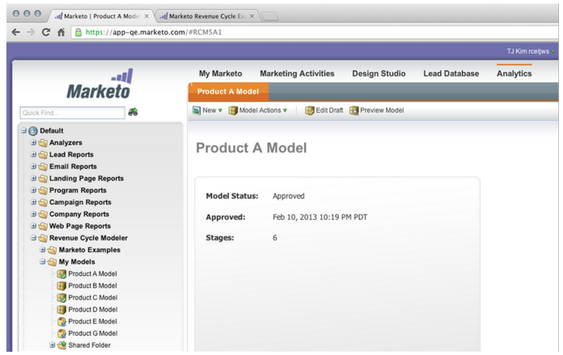

# Notes de mise à jour : juin 2013 {#release-notes-june}

Les fonctionnalités suivantes sont incluses dans la version de juin.

## Langues supplémentaires de l&#39;utilisateur {#additional-user-languages}

Affichez l’interface de gestion des prospects de Marketo dans la langue de votre choix, désormais en espagnol et en portugais.

## Interface utilisateur cobalt {#cobalt-user-interface}

Au cours des prochains mois, vous remarquerez un nouveau thème déployé dans différentes parties de l’application ; ayant un impact sur les fenêtres modales par exemple.

## Clonage de sous-dossiers {#subfolder-cloning}

Clonage de ressources dans des sous-dossiers.

## Modèles multiples {#multiple-models}

Cette fonctionnalité, qui est l’une des meilleures idées de Revenue Cycle Analytics (RCA) dans la communauté, vous permet de créer plusieurs modèles afin de mieux comprendre votre entonnoir de revenus par ligne de produit, unité opérationnelle ou région. Les rapports Leads par étape de chiffre d’affaires, Analyseur de chemin de succès, Analyseur de programme et Explorateur de chiffre d’affaires prennent désormais en charge la possibilité de sélectionner un modèle spécifique pour le compte rendu des performances.

Par défaut, deux modèles sont disponibles pour Select SMB Edition et quinze pour Enterprise Edition. Vous pouvez également acheter des modèles supplémentaires.

