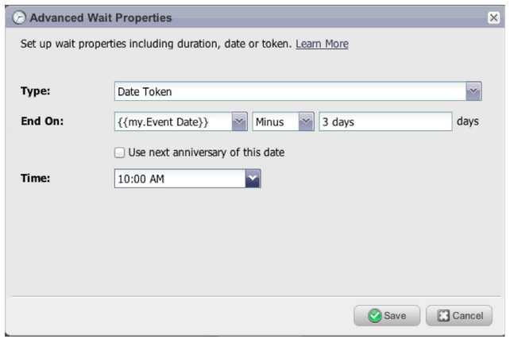

# Notes De Mise À Jour : Mars 2013 {#release-notes-march}

Les fonctionnalités suivantes sont incluses dans la version de mars.

## Fichiers de calendrier Marketo {#marketo-calendar-files}

Créez un fichier de calendrier en tant que **Mon jeton** à utiliser dans vos e-mails de confirmation et de rappel d’événement. Ce fichier de calendrier intégré (par exemple, fichier .ics) effectue le rendu de tous les jetons, y compris Mes jetons et le jeton `{{member.webinar URL}}`.

## Attendre Jusqu’À +/- {#wait-until}

Créez des étapes d’attente pouvant s’exécuter un nombre spécifié de jours avant ou après un jeton de date. Par exemple, vous pouvez créer une étape d’attente qui attend 3 jours avant la date de l’événement, puis envoyer un rappel !

Vous pouvez créer une étape d’attente qui attend 14 jours avant l’anniversaire du prospect. En sélectionnant « Utiliser le prochain anniversaire de cette date », le système ignorera automatiquement l’année associée à la date et utilisera plutôt l’année civile en cours ou la prochaine année civile.

## Loteries sociales {#social-sweepstakes}

Un tirage au sort donne à vos prospects la chance de gagner un prix et de parler de vous à leurs amis. Vous sélectionnez des gagnants aléatoires parmi les participants et vous leur envoyez un e-mail.

## Formulaire supplémentaire [!UICONTROL  Message d’erreur ] Langues {#additional-form-error-message-languages}

Plus d’une douzaine de langues ont été ajoutées aux messages d’erreur du formulaire.

## Informations et alertes d’assistance {#support-news-and-alerts}

Restez connecté au service clientèle de Marketo en vous abonnant aux actualités et alertes de l’assistance pour les alertes P1, les problèmes connus, les conseils et astuces de nos experts de l’assistance et les mises à jour de l’assistance clientèle de Marketo.
