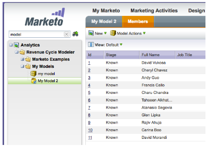
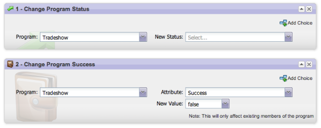

# Notes de mise à jour : mai 2013 {#release-notes-may}

Les fonctionnalités suivantes sont incluses dans la version de mai.

## Fichiers de calendrier pour les pages de destination {#calendar-files-for-landing-pages}

Créez un fichier de calendrier en tant que jeton Mon jeton pouvant être ajouté à votre page de destination. Ce fichier de calendrier intégré (par exemple, fichier .ics) effectue le rendu de tous les jetons, y compris Mes jetons sur les pages de destination des ressources locales.

## Onglet du modèle d&#39;adhésion {#model-membership-tab}

Visualisez toutes les données des membres de votre modèle au même endroit afin de faciliter la surveillance et la résolution des problèmes. Le nouvel onglet [!UICONTROL Membres] est une vue en lecture seule disponible lorsque vous sélectionnez un modèle de cycle du produit approuvé.

## Arborescence d’actions de flux réorganisée {#reorganized-flow-action-tree}

Recherchez plus rapidement les actions de flux avec l’arborescence d’actions de flux nouvellement réorganisée.

## Actions de flux renommées {#renamed-flow-actions}

Modifier le statut de progression est désormais [!UICONTROL Modifier le statut du programme]. Modifier les données du programme est désormais [!UICONTROL &#x200B; Modifier la réussite du programme &#x200B;].

