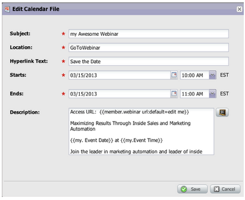

# Notes de mise à jour : mai 2013 {#release-notes-may}

Les fonctionnalités suivantes sont incluses dans la version de mai.

## Fichiers de calendrier pour les pages d’entrée {#calendar-files-for-landing-pages}

Créez un fichier de calendrier appelé Mon jeton qui peut être ajouté à votre landing page. Ce fichier de calendrier intégré (fichier .ics, par exemple) effectuera le rendu de tous les jetons, y compris Mes jetons sur les pages d’entrée des ressources locales.

## Onglet du modèle d&#39;adhésion {#model-membership-tab}

Affichez toutes les données de votre membre de modèle à un seul endroit afin de surveiller facilement et de résoudre les problèmes. Le nouvel onglet Membres est une vue en lecture seule disponible lorsque vous sélectionnez un modèle de cycle de revenu approuvé.

## Arborescence d’actions de flux réorganisée {#reorganized-flow-action-tree}

Trouvez plus rapidement les actions de flux grâce à l’arborescence d’actions de flux nouvellement réorganisée.

## Actions de flux renommées {#renamed-flow-actions}

Modifier l’état de progression est maintenant Modifier l’état du programme. Modifier les données du programme Changer la réussite du programme

