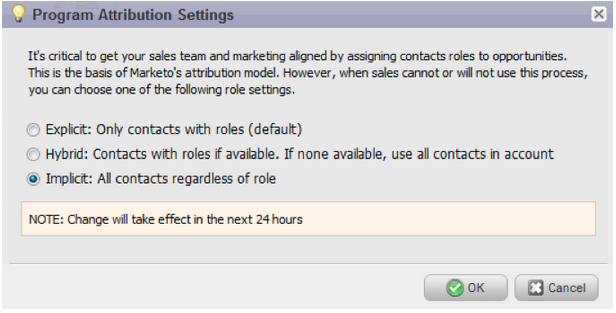

# Notes de mise à jour : septembre 2013 {#release-notes-september}

Les fonctionnalités suivantes sont incluses dans la version de septembre.

## URL courtes {#shorter-urls}

Les URL des e-mails sont désormais plus courtes et plus agréables pour le destinataire, mais elles conservent leur fonctionnalité de suivi.

>[!CAUTION]
>
>Lorsque nous passerons aux URL courtes, les liens dans les e-mails envoyés avant la version de septembre expireront 90 jours après cette version.

Utilisez des données provenant d’objets personnalisés Marketo ou ajoutez une logique conditionnelle au contenu de votre e-mail à l’aide du langage de modèle Velocity.

## Remplacer Envoyer le test par Envoyer l’exemple {#change-send-test-to-send-sample}

Nous avons renommé l’action Envoyer le test en Envoyer l’exemple

## Personnalisé [!UICONTROL Envoyer un exemple d’e-mail] {#personalized-send-sample-email}

Lorsque vous envoyez un exemple d’e-mail, vous pouvez sélectionner le nom d’un prospect pour personnaliser l’exemple d’e-mail.

## Synchronisation de champ supplémentaire pour [!DNL GoToWebinar] {#additional-field-sync-for-gotowebinar}

Vous pouvez synchroniser le nom de la société et le titre du poste de votre formulaire Marketo avec [!DNL GoToWebinar]. Pour activer ces champs supplémentaires, accédez à Partenaires d’événement et cochez la case « Activer les champs supplémentaires ».

## Restreindre la connexion de l&#39;utilisateur à l&#39;authentification unique {#restrict-user-login-to-sso-only}

Configurez les abonnements pour autoriser uniquement les utilisateurs de Marketo à se connecter via l’authentification unique et non via l’écran de connexion classique

## Recherche des virus dans les fichiers téléchargés {#virus-scan-of-uploaded-files}

Les fichiers téléchargés dans Design Studio sont automatiquement scannés et bloqués s&#39;ils contiennent des virus.

## Exporter l&#39;analyseur d&#39;influence sur l&#39;opportunité {#export-opportunity-influence-analyzer}

Vous pouvez désormais exporter les données dans l’analyseur d’influence d’opportunité vers [!DNL Excel]. Chaque fichier [!DNL Excel] exporté contient toutes les interactions marketing pour tous les prospects (y compris ceux sans rôle dans l’opportunité) ainsi que toutes les opportunités sous le compte sélectionné dans l’analyseur. Les lignes d’opportunité sont surlignées en vert. Vous pouvez utiliser les fonctionnalités natives de filtrage des données de [!DNL Excel] si vous devez vous concentrer sur des prospects ou des activités marketing spécifiques.

## Paramètres d&#39;attribution du programme {#program-attribution-settings}

Vous pouvez modifier la façon dont Marketo lie les contacts et les opportunités pour les mesures d’attribution Première touche et Touche multiple, y compris la possibilité d’effectuer une attribution basée sur les comptes. Ces paramètres auront un impact sur les mesures d’attribution dans les rapports [!UICONTROL Explorateur de revenus] sous la zone Analyse des opportunités du programme et la zone Analyse des opportunités. Cela affectera également les mesures d’attribution dans l’analyseur de programme.

Vous pouvez modifier les paramètres d’attribution du programme selon l’un des trois choix suivants. La modification de ce paramètre ne modifie aucune donnée Marketo ou CRM ; elle modifie simplement la manière dont vos rapports s’exécutent et peut être annulée à tout moment.

Le paramètre Explicite examine uniquement les contacts ayant des rôles (comportement actuel). Implicite examinera tous les contacts associés au compte, quel que soit leur rôle. Nous vous recommandons vivement d’utiliser le mode Explicite si possible. L’utilisation d’Implicite peut créer des faux positifs, c’est-à-dire des personnes qui ont du crédit pour une opportunité même si elles n’ont aucune influence réelle sur celle-ci.

## [!UICONTROL Sales Insight] disponible en français et en allemand ([!DNL Salesforce] uniquement) {#sales-insight-available-in-french-and-german-salesforce-only}

Téléchargez la dernière version de Marketo Lead Management et de Marketo [!UICONTROL Sales Insight] à partir de [!DNL AppExchange] afin que vos vendeurs français et allemands puissent voir le contenu [!UICONTROL Sales Insight] dans leur langue préférée.

## Interface utilisateur cobalt {#cobalt-user-interface}

Au cours des prochains mois, un nouveau thème sera déployé dans différentes parties de l’application. Ce mois-ci, vous remarquerez peut-être d’autres nouvelles fenêtres modales bleues.
