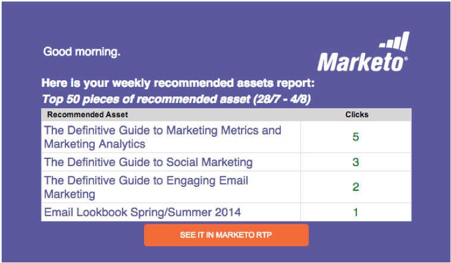

# Notes de mise à jour : août 2014 {#release-notes-august}

Les fonctionnalités suivantes sont incluses dans la version d’août 2014. Vérifiez la disponibilité des fonctionnalités dans votre édition Marketo. Revenez après la publication pour obtenir des liens vers la documentation détaillée sur les fonctionnalités.

## Licences du calendrier marketing {#marketing-calendar-licenses}

Après le 5 septembre 2014, seuls 5 utilisateurs pourront accéder gratuitement au calendrier marketing. Veillez à [Émettre/Révoquer une licence de calendrier marketing](/help/marketo/product-docs/core-marketo-concepts/marketing-calendar/understanding-the-calendar/issue-revoke-a-marketing-calendar-license.md) pour les utilisateurs de votre choix avant cette date afin d’obtenir un accès ininterrompu.

## Nouvelles autorisations d’utilisateurs {#new-user-permissions}

Les nouvelles autorisations utilisateur suivantes ont été ajoutées :

| Autorisation | Description |
|---|---|
| Accéder à l’explorateur de recettes | Si vous avez acheté RCA, vous aurez désormais le contrôle sur qui peut y accéder. |
| Importer la liste | Empêcher les utilisateurs d&#39;importer des listes dans la base de données de leads. |
| Importer une liste | Empêchez les utilisateurs d’importer des listes via un programme dans les activités marketing. |
| Activer la campagne à déclencheurs | Contrôlez qui peut et ne peut pas activer les campagnes de déclenchement. |
| Programmer une campagne par lot | Contrôler qui peut et ne peut pas planifier des exécutions de campagnes par lots. |

## Exporter des utilisateurs et des rôles depuis [!UICONTROL Admin] {#export-users-and-roles-from-admin}

Vous pouvez désormais [Exporter une liste d’utilisateurs et de rôles](/help/marketo/product-docs/administration/users-and-roles/export-a-list-of-users-and-roles.md) à partir de Marketo. Vous pouvez également inclure un horodatage « Dernière connexion » à inclure avec l’exportation.

## Supprimer les canaux et les balises {#delete-channels-and-tags}

Vous pouvez désormais supprimer tous les canaux et statuts inutilisés. Comme toujours, vous ne pouvez masquer qu’un seul élément en cours d’utilisation.

## Automated [!DNL DKIM] {#automated-dkim}

Pour une meilleure délivrabilité, tous les e-mails sortants seront [!DNL DKIM] (DomainKeys Identified Mail) signés. Par défaut, les e-mails utiliseront la signature [!DNL DKIM] partagée Marketo. Vous aurez la possibilité de personnaliser cette signature.

>[!NOTE]
>
>[!DNL DKIM] sera déployé lentement, il se peut que vous ne le voyiez pas avant quelques semaines.

## Mises À Jour Du Personalization En Temps Réel {#real-time-personalization-updates}

Nous avons ajouté des libellés à la page de campagne afin que vous puissiez ajouter des balises au contenu de vos cœurs.

## Ciblage mobile {#mobile-targeting}

Vous avez demandé à la communauté et nous avons tenu parole ! Vous pouvez désormais inclure, exclure ou définir un call to action spécifique pour les utilisateurs d’appareils mobiles et de tablettes.

## Segmentation et ciblage 1:1 améliorés {#enhanced-segmentation-and-targeting}

Vous pouvez désormais utiliser des opérateurs de filtre avancés pour cibler les visiteurs connus.

## Partage de campagne {#campaign-sharing}

Vous avez désormais la possibilité de partager rapidement et facilement un lien d’aperçu de campagne RTP.

## Rapport du moteur de recommandations de contenu {#content-recommendation-engine-report}

Nous avons ajouté un nouveau rapport sur le moteur de recommandation de contenu pour que vous puissiez en voir un bon résumé.

## Amélioration de l’administration des utilisateurs {#enhanced-user-administration}

Les utilisateurs administrateurs peuvent désormais verrouiller les utilisateurs en raison de plusieurs échecs de tentative de connexion. Vous pouvez également déverrouiller ces utilisateurs ou utilisatrices si vous le souhaitez.

## Contrôle de suivi {#tracking-control}

Vous pouvez désormais exclure des adresses IP spécifiques de l’ensemble du suivi et des rapports dans Real-Time Personalization.

