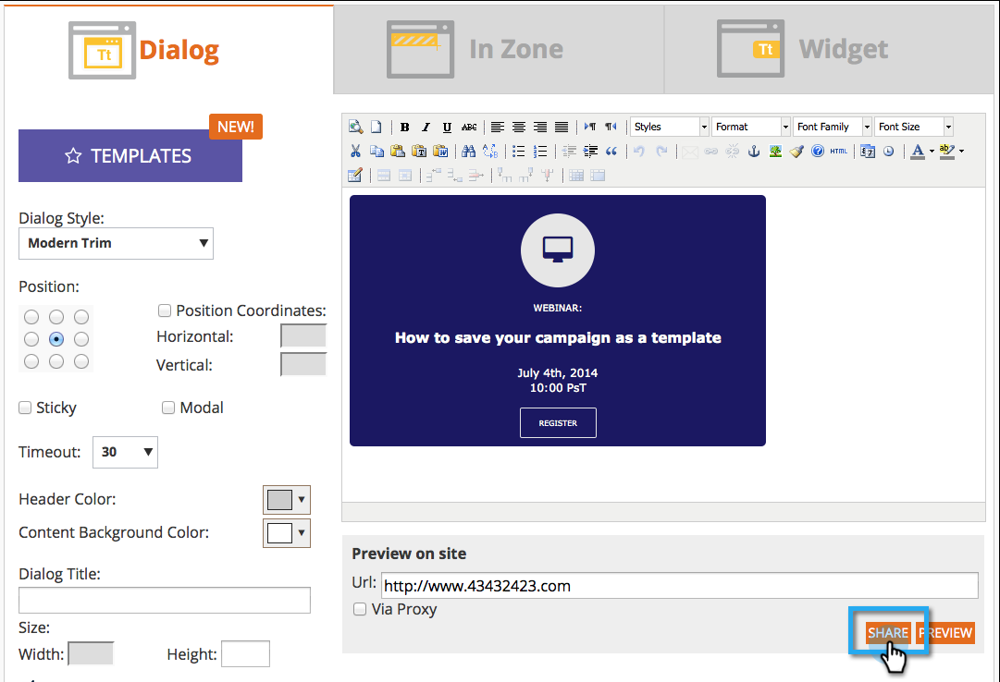

# Notes de mise à jour : Août 2014 {#release-notes-august}

Les fonctionnalités suivantes sont incluses dans la version d’août 2014. Vérifiez la disponibilité de votre édition Marketo. Revenez après la version pour obtenir des liens vers la documentation détaillée sur les fonctionnalités.

## Licences de calendrier marketing {#marketing-calendar-licenses}

Après le 5 septembre 2014, seuls 5 utilisateurs peuvent accéder gratuitement au calendrier marketing. Veillez à [Problème/révocation d’une licence de calendrier marketing](/help/marketo/product-docs/core-marketo-concepts/marketing-calendar/understanding-the-calendar/issue-revoke-a-marketing-calendar-license.md) aux utilisateurs de votre choix pour un accès ininterrompu.

## Nouvelles autorisations d’utilisateurs {#new-user-permissions}

Les nouvelles autorisations utilisateur suivantes ont été ajoutées :

| Autorisation | Description |
|---|---|
| Accéder à l’explorateur de recettes | Si vous avez acheté une RCA, vous aurez désormais le contrôle de qui peut y accéder. |
| Importer la Liste | Limite l’importation des listes par les utilisateurs dans la base de données de piste. |
| Importer une liste | Restreindre les utilisateurs à importer des listes via un programme sous des activités marketing. |
| Activer la campagne à déclencheurs | Contrôlez qui peut ou ne peut pas activer les campagnes de déclenchement. |
| Programmer une campagne par lot | Permet de contrôler qui peut et ne peut pas planifier les exécutions de campagne par lots. |

## Exportation des utilisateurs et des rôles à partir de l’administrateur {#export-users-and-roles-from-admin}

Vous pouvez désormais [Exportation d’une liste d’utilisateurs et de rôles](/help/marketo/product-docs/administration/users-and-roles/export-a-list-of-users-and-roles.md) de Marketo. Vous pouvez également inclure un horodatage &quot;Dernière connexion&quot; dans l’exportation.

## Suppression de canaux et de balises {#delete-channels-and-tags}

Vous pouvez désormais supprimer les canaux et les états inutilisés. Comme toujours, vous ne pouvez masquer qu’un seul qui est actuellement utilisé.

## DKIM automatisé {#automated-dkim}

Pour une meilleure délivrabilité, tous les emails sortants seront signés DKIM (DomainKeys Identified Mail). Par défaut, les emails utilisent la signature DKIM partagée Marketo. Vous aurez la possibilité de personnaliser cette signature.

>[!NOTE]
>
>DKIM sera déployé lentement, vous ne le verrez peut-être pas avant quelques semaines.

## Mises à jour de la personnalisation en temps réel {#real-time-personalization-updates}

Nous avons ajouté des étiquettes à la page de la campagne afin que vous puissiez baliser le contenu de vos coeurs.

## Ciblage mobile {#mobile-targeting}

Vous avez demandé à la communauté et nous avons livré ! Vous pouvez désormais inclure, exclure ou définir un appel à l’action spécifique pour les utilisateurs de mobiles et de tablettes.

## Amélioration de la segmentation et du ciblage 1:1 {#enhanced-segmentation-and-targeting}

Vous pouvez désormais utiliser des opérateurs de filtres avancés pour cibler les visiteurs connus.

## Partage de campagnes {#campaign-sharing}

Vous avez désormais la possibilité de partager rapidement et facilement un lien d’aperçu de campagne RTP.

## Rapport Moteur de recommandation de contenu {#content-recommendation-engine-report}

Nous avons ajouté un nouveau rapport de moteur de recommandations de contenu pour que vous puissiez voir un bon résumé.

## Amélioration de l’administration des utilisateurs {#enhanced-user-administration}

Les utilisateurs administrateurs peuvent désormais verrouiller les utilisateurs en raison de plusieurs échecs de connexion. Vous pouvez également déverrouiller ces utilisateurs si vous le souhaitez.

## Contrôle de suivi {#tracking-control}

Vous pouvez désormais exclure des adresses IP spécifiques de tout suivi et reporting dans la personnalisation en temps réel.

