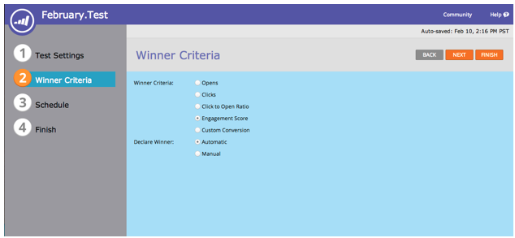

# Notes De Mise À Jour : Février 2014 {#release-notes-february}

Les fonctionnalités suivantes sont incluses dans la version de février 2014. Consultez votre édition Marketo pour connaître la disponibilité des fonctionnalités. Après la publication, veillez à revenir pour trouver des liens vers des articles détaillés de la base de connaissances pour chaque fonctionnalité.

## [!UICONTROL score de l’engagement] comme critères gagnants {#engagement-score-as-winning-criteria}

[Utilisez le score d’engagement](/help/marketo/product-docs/email-marketing/email-programs/email-program-actions/email-test-a-b-test/define-the-a-b-test-winner-criteria.md) pour déterminer la variante gagnante de votre test de partage A/B ou de votre test Champion/Challenger. Le test doit durer au moins 24 heures pour obtenir un score d’engagement adéquat.

## Programme d&#39;e-mail [!UICONTROL onglet Résultats] {#email-program-results-tab}

[Affichez les résultats](/help/marketo/product-docs/email-marketing/email-programs/email-program-data/view-email-program-results.md) et les activités consignés pour le programme de messagerie.

## Personnes/[!UICONTROL Leads] interdits de publipostage {#people-leads-blocked-from-mailing}

[Cliquez sur le numéro personnes/prospects dont l’envoi a été bloqué](/help/marketo/product-docs/email-marketing/email-programs/managing-people-in-email-programs/define-an-audience-with-a-smart-list.md) pour savoir qui ne recevra pas l’e-mail en raison d’un désabonnement, d’une mise sur liste noire, d’une adresse e-mail non valide ou vide ou d’une suspension du marketing.

## Exporter les données du programme de messagerie {#export-email-program-data}

[Exporter les mesures e-mail vers [!DNL Excel]](/help/marketo/product-docs/email-marketing/email-programs/email-program-data/export-email-program-dashboard-to-excel.md), y compris les données de variante de test AB.

## [!UICONTROL score de l’engagement] dans le rapport [!UICONTROL performances du volet Engagement] {#engagement-score-in-engagement-stream-performance-report}

Nous avons ajouté le score de l’engagement au rapport [[!UICONTROL Performances du flux d’engagement] ](/help/marketo/product-docs/email-marketing/drip-nurturing/reports-and-notifications/engagement-stream-performance-report.md) pour vous aider à évaluer l’efficacité du contenu de votre programme d’engagement.

## Détails des programmes dans l’analyse des e-mails {#program-details-in-email-analysis}

[Vous pouvez désormais regrouper vos mesures par nom de programme, canal et balises](/help/marketo/product-docs/reporting/revenue-cycle-analytics/email-analysis/build-an-email-analysis-report-that-shows-program-information.md). Le nom du programme est ajouté au champ Nom de l’e-mail lorsque l’e-mail est une ressource locale du programme. Le nouveau champ Nom du programme affiche le nom du programme de la campagne intelligente qui a envoyé l’e-mail. Elle peut être différente du programme dans le champ Nom de l’e-mail si l’e-mail est une ressource locale d’un autre programme.

## Mettre à jour vers les filtres de lien de clics et le déclencheur {#update-to-clicks-link-filters-and-trigger}

Les noms de filtre et de déclencheur suivants ont été mis à jour :

* Clics Lier à [!UICONTROL Clics sur le lien d’une page web]
* A cliqué sur Lien vers [!UICONTROL A cliqué sur Lien sur la page web]
* Non cliqué Lier à [!UICONTROL Non cliqué Lien sur la page web]

## Améliorations des formulaires 2.0 {#forms-enhancements}

Cette version de Forms 2.0 contient plusieurs mises à jour relatives à la « qualité de vie ». Outre l’activation du profilage progressif sur les formulaires incorporés, nous avons apporté des modifications aux workflows et à l’expérience utilisateur afin de faciliter l’utilisation des fonctionnalités plus avancées de l’éditeur, [notamment les règles de visibilité](/help/marketo/product-docs/demand-generation/forms/form-fields/dynamically-toggle-visibility-of-a-form-field.md), les pages de remerciement avancées et les champs masqués.

