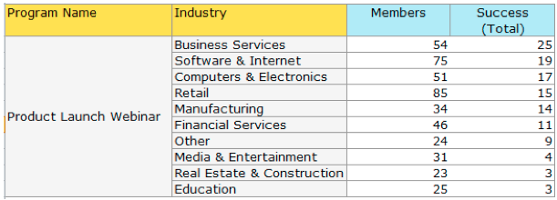

# Notes de mise à jour : janvier 2014 {#release-notes-january}

Les fonctionnalités suivantes sont incluses dans la version de janvier 2014. Vérifiez la disponibilité de vos fonctionnalités dans [Marketo Edition](https://www.marketo.com/pricing/).

## Formulaires 2.0 {#forms}

En tête : la documentation de Forms 2.0 est bientôt disponible !

Prenez le contrôle du processus de création de formulaire et laissez une pause à vos développeurs web. Forms 2.0 est conçu pour permettre aux marketeurs de créer des formulaires visuellement et fonctionnels sans avoir besoin de connaissances en programmation.

**Donnez à votre Forms la prise de contrôle visuelle qu’elle mérite :**

Les conceptions de thème, la personnalisation de boutons et les dispositions flexibles vous permettent de concevoir des formulaires à l’aspect moderne qui s’adaptent parfaitement à l’apparence de votre site.

**Visibilité conditionnelle et page de relance Logique :**

Vous souhaitez que &quot;Etat&quot; apparaisse uniquement si un utilisateur sélectionne Etats-Unis comme &quot;Pays&quot; ? Pourquoi ne pas présenter différents livres blancs aux clients en fonction de la manière dont ils répondent aux questions de votre formulaire ? Construisez une logique conditionnelle dans vos formulaires directement à partir de l’éditeur. Aucun javascript requis !

**Incorporer facilement le Forms sur vos propres landing pages :**

Les jours de la levée du code HTML des formulaires placés sur les pages d’entrée Marketo et de leur suppression dans un iFrame sont révolus. Il vous suffit de saisir le code incorporé et de le placer sur la page d’entrée où vous souhaitez que le formulaire soit rendu. Deux modes - normal et Lightbox - vous donnent encore plus de flexibilité avec les formulaires Marketo sur votre site.

## Limites de communication pour le programme Email {#communication-limits-for-email-program}

[ Définissez des limites de communication sur un programme de messagerie ](/help/marketo/product-docs/email-marketing/email-programs/email-program-actions/enable-disable-communication-limits-in-an-email-program.md) pour vous assurer que vous ne communiquez pas trop sur votre base de données. Si une personne dépasse la limite définie, elle ne recevra pas l’email.

## Champs supplémentaires dans l&#39;analyse de l&#39;adhésion au programme {#additional-fields-in-program-membership-analysis}

Vous pouvez maintenant ajouter et regrouper vos mesures [Analyse de l’appartenance au programme](/help/marketo/product-docs/reporting/revenue-cycle-analytics/program-analytics/build-a-program-membership-analysis-report-that-lists-leads.md) par attributs de prospect et de société. Par exemple, vous pouvez ajouter le champ Secteur industriel pour afficher la répartition des membres et des succès de votre programme.

