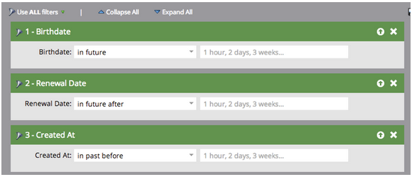

# Notes de mise à jour : juillet 2014 {#release-notes-july}

Les fonctionnalités suivantes sont incluses dans la version de juillet 2014. Consultez votre édition Marketo pour connaître la disponibilité des fonctionnalités. Revenez après la publication pour obtenir des liens vers la documentation détaillée sur les fonctionnalités.

## Calendrier marketing {#marketing-calendar}

Afficher l’ensemble des événements, des e-mails et bien plus dans les programmes. [Ce nouveau produit](/help/marketo/product-docs/core-marketo-concepts/marketing-calendar/understanding-the-calendar/navigating-the-marketing-calendar.md) sera disponible gratuitement pour les clients disposant de 10 utilisateurs de [!DNL Marketo Lead Management] ou de boîte de dialogue ou moins.

La documentation relative au calendrier marketing sera disponible au moment de la publication.

## Nouvelles présentation et fonctionnalités {#new-look-and-feel}

[!DNL Marketo Lead Management] sera mis à jour avec une nouvelle apparence, moderne et élégante, qui comprend une navigation mise à jour.

## Opérateurs de date {#date-operators}

[Filtres avancés](/help/marketo/product-docs/core-marketo-concepts/smart-lists-and-static-lists/creating-a-smart-list/smart-list-filter-operators-glossary.md) pour « [!UICONTROL &#x200B; dans le passé avant &#x200B;] », « [!UICONTROL &#x200B; dans le futur &#x200B;] » et « [!UICONTROL &#x200B; dans le futur après &#x200B;] ». Par exemple, trouvez les prospects dont la date de naissance se situe dans les 3 prochains mois ou dont le contrat expire après 6 mois.

## Vue Planning du programme {#program-schedule-view}

Outre le calendrier marketing avec lequel vous gérez vos événements et programmes par défaut, une nouvelle vue de planning est disponible directement sur le programme.

* Replanifier toutes les dates simultanément
* Nouvelles dates provisoires - faites-le figurer au crayon !
* Types d’entrée personnalisés - À faire, Communiqué de presse, tout ce que vous voulez

## Liste des opérations dans l’API REST {#list-operations-in-the-rest-api}

Nous avons ajouté les appels ci-dessous liés aux opérations de liste dans ReST. Voir [https://experienceleague.adobe.com/fr/docs/marketo-developer/marketo/rest/rest-api](https://experienceleague.adobe.com/fr/docs/marketo-developer/marketo/rest/rest-api) pour consulter la documentation complète.

* Obtenir la liste par ID
* Obtenir plusieurs listes
* Importer dans la liste
* Obtenir le statut d’importation dans la liste

## Importation de liste rapide {#fast-list-import}

Plus de **50 fois plus rapide**, vos fichiers zoomeront sur Marketo ! Les anciennes options d’importation « Normal » et « Optimisé pour les nouveaux prospects » ont été remplacées par « Par défaut (importation rapide) ».

L’option « Ignorer les nouveaux leads et les mises à jour » reste inchangée.

## Nouveau Munchkin amélioré ! {#new-improved-munchkin}

Le déploiement commencera à la mi-juillet et se poursuivra au cours des prochains mois.

* Supprime le [!DNL jQuery] de dépendance pour une compatibilité complète et future
* Plus compatible avec les autres JavaScript de votre site
* Entièrement testé sur de nombreux sites au cours de l’année écoulée !

## RTP : Real-Time Personalization Campaign Templates {#rtp-real-time-personalization-campaign-templates}

La page Définir la campagne de RTP [comprend désormais des modèles prêts à l’emploi](/help/marketo/product-docs/web-personalization/using-templates/using-templates-to-create-web-campaigns.md). Choisissez parmi une variété de styles, y compris des webinaires, des études de cas, des livres électroniques.

## RTP : améliorations de l’API JavaScript {#rtp-javascript-api-enhancements}

Nouvel appel API RTP pour obtenir des données visiteur en temps réel telles que la correspondance de l’organisation, du secteur, de l’emplacement et du code segment. En outre, le survol d’un nom de segment dans la page Segments affiche une info-bulle indiquant le code segment. Consultez notre [site destiné aux développeurs](https://experienceleague.adobe.com/fr/docs/marketo-developer/marketo/javascriptapi/rich-media-recommendation) pour obtenir une documentation complète.

## RTP : prise en charge d’HTML5 dans l’éditeur de contenu de Campaign {#rtp-html-support-in-campaign-content-editor}

L’éditeur de WYSIWYG de contenu de la page Définir les campagnes est désormais entièrement compatible avec HTML5. Cliquez sur l’icône « HTML » dans l’éditeur pour insérer du code HTML5.
