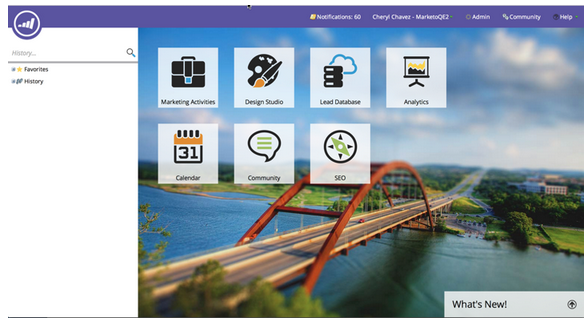
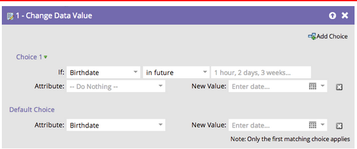

# Notes de mise à jour : juillet 2014 {#release-notes-july}

Les fonctionnalités suivantes sont incluses dans la version de juillet 2014. Vérifiez la disponibilité de vos fonctionnalités dans Marketo Edition. Revenez après la version pour obtenir des liens vers la documentation détaillée sur les fonctionnalités.

## Calendrier marketing {#marketing-calendar}

Afficher l’ensemble des événements, des e-mails et bien plus dans les programmes. [Ce nouveau produit](/help/marketo/product-docs/core-marketo-concepts/marketing-calendar/understanding-the-calendar/navigating-the-marketing-calendar.md) sera disponible sans frais pour les clients ayant 10 utilisateurs ou moins de la gestion des pistes Marketo ou de la boîte de dialogue.

La documentation du calendrier marketing sera disponible au moment de la publication.

## Nouvelles présentation et fonctionnalités {#new-look-and-feel}

La gestion des leads Marketo sera mise à jour avec une nouvelle apparence moderne et élégante, avec une navigation mise à jour.

## Opérateurs de date {#date-operators}

[Filtres avancés](/help/marketo/product-docs/core-marketo-concepts/smart-lists-and-static-lists/creating-a-smart-list/smart-list-filter-operators-glossary.md) pour &quot;dans le passé avant&quot;, &quot;dans le futur&quot; et &quot;dans le futur après&quot;. Par exemple, recherchez les pistes dont la date de naissance est fixée aux 3 prochains mois ou un contrat qui arrive à expiration après 6 mois.

## Affichage de la planification des programmes {#program-schedule-view}

Outre le calendrier marketing avec lequel vous gérez vos événements et programmes par défaut, une nouvelle vue de planification s’affiche directement dans le programme.

* Replanifier toutes les dates en même temps
* Nouvelles dates provisoires - faites-le crayon !
* Types d’entrée personnalisés : tâches, communiqué de presse, tout ce que vous souhaitez.

## Liste des opérations dans l’API ReST {#list-operations-in-the-rest-api}

Nous avons ajouté les appels ci-dessous relatifs aux opérations de liste dans ReST. Voir [https://experienceleague.adobe.com/fr/docs/marketo-developer/marketo/rest/rest-api](https://experienceleague.adobe.com/fr/docs/marketo-developer/marketo/rest/rest-api) pour obtenir la documentation complète.

* Obtenir la liste par identifiant
* Obtenir plusieurs listes
* Importer dans la liste
* Obtention de l’état de l’importation dans la liste

## Importation de liste rapide {#fast-list-import}

Plus de **50x plus rapide**, vos fichiers effectueront un zoom sur Marketo ! Les anciennes options d’importation &quot;Normale&quot; et &quot;Optimisée pour les nouvelles pistes&quot; ont été remplacées par &quot;Par défaut (importation rapide)&quot;.

L’option &quot;Ignorer les nouvelles pistes et mises à jour&quot; reste inchangée.

## Nouveau Munchkin amélioré ! {#new-improved-munchkin}

Le déploiement débutera à la mi-juillet et se poursuivra au cours des prochains mois.

* Supprime la dépendance jQuery pour une compatibilité complète et future.
* Plus compatible avec les autres JavaScript de votre site
* Entièrement testé sur de nombreux sites au cours de l’année passée !

## RTP : modèles de campagne Personalization en temps réel {#rtp-real-time-personalization-campaign-templates}

La page Campagne d’ensemble RTP [ comprend désormais des modèles prêts à l’emploi ](/help/marketo/product-docs/web-personalization/using-templates/using-templates-to-create-web-campaigns.md). Choisissez parmi une variété de styles, notamment des webinaires, des études de cas et des livres électroniques.

## RTP : améliorations de l’API JavaScript {#rtp-javascript-api-enhancements}

Nouvel appel de l’API RTP pour obtenir des données sur les visiteurs en temps réel telles que l’organisation, le secteur, l’emplacement et la correspondance de code segment. En outre, le survol d’un nom de segment dans la page Segments affiche une info-bulle présentant le code segment. Consultez notre [site de développeurs](https://experienceleague.adobe.com/fr/docs/marketo-developer/marketo/javascriptapi/rich-media-recommendation) pour obtenir une documentation complète.

## RTP : prise en charge d’HTML5 dans l’éditeur de contenu de Campaign {#rtp-html-support-in-campaign-content-editor}

L’éditeur WYSIWYG de contenu de la page Définir des campagnes est désormais entièrement compatible avec HTML5. Cliquez sur l&#39;icône &quot;HTML&quot; dans l&#39;éditeur pour insérer du code HTML5.
