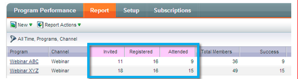

# Notes de mise à jour : mars 2014 {#release-notes-march}

Les fonctionnalités suivantes sont incluses dans la version de mars 2014. Vérifiez la disponibilité de vos fonctionnalités dans Marketo Edition. Après la version, veillez à revenir pour obtenir des liens vers les articles de la base de connaissances pour chaque fonctionnalité.

## Bouton Actualiser le tableau de bord du programme de messagerie {#email-program-dashboard-refresh-button}

Utilisez le [bouton d’actualisation](/help/marketo/product-docs/email-marketing/email-programs/email-program-data/use-the-email-program-dashboard.md) pour obtenir des mesures d’email à la minute près concernant votre envoi d’email ou votre test AB !

## Annuler/rétablir dans l’éditeur de courrier électronique et l’éditeur de fragments de code {#undo-redo-in-the-email-editor-and-snippet-editor}

[Annuler ou rétablir](/help/marketo/product-docs/email-marketing/general/email-editor-2/edit-elements-in-an-email.md) jusqu’à 50 actions pour la session en cours.

## Colonnes d’état du programme dans le rapport de performance du programme {#program-status-columns-in-program-performance-report}

Lors de l’utilisation du [rapport de performances du programme](/help/marketo/product-docs/core-marketo-concepts/programs/program-performance-report/add-program-status-columns-to-a-program-report.md), vous pouvez maintenant voir combien de personnes se trouvent dans les états du programme.

## Programmes opérationnels et inclusifs pour les analyses {#inclusive-and-operational-programs-for-analytics}

Vous pouvez désormais [inclure des programmes sans frais de période](/help/marketo/product-docs/reporting/revenue-cycle-analytics/program-analytics/make-a-program-without-a-period-cost-available-in-revenue-explorer-and-analyzers.md) dans l’ Explorateur des recettes et les analyseurs en définissant l’option Comportement d’Analytics sur &quot;Inclusif&quot; lorsque vous modifiez les canaux de programme. Vous pouvez également exclure les programmes opérationnels de la création de rapports tous ensemble en choisissant &quot;Opérationnel&quot;.

## Options hybrides et implicites pour la conversion de pistes {#hybrid-and-implicit-options-for-lead-conversion}

Vous pouvez modifier la manière dont Marketo lie les contacts et les opportunités pour les mesures de conversion de piste dans l’analyse de piste. Vous pouvez [modifier le paramètre d’attribution](/help/marketo/product-docs/administration/settings/change-attribution-settings-for-analytics.md) en l’un des trois choix possibles. La modification de ce paramètre ne modifie aucune donnée de Marketo ou de gestion de la relation client ; elle modifie simplement l’exécution des rapports et peut être annulée à tout moment.

Le paramètre Explicite traite uniquement les contacts avec les rôles d’une opportunité comme des pistes converties (comportement par défaut). Implicit traite tous les contacts associés au compte dans l’opportunité, quel que soit le rôle, comme convertis. Hybrid traite les contacts avec des rôles comme convertis si disponibles ; si aucun contact n’est disponible, tous les contacts du compte sont traités comme convertis.

Pour rappel, ce paramètre modifie également les mesures d’attribution de programme.

## Langue d’utilisateur supplémentaire {#additional-user-language}

Sélectionnez Votre [Langue De L’Application Marketo](/help/marketo/product-docs/administration/settings/select-your-language-locale-and-time-zone.md). Affichez l’interface de gestion des prospects Marketo dans la langue de votre choix, qui prend désormais en charge le japonais.

## Blog des développeurs Marketo {#marketo-developer-blog}

Le [blog de développement Marketo](https://developers.marketo.com/blog/) est dédié aux développeurs web et aux ingénieurs en logiciels qui prennent en charge les besoins en évolution rapide des spécialistes du marketing moderne. Vous pouvez vous abonner à des annonces sur les nouvelles options d’intégration, les mises à jour des versions de l’API et une nouvelle série d’articles pratiques qui incluent des exemples de code et des bonnes pratiques d’intégration à la plateforme Marketo.

Le [premier article](https://developers.marketo.com/blog/retrieving-customer-and-prospect-information-from-marketo-using-the-api/) de cette série vous explique comment récupérer efficacement des informations sur les personnes (clients/contacts/pistes) qui sont stockées dans Marketo à l’aide de l’API.
