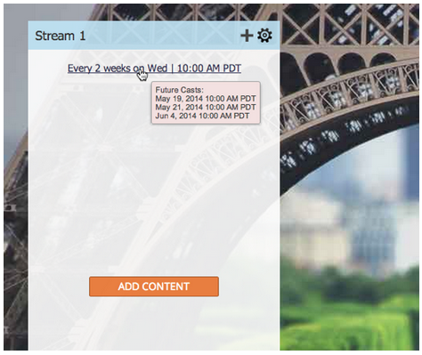

# Notes De Mise À Jour : Mai 2014 {#release-notes-may}

Les fonctionnalités suivantes sont incluses dans la version de mai 2014. Consultez votre édition Marketo pour connaître la disponibilité des fonctionnalités. Après la publication, veillez à revenir pour trouver des liens vers des articles détaillés de la base de connaissances pour chaque fonctionnalité.

## Supprimer l&#39;espace de travail {#delete-workspace}

Vous pouvez maintenant [supprimer un espace de travail inutilisé](/help/marketo/product-docs/administration/workspaces-and-person-partitions/delete-a-workspace.md). Veillez à déplacer toutes les ressources dans un autre espace de travail avant d’essayer de supprimer l’espace de travail.

## Planifier le premier lancer {#schedule-first-cast}

Dans les programmes d’engagement, vous pouvez planifier la date de la [première diffusion](/help/marketo/product-docs/email-marketing/drip-nurturing/engagement-program-streams/set-stream-cadence.md). Par exemple, spécifiez la cadence toutes les 2 semaines et sélectionnez la date du premier cast.

## Programmes d’engagement améliorés {#enhanced-engagement-programs}

Maintenant, tout le monde obtient plusieurs programmes, flux et limites de communication.

## Suivi des liens dans les e-mails texte {#link-tracking-in-text-emails}

[Ajoutez des crochets doubles](/help/marketo/product-docs/email-marketing/general/functions-in-the-editor/add-tracked-links-to-a-text-email.md) autour des URL dans la version texte de vos e-mails, pour indiquer quand les liens doivent être convertis en liens de suivi Marketo redirigés.

>[!NOTE]
>
>**Exemple**
>
>`[[https://www.marketo.com]]`

Par défaut, aucun lien ne sera suivi dans la version texte des e-mails. Ajoutez cette nouvelle syntaxe pour indiquer à quel moment un lien doit être converti en lien de suivi. Le comportement des liens HTML est inchangé.  Pour ajouter des liens suivis à vos e-mails :

* **Version d’HTML :** il vous suffit d’insérer votre lien. Il sera suivi par défaut.
* **Version texte :** saisissez l’URL entourée de doubles crochets.

Pour ajouter des liens non suivis à vos e-mails :

* **Version d’HTML :** insérez votre lien et ajoutez la classe « mktNoTrack » au lien.
* **Version texte :** il vous suffit de saisir l’URL. Il ne sera pas suivi par défaut.

## Balisage de lien dans les exemples d’e-mails {#link-markup-in-sample-emails}

Découvrez comment vos liens se comporteront dans les e-mails à l’avance. Les exemples d’e-mails affichent désormais les liens tels qu’ils apparaîtraient à vos prospects. Prévisualisez les liens qui ont été convertis en liens de suivi, ce qui vous permet de mieux comprendre comment le message apparaîtra réellement aux destinataires.

## [!UICONTROL Abandonner la campagne] {#abort-campaign}

Ne paniquez pas ! Si vous trouvez une erreur, utilisez le nouveau bouton [abandonner la campagne](/help/marketo/product-docs/core-marketo-concepts/smart-campaigns/using-smart-campaigns/abort-a-smart-campaign.md) pour arrêter immédiatement les campagnes dont ils sont le siège. Vous recevrez une notification indiquant le nombre de leads en attente dans chaque étape de flux lorsque la campagne a été arrêtée.

## [!UICONTROL Sales Insight] en japonais, portugais et espagnol {#sales-insight-in-japanese-portuguese-and-spanish}

Téléchargez la dernière version d’[!UICONTROL Sales Insight] depuis AppExchange afin que vos agents commerciaux parlant le japonais, le portugais et l’espagnol voient le contenu [!UICONTROL Sales Insight] dans leur langue préférée.

## Statut du programme et calendrier de réussite dans l’analyse des adhésions au programme {#program-status-and-success-timeframe-in-program-membership-analysis}

Affichez le nombre de [membres) présents dans chaque statut de programme](/help/marketo/product-docs/reporting/revenue-cycle-analytics/program-analytics/build-a-program-membership-analysis-report-that-lists-leads.md) et le moment où ils sont passés à chaque statut, y compris la date à laquelle ils ont atteint le succès du programme.

## E-mails de test A/B dans [!UICONTROL Analyse des e-mails] {#a-b-test-emails-in-email-analysis}

Créez un rapport sur chacune de vos variantes d’e-mail de test A/B [A/B](/help/marketo/product-docs/reporting/revenue-cycle-analytics/email-analysis/build-an-email-analysis-report-that-shows-program-information.md) dans [!UICONTROL Analyse des e-mails].

## Modifications du package Analytics {#analytics-packaging-changes}

Revenue Cycle Modeler et Success Path Analyzer sont désormais inclus dans l’édition standard de MA.

## Informations sur la plateforme mobile {#mobile-platform-info}

[Segmenter et déclencher](/help/marketo/product-docs/reporting/basic-reporting/report-activity/build-a-people-performance-report-with-mobile-platform-columns.md) hors des prospects ouvrant et cliquant sur des e-mails à partir de leurs appareils mobiles.
