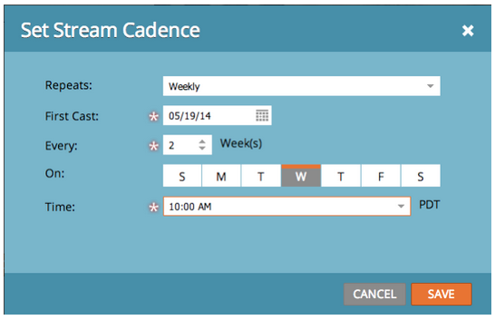
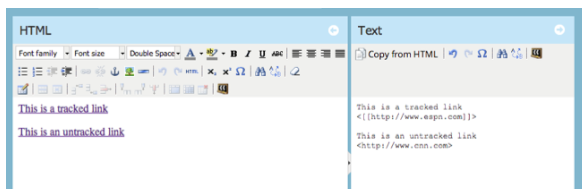

# Notes de mise à jour : mai 2014 {#release-notes-may}

Les fonctionnalités suivantes sont incluses dans la version de mai 2014. Vérifiez la disponibilité de vos fonctionnalités dans Marketo Edition. Après la publication de la version, veillez à revenir à la page pour trouver des liens vers des articles détaillés de la base de connaissances pour chaque fonctionnalité.

## Supprimer l&#39;espace de travail {#delete-workspace}

Vous pouvez désormais [supprimer un espace de travail inutilisé](/help/marketo/product-docs/administration/workspaces-and-person-partitions/delete-a-workspace.md). Veillez à déplacer toutes les ressources dans un autre espace de travail avant de tenter de supprimer l’espace de travail.

## Planifier la première diffusion {#schedule-first-cast}

Dans les programmes d’engagement, vous pouvez planifier la date de la [première diffusion à exécuter](/help/marketo/product-docs/email-marketing/drip-nurturing/engagement-program-streams/set-stream-cadence.md). Par exemple, indiquez la cadence à toutes les 2 semaines et sélectionnez la date de la première diffusion.

## Programmes d’engagement améliorés {#enhanced-engagement-programs}

Maintenant tout le monde obtient de multiples programmes, flux et limites de communication.

## Suivi de liens dans les emails texte {#link-tracking-in-text-emails}

[Ajoutez des crochets doubles](/help/marketo/product-docs/email-marketing/general/functions-in-the-editor/add-tracked-links-to-a-text-email.md) autour des URL dans la version texte de vos emails pour indiquer quand les liens doivent être convertis en liens de suivi Marketo redirigés.

>[!NOTE]
>
>**Exemple**
>
>`[[https://www.marketo.com]]`

Par défaut, aucun lien ne sera suivi dans la version texte des emails. Ajoutez cette nouvelle syntaxe pour indiquer à quel moment un lien doit être converti en lien de tracking. Le comportement des liens d’HTML reste inchangé.  Pour ajouter des liens trackés à vos emails :

* **Version de l&#39;HTML :** insérez simplement votre lien. Il sera suivi par défaut.
* **Version texte :** Saisissez l’URL entourée de deux crochets.

Pour ajouter des liens non trackés à vos emails :

* **HTML version :** Insérez votre lien et ajoutez la classe &quot;mktNoTrack&quot; au lien.
* **Version texte :** Saisissez simplement l’URL. Par défaut, il sera détracké.

## Balisage de lien dans des exemples de courrier électronique {#link-markup-in-sample-emails}

Découvrez le comportement de vos liens dans les emails à l’avance. Les exemples d’emails affichent désormais les liens exactement comme ils apparaissent dans vos pistes. Prévisualiser les liens qui ont été convertis en liens de tracking, afin de mieux comprendre comment le message apparaîtra réellement aux destinataires.

## Abandonner la campagne {#abort-campaign}

Ne paniquez pas ! Si vous constatez une erreur, utilisez le nouveau bouton [abort campaign](/help/marketo/product-docs/core-marketo-concepts/smart-campaigns/using-smart-campaigns/abort-a-smart-campaign.md) pour arrêter immédiatement les campagnes dans leur suivi. Vous recevrez une notification indiquant le nombre de pistes en attente à chaque étape de flux lorsque la campagne a été arrêtée.

## Statistiques des ventes en japonais, portugais et espagnol {#sales-insight-in-japanese-portuguese-and-spanish}

Téléchargez la dernière version de Sales Insight depuis AppExchange afin que vos agents de vente hispanophones, portugais et japonais consultent le contenu de Sales Insight dans la langue de leur choix.

## État du programme et période de succès dans l’analyse de l’adhésion au programme {#program-status-and-success-timeframe-in-program-membership-analysis}

Affichez le nombre de membres [présents dans chaque état de programme](/help/marketo/product-docs/reporting/revenue-cycle-analytics/program-analytics/build-a-program-membership-analysis-report-that-lists-leads.md) et lorsqu’ils ont changé en état, y compris la date à laquelle ils ont atteint le succès du programme.

## Emails de test A/B dans l’analyse des emails {#a-b-test-emails-in-email-analysis}

Créez des rapports sur chacune de vos [variantes d’emails de test A/B](/help/marketo/product-docs/reporting/revenue-cycle-analytics/email-analysis/build-an-email-analysis-report-that-shows-program-information.md) dans l’analyse des emails.

## Modifications des packages Analytics {#analytics-packaging-changes}

Les outils Recettes Cycle Modeler et Succès Path Analyzer sont désormais inclus dans MA Standard Edition.

## Informations sur la plateforme mobile {#mobile-platform-info}

[Segmenter et déclencher](/help/marketo/product-docs/reporting/basic-reporting/report-activity/build-a-people-performance-report-with-mobile-platform-columns.md) l’ouverture et le clic de pistes à partir de leurs appareils mobiles.
