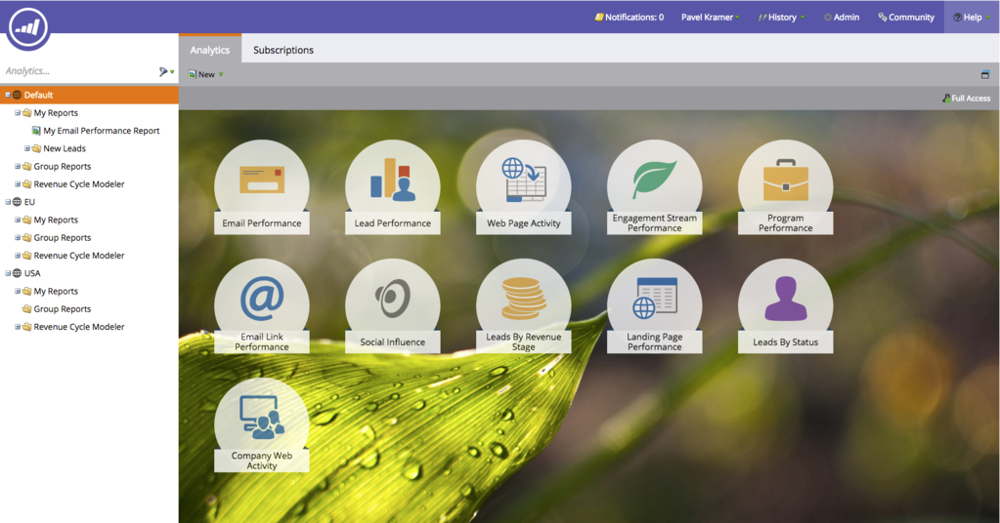
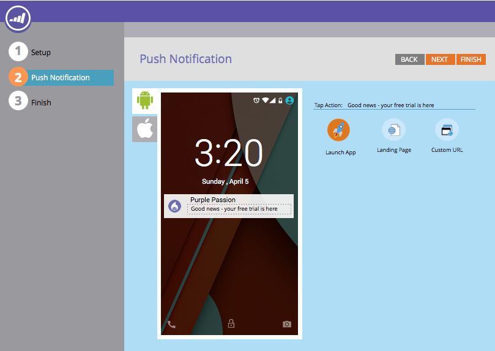

# Notes de mise à jour : avril 2015 {#release-notes-april}

Les fonctionnalités suivantes sont incluses dans la version d’avril 2015. Consultez votre édition Marketo pour connaître la disponibilité des fonctionnalités. Après la publication, veillez à revenir pour trouver des liens vers des articles détaillés pour chaque fonctionnalité.

## Redéfinition de l’écran d’accueil d’Analytics

[Redéfinition de l’écran d’accueil d’Analytics](/help/marketo/product-docs/reporting/basic-reporting/creating-reports/navigating-the-analytics-home-page.md)

>[!NOTE]
>
>Cette fonctionnalité sera publiée le mardi 28 avril.

La nouvelle page d’accueil [[!UICONTROL Analytics] &#x200B;](/help/marketo/product-docs/reporting/basic-reporting/creating-reports/navigating-the-analytics-home-page.md) permet un accès rapide pour l’exécution de rapports ad hoc sur tous les types de rapports disponibles.

En outre, l’organisation de rapports privée ou partagée est désormais disponible. Créez des rapports ou faites-les glisser dans votre dossier [!UICONTROL Mes rapports] pour empêcher d’autres utilisateurs de les afficher, de les modifier ou de les supprimer. [!UICONTROL Rapports de groupe] est partagé entre tous les utilisateurs.

## Marketo Mobile Engagement {#marketo-mobile-engagement}

**Engagement Mobile Marketo**

Avec Marketo Mobile Engagement, il est facile de fournir des expériences mobiles attrayantes. Créez des campagnes hautement personnalisées qui diffusent du contenu attrayant sans jamais avoir à compter sur une équipe de développement d’applications. De nouveaux filtres et triggers permettent d&#39;écouter et de répondre sur le canal mobile par le biais de notifications push.

## Intégration de l’accélérateur de leads [!DNL LinkedIn]

[Intégration de l’accélérateur de leads [!DNL LinkedIn]](/help/marketo/product-docs/demand-generation/social/social-functions/use-a-marketo-list-or-smart-list-as-a-linkedin-audience-segment.md)

Étendez votre stratégie d’entretien des prospects à l’affichage payant et aux publicités sociales. L’intégration réseau [ad](/help/marketo/product-docs/demand-generation/ad-network-integrations/add-linkedin-matched-audiences-as-a-launchpoint-service.md) avec [!DNL LinkedIn]’accélérateur de leads vous permet de créer en toute sécurité un segment d’audience dans [!DNL LinkedIn] en fonction des membres de n’importe quelle liste dynamique ou statique. Les membres d’un segment d’audience [!DNL LinkedIn] peuvent ensuite être encouragés avec une séquence d’annonces pertinentes.

## [!DNL Sales Insight] Marketo pour [!DNL Salesforce1] {#marketo-sales-insight-for-salesforce}

Vos fonctionnalités de [!DNL Sales Insight] préférées (flux de leads, meilleurs paris, moments intéressants et ajout à Marketo Campaign), toutes disponibles sur l’application [!DNL Salesforce1].

 

## Protocole RTP : analyse marketing basée sur les comptes client {#rtp-account-based-marketing-analytics}

**Protocole RTP : analyse marketing basée sur les comptes client**

Obtenez une visibilité instantanée des performances de vos listes de comptes nommés clés en fonction de chaque étape du cycle d’achat, avec le nouveau graphique de performances pour vos listes de comptes nommés. Le graphique montre l’étape de la visite, de l’organisation clé, de la sensibilisation à l’action, en fonction du nombre de visites et du statut du visiteur.
