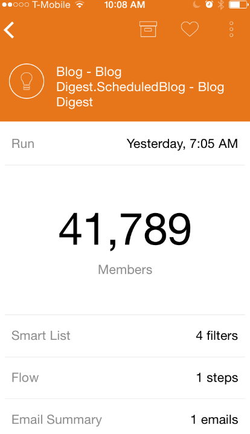

# Notes De Mise À Jour : Automne 2015 {#release-notes-fall}

Les fonctionnalités suivantes sont incluses dans la version de l’automne 15. Consultez votre édition Marketo pour connaître la disponibilité des fonctionnalités.

## S’abonner à une liste dynamique {#subscribe-to-a-smart-list}

[S’abonner à une liste dynamique](/help/marketo/product-docs/reporting/basic-reporting/report-subscriptions/subscribe-to-a-smart-list.md)

S’abonner à la liste dynamique permet aux marketeurs d’exporter une liste dynamique et de l’envoyer par e-mail aux parties prenantes qui n’utilisent pas Marketo, par exemple les équipes de vente ou de télémarketing.

L’exportation peut être planifiée tous les jours, toutes les semaines ou tous les mois, comporter une date de fin de diffusion et être personnalisée pour partager un nombre limité de colonnes.


Plusieurs abonnements peuvent être créés sur une liste dynamique. Le nombre d’abonnements est limité à 100 avec 100 000 prospects par abonnement, pour tous les espaces de travail et par instance Marketo.


## Objets personnalisés Marketo {#marketo-custom-objects}

[Objets personnalisés Marketo](/help/marketo/product-docs/administration/marketo-custom-objects/understanding-marketo-custom-objects.md)

Créez facilement des objets personnalisés à partir de l’interface utilisateur d’administration. Nous prenons actuellement en charge la possibilité de créer un objet personnalisé 1:N dans Marketo et de le connecter à un prospect ou à une entreprise.

>[!NOTE]
>
>Les objets personnalisés Marketo ne sont pas disponibles pour Spark.


## Marketo Insights pour [!DNL Google Chrome] {#marketo-insights-for-google-chrome}

[Marketo Insights pour  [!DNL Google Chrome]](/help/marketo/product-docs/marketo-sales-insight/msi-chrome-plugin/using-marketo-insights-for-google-chrome.md)

Nous sommes ravis d’annoncer la publication d’une mise à jour de notre extension [!DNL Google Mail] [!DNL Sales Insight] ! Affichez-le dans la [[!DNL Chrome Store]](https://chrome.google.com/webstore/detail/marketo-insights-for-goog/jjkfbhajlmoeegbjgjipliamplidmbjb).

Cette mise à jour comprend de nombreuses nouvelles fonctionnalités :

* Avant de s’engager, les vendeurs et vendeuses peuvent consulter des informations pertinentes sur leurs prospects directement dans [!DNL Google Mail], notamment les intitulés de poste, les profils Twitter, les informations sur l’entreprise, des photos, etc.
* Les vendeurs peuvent voir en temps réel avec quel contenu les prospects interagissent sur l’ensemble des canaux, comme les e-mails ouverts ou sur lesquels ils cliquent, les événements en ligne ou en personne auxquels ils assistent, les pages web visitées, les livres électroniques téléchargés, etc.
* Les e-mails envoyés via [!DNL Google Mail] sont consignés dans Marketo et suivis en temps réel. Cela permet aux vendeurs de voir quand les prospects consultent leurs e-mails afin qu’ils puissent faire un suivi au bon moment. Marketo [!DNL Sales Insight] for [!DNL Google Mail] permet également aux vendeurs de tirer facilement parti des modèles créés par le marketing pour envoyer de belles invitations, offres et autres types de contenu.


## Engagement mobile Marketo - Jetons, exemple d’envoi et prévisualisation {#marketo-mobile-engagement-tokens-send-sample-preview}

* [Jetons](/help/marketo/product-docs/mobile-marketing/push-notifications/configure-mobile-push-notification.md)
* [Envoyer un échantillon](/help/marketo/product-docs/mobile-marketing/push-notifications/send-a-push-notification-sample.md)
* [Prévisualiser](/help/marketo/product-docs/mobile-marketing/push-notifications/preview-a-push-notification.md)

Personnalisez facilement les notifications push avec des [jetons](/help/marketo/product-docs/mobile-marketing/push-notifications/configure-mobile-push-notification.md).


Vous pouvez également [prévisualiser](/help/marketo/product-docs/mobile-marketing/push-notifications/preview-a-push-notification.md) ou envoyer une notification push [exemple](/help/marketo/product-docs/mobile-marketing/push-notifications/send-a-push-notification-sample.md) avant de la déployer auprès des clients.


## Campagnes intelligentes en quelques instants {#smart-campaigns-in-moments}

[Campagnes intelligentes en quelques instants](/help/marketo/product-docs/core-marketo-concepts/mobile-apps/marketo-moments/understanding-moments/understanding-smart-campaign-cards.md)

Les statistiques sur les e-mails envoyés par le biais de campagnes intelligentes sont désormais disponibles dans Moments. Les autres fonctionnalités de cette mise à niveau sont les suivantes :

* Balayer vers la fin. Vous avez trop de cartes dans votre flux ? Vous pouvez maintenant les faire glisser !
* Envoyer un échantillon directement depuis l’écran de prévisualisation
* Détails de liste dynamique ajoutés aux cartes de programme d’e-mail
* Ajout de la prise en charge du statut Abandonné pour les programmes de messagerie



## RTP - Content Analytics et recommandations {#rtp-content-analytics-and-recommendations}

[Content Analytics](/help/marketo/product-docs/web-personalization/understanding-web-personalization/understanding-content-analytics.md) et Recommendations

RTP Content Analytics vous montre les performances de vos ressources de contenu web lors de visites régulières sur le web, ainsi que les visites générées par le moteur de recommandation de contenu de RTP.

* Identifiez le contenu qui présente les meilleures performances et qui attire le plus de prospects
* Augmentez votre consommation de contenu en activant le contenu dans le moteur de contenu prédictif de RTP pour recommander automatiquement le meilleur contenu aux bons visiteurs
* Explorez chaque ressource de contenu pour afficher des mesures, des graphiques et des performances plus détaillés

La page Assets de RTP est maintenant divisée en Content Analytics et Recommandations de contenu.

* **Content Analytics :** affiche les vues et les prospects directs de tout le contenu web découvert et défini, ce qui vous aide à analyser votre contenu le plus performant
* **Recommandations de contenu** : affiche les impressions et les clics provenant du contenu recommandé par le RTP et de l’attribution de prospect associée. Vous pouvez également modifier et activer les recommandations de contenu de cette page pour les recommandations [bar](/help/marketo/product-docs/predictive-content/enabling-predictive-content/enable-the-content-recommendation-bar.md) et [médias riches](/help/marketo/product-docs/predictive-content/enabling-predictive-content/enable-predictive-content-for-web-rich-media.md).

* Toutes les données de prospect direct de ces deux pages ont été mises à jour rétrospectivement depuis le début de l’année (1er janvier 2015).

## RTP - Cloner une campagne RTP {#rtp-clone-an-rtp-campaign}

[RTP - Cloner une campagne RTP](/help/marketo/product-docs/web-personalization/working-with-web-campaigns/clone-a-web-campaign.md)

Le clonage d’une campagne RTP permet de créer plus rapidement et plus efficacement des campagnes web plus personnalisées. Utilisez la fonction de clonage de la page de campagne de RTP pour copier les paramètres de la campagne et modifier le contenu pour l’optimisation du test de partage, ou clonez une campagne avec le même contenu et ciblez-la vers un autre segment. Créez des campagnes en quelques secondes !


## Améliorations de l’éditeur de texte enrichi {#rich-text-editor-improvements}

Nous apportons plusieurs améliorations à l’éditeur de texte enrichi. Après la publication de la mise à jour de l’éditeur en juillet, nous avons reçu d’excellents commentaires et avons pu appliquer ces modifications à cette mise à niveau. Beaucoup d’autres choses nous attendent au cours des prochains mois. Voici une liste des nouveautés du 4e trimestre :

* VML est désormais pris en charge dans votre code HTML :

```
<v:background xmlns:v="urn:schemas-microsoft-com:vml" fill="t">
<v:fill type="tile" src="<a href="https://i.imgur.com/YJOX1PC.png" rel="nofollow">https://i.imgur.com/YJOX1PC.png</a>" color="#7bceeb"/>
</v:background>
```

* Tout peut désormais être inséré dans un commentaire HTML valide (certaines syntaxes comme celles présentées ci-dessous ont été supprimées) :

`<!--[if gte mso 9]> <![endif]-->`

* Ne remplissez pas les cellules vides du tableau avec des `&nbsp;`

* Bouton Agrandir/Réduire ajouté à l’éditeur source d’HTML
* Les propriétés de tableau préexistantes sont désormais identifiées et affichées dans la boîte de dialogue Propriétés du tableau .
* Les deux lignes de boutons s’affichent désormais par défaut.
* L’éditeur accepte désormais n’importe quel élément (même les éléments obsolètes ou non standard) :

`<myCustomElement>Hello World!</myCustomElement>`

* L’éditeur accepte désormais tous les attributs (même les attributs obsolètes ou non standard) :

```
<myCustomElement myCustomAttribute="foo">Hello World!</myCustomElement>
<td background="someImage.png">
```

## [!DNL Microsoft Dynamics] - Valider la synchronisation {#microsoft-dynamics-validate-sync}

[[!DNL Microsoft Dynamics] - Valider la synchronisation](/help/marketo/product-docs/crm-sync/microsoft-dynamics-sync/sync-setup/validate-microsoft-dynamics-sync.md)

Ce nouvel outil d’administration exécute une série de vérifications pour vérifier si vos configurations de synchronisation ont été correctement configurées.


## Ajouter des champs à la synchronisation d’objet personnalisé CRM {#add-fields-to-crm-custom-object-sync}

Ajoutez facilement de nouveaux champs aux objets personnalisés synchronisés à partir de [!DNL Salesforce] et [!DNL Dynamics]. Vous pouvez désormais ajouter de nouveaux champs à la synchronisation de votre objet personnalisé sans désactiver ni activer l’ensemble de votre objet personnalisé.

## Modification des fonctions de sécurité {#changes-to-security-features}

* Les tentatives de mot de passe sont limitées à 5. Après la cinquième tentative, l’utilisateur sera verrouillé.
* La temporisation de session inactive peut désormais être configurée pour l’abonnement.


## Prise en charge d’IE 11 (et obsolescence de la prise en charge d’IE 9) {#ie-support-and-deprecating-support-for-ie}

Nous prenons désormais officiellement en charge le navigateur [!DNL Microsoft Internet Explorer] 11 et supprimons la prise en charge du navigateur [!DNL Microsoft Internet Explorer] 9.

## Prise en charge de l’interface utilisateur Lightning pour MSI {#lightning-ui-support-for-msi}

Le dernier package MSI sur App Exchange fonctionne avec les versions Lightning et Legacy de l&#39;interface utilisateur de [!DNL Salesforce].

## Nouveau plug-in [!DNL Dynamics] {#new-dynamics-plug-in}

Ce nouveau plug-in exécute diverses actions en mode asynchrone pour améliorer les performances.

## Recherche par URL de page de destination dans Design Studio {#search-by-url-of-landing-page-in-design-studio}

Dans la grille de page de destination de Design Studio, vous pouvez désormais rechercher vos pages de destination par URL de page. Il peut également être exporté.
