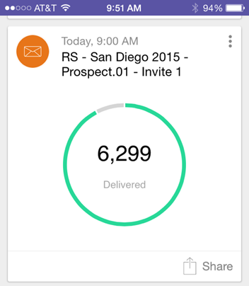
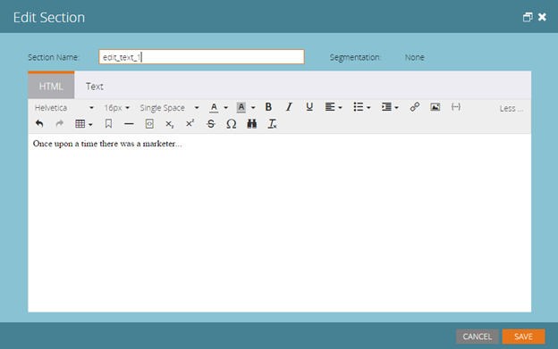

# Notes De Mise À Jour : Juillet 2015 {#release-notes-july}

## [!DNL Marketo Moments] {#marketo-moments}

Sorti le midi mais vous avez besoin de reprogrammer un email ? L’application [!DNL Marketo Moments], disponible à partir d’App Store ou de [!DNL Google Play], vous permet de voir comment vos campagnes par e-mail et événementielles se comportent en temps réel, ainsi que les performances à venir, à partir de votre téléphone iPhone, iPad ou Android.

## Mise à jour de l’éditeur de texte enrichi {#rich-text-editor-update}

Mise à jour de l’éditeur de texte pour moderniser l’aspect, notamment la mise en forme rationalisée du texte, la modification des images, l’insertion de liens et la modification dans HTML. L’éditeur HTML offre désormais une validation minimale, ce qui permet une modification de code moins restrictive.
`<iframe width="420" height="315" src="https://www.youtube.com/embed/LmmBN6IQrII" frameborder="0" allowfullscreen></iframe>` Cette mise à jour sera automatiquement déployée dans les jours qui suivront la publication de juillet. Ensuite, vous pourrez basculer entre les versions nouvelle et héritée de l’éditeur à partir de **[!UICONTROL Admin] > [!UICONTROL E-mail] > [!UICONTROL Modifier les paramètres de l’éditeur]**.

Mise à jour des boîtes de dialogue de lien et d’image.

Activez/désactivez la version de l’éditeur de texte.

## Authentification unique pour la délivrabilité des e-mails {#email-deliverability-single-sign-on}

Lorsque vous cliquez sur la mosaïque délivrabilité des e-mails, vous n’avez plus besoin de fournir vos informations de connexion.

## Hiérarchisation des campagnes {#campaign-prioritization}

Avez-vous mis en place plusieurs campagnes RTP personnalisées et remarqué que certaines d’entre elles peuvent se chevaucher ? Continuez et définissez une priorité pour laquelle le RTP des campagnes doit s’afficher par rapport aux autres.

## API d’entreprise {#company-api}

**Accès aux objets de la société via l’API REST** : l’API REST permet désormais d’accéder à l’objet Société Marketo (ou compte). Cela signifie que vous pouvez lire, mettre à jour et supprimer des objets société que vous avez créés dans Marketo et associer des prospects à ces sociétés à l’aide de l’API [!DNL Lead] mise à jour.

En savoir [plus]https://developer.adobe.com/marketo-apis/api/mapi/#tag/Companies) dans notre guide de référence pour l’API d’entreprise.

## Accéder à la délivrabilité des e-mails {#access-email-deliverability}

**Accéder à l’outil de délivrabilité des e-mails** : cette nouvelle autorisation permet aux administrateurs d’accorder aux utilisateurs l’accès à l’outil de délivrabilité des e-mails.
