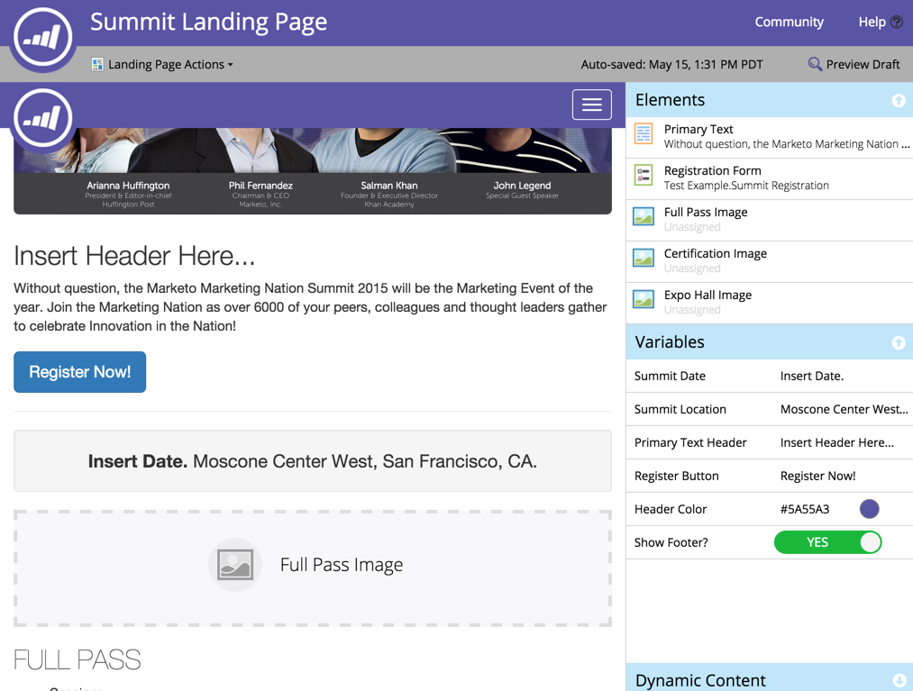

# Notes de mise à jour : mai 2015 {#release-notes-may}

Les fonctionnalités suivantes sont incluses dans la version de mai 2015. Consultez votre édition Marketo pour connaître la disponibilité des fonctionnalités. Après la publication, veillez à revenir pour trouver des liens vers des articles détaillés pour chaque fonctionnalité.

## Pages de destination entièrement réactives

[Pages de destination entièrement réactives](/help/marketo/product-docs/demand-generation/landing-pages/guided-landing-pages/create-a-guided-landing-page.md)

Nous publions un nouveau mode de modification de la page de destination et une nouvelle syntaxe de modèle. Contrairement à notre éditeur de page de destination « Structure libre », le nouvel éditeur de page de destination « Guidé » fournit une expérience d’édition structurée pour des pages de destination entièrement réactives.

## Abandonner le programme d’e-mail

[Abandonner le programme d’e-mail](/help/marketo/product-docs/email-marketing/email-programs/email-program-actions/abort-email-program.md)

Avez-vous cliqué sur Envoyer avant qu&#39;un programme de messagerie ne soit prêt à être lancé ? Appuyez sur les freins avec le nouveau bouton d’abandon du programme de messagerie. Les programmes de messagerie en cours d’exécution ne pourront plus fonctionner correctement.

## Délivrabilité des e-mails  {#email-deliverability}

Marketo exécutera désormais des vérifications automatisées hebdomadaires de [!DNL SPF] et de [!DNL DKIM] sur les domaines que vous avez ajoutés. Tenez-vous au courant en consultant vos notifications.

## Modification du comportement du modèle d’e-mail {#email-template-behavior-change}

Depuis cette version, les commentaires HTML valides sont désormais autorisés et non supprimés lors de la création de nouveaux e-mails.

## RTP : éditeur de segments par glisser-déposer {#rtp-drag-and-drop-segment-editor}

RTP : [Glisser-déposer l’éditeur de segment](/help/marketo/product-docs/web-personalization/using-web-segments/web-segments.md)

Faites glisser et déposez vos critères dans le créateur de segments, définissez la valeur, et vous êtes sur la bonne voie pour créer un segment en temps réel.

## RTP : recommandations du contenu prévisible {#rtp-predictive-content-recommendations}

[Recommandations de contenu prédictif](/help/marketo/product-docs/predictive-content/enabling-predictive-content/enable-predictive-content-for-web-rich-media.md)

Utilisez le machine learning et les algorithmes d’analyse prédictive de RTP pour recommander le contenu approprié au prospect approprié. Améliorez vos ressources de contenu visuellement avec des images et des descriptions textuelles et recommandez plusieurs ressources de contenu.
