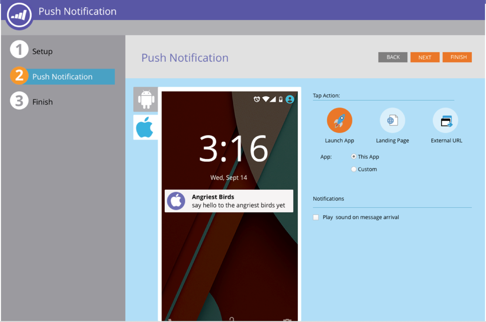

# Notes de mise à jour : automne 16 {#release-notes-fall}

Les fonctionnalités suivantes sont incluses dans la version de l’automne 16. Vérifiez la disponibilité de vos fonctionnalités dans l’édition Marketo. Cliquez sur les liens de titre pour afficher des articles détaillés pour chaque fonctionnalité.

## Contenu prédictif dans un email {#predictive-content-in-email}

Notre application de contenu prédictif dispose d’une nouvelle expérience utilisateur pour suivre, gérer et recommander votre contenu par le biais de nos algorithmes d’apprentissage automatique et de prédiction sur le web et les canaux de messagerie.

>[!NOTE]
>
>Tous les clients disposant du module Prédictif seront activés d’ici le 10 janvier.

Vous pouvez maintenant ajouter du contenu prédictif à votre email. Lorsque l’email est ouvert, le destinataire reçoit automatiquement le contenu pertinent et recommandé qui contribue à augmenter l’engagement du contenu et les conversions.

## [Conversions hors ligne Facebook ](/help/marketo/product-docs/demand-generation/facebook/understanding-facebook-offline-conversions.md) {#facebook-offline-conversions}

Avec l’intégration des conversions hors ligne de Facebook, les données de conversion dans Marketo (pour les pistes publicitaires) sont automatiquement renvoyées à Facebook afin que votre équipe publicitaire puisse optimiser ses dépenses publicitaires. Dans ce rapport Gestionnaire de publicités Facebook, les conversions hors ligne sont mises en surbrillance.

## [ID universel](/help/marketo/product-docs/administration/settings/using-a-universal-id-for-subscription-login.md) {#universal-id}

Un ID universel permet d’accéder à plusieurs abonnements Marketo à l’aide d’une seule connexion et de basculer rapidement d’un abonnement à l’autre. Vous pouvez utiliser un profil de communauté unique pour tous vos abonnements.

>[!NOTE]
>
>Contactez le support Marketo pour activer cette fonctionnalité.

## Améliorations marketing basées sur les comptes Marketo {#marketo-account-based-marketing-enhancements}

Désormais, vous pouvez affecter des équipes de compte à des comptes nommés dans le cadre du marketing basé sur les comptes (ABM), par exemple, le propriétaire du compte, le représentant du développement commercial, le représentant du développement commercial et le gestionnaire de compte. Vous pouvez également créer des listes de comptes spécifiques au propriétaire du compte et envoyer des rapports ABM hebdomadaires personnalisés à l’équipe du compte.

**API REST**

Cette version vous permet également de gérer des attributs de compte et des scores de comptes nommés dans ABM à l’aide de l’API REST Marketo. Pour plus d’informations sur les opérations de l’API, consultez le [site web des développeurs Marketo](https://experienceleague.adobe.com/en/docs/marketo-developer/marketo/rest/lead-database/named-accounts).

## [Améliorations du journal d’audit](/help/marketo/product-docs/administration/audit-trail/change-details-in-audit-trail.md) {#audit-trail-enhancements}

Le journal d’audit fournit un historique complet des modifications apportées à votre abonnement Marketo. Nous avons ajouté d’autres fonctionnalités de suivi pour les programmes, ainsi que des informations importantes sur les modifications pour les campagnes intelligentes, les listes dynamiques et les modifications apportées aux utilisateurs et aux rôles.

## [Nouvelles autorisations](/help/marketo/product-docs/administration/users-and-roles/descriptions-of-role-permissions.md) {#new-permissions}

**Rendre le courrier électronique opérationnel**

L’époque où vous deviez vous inquiéter de l’envoi d’emails transactionnels à des personnes de votre base de données qui se sont désabonnées était révolue. Vous pouvez maintenant spécifier quels utilisateurs peuvent rendre un email opérationnel ou modifier des emails opérationnels.

**Modifier les restrictions de campagne**

Pourquoi définir des [restrictions de campagne](/help/marketo/product-docs/administration/email-setup/enable-person-restrictions-for-smart-campaigns.md) si vous ne pouvez pas les appliquer ? Lorsque vous définissez Paramètres de limite de campagne pour limiter le nombre de personnes dans votre base de données pouvant être ciblées avec une seule campagne, vous avez désormais la possibilité de restreindre les utilisateurs qui peuvent remplacer ces paramètres lors de la planification d’une campagne.

## [Son pour les notifications push mobiles](/help/marketo/product-docs/mobile-marketing/push-notifications/configure-mobile-push-notification.md) {#sound-for-mobile-push-notifications}

Donnez à votre notification push iOS une plus grande richesse en activant le son. Cette nouvelle fonctionnalité vous permet de déclencher un son lorsque la notification push s’affiche sur le périphérique mobile.

>[!NOTE]
>
>* Les propriétaires d’appareils peuvent choisir d’empêcher la lecture des sons dans les paramètres de l’appareil, et les développeurs d’applications peuvent offrir aux propriétaires d’appareils des options dans l’application pour empêcher la lecture des sons.
>* Les sons sont automatiquement lus lorsqu’une notification push s’affiche sur un appareil Android.

## [ Sales Insight compatible avec Salesforce Encryption ](/help/marketo/product-docs/marketo-sales-insight/msi-for-salesforce/installation/install-marketo-sales-insight-package-in-salesforce-appexchange.md) {#sales-insight-compatible-with-salesforce-encryption}

Market Sales Insight est désormais compatible avec Salesforce Shield Encryption. Tous les clients Sales Insight doivent effectuer une mise à niveau vers ce dernier package géré (version 1.4359.2), qui est [ disponible sur Appexchange](https://appexchange.salesforce.com/listingDetail?listingId=a0N30000001SVZmEAO).

## [API de comptes nommés](https://experienceleague.adobe.com/en/docs/marketo-developer/marketo/rest/lead-database/named-accounts) {#named-accounts-apis}

Avec cette version, les utilisateurs de Marketo ABM peuvent gérer des comptes nommés via l’API des comptes nommés. Les utilisateurs peuvent créer, mettre à jour et supprimer des comptes nommés, ainsi que lire et mettre à jour des scores de compte nommé ABM.

## [Prise en charge de l’API de l’éditeur de messagerie électronique v2.0](https://experienceleague.adobe.com/en/docs/marketo-developer/marketo/email-scripting) {#email-editor-v-api-support}

Gérez les variables et les modules pour les emails au format v2.0 à l’aide de l’API REST Marketo.

## [Modifications de la synchronisation Marketo Salesforce](https://nation.marketo.com/docs/DOC-3840) {#changes-to-marketo-salesforce-sync}

L’intégration de Marketo Salesforce évolue afin d’améliorer la synchronisation des champs Marketo avec Salesforce. Désormais, au lieu d’avoir à synchroniser un grand groupe de champs dont vous avez ou non besoin, vous pouvez choisir les champs que vous souhaitez inclure. Pour plus d&#39;informations, consultez notre documentation ici : [https://nation.marketo.com/docs/DOC-3840](https://nation.marketo.com/docs/DOC-3840).
