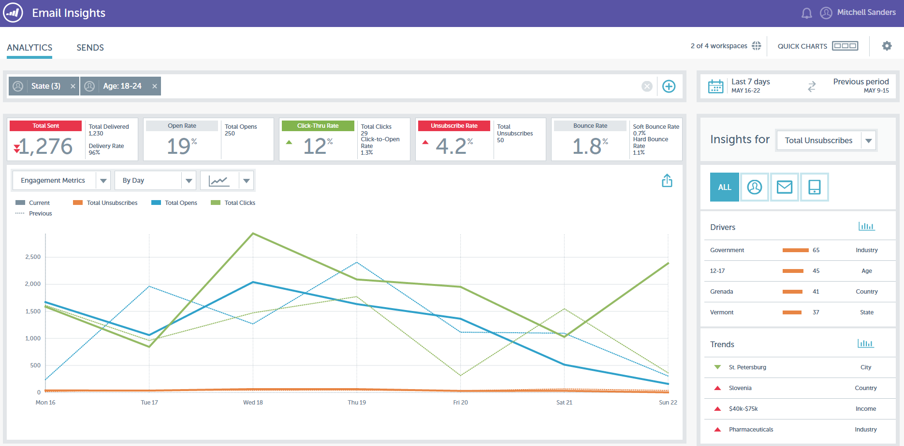

# Notes de mise à jour : printemps 2016 {#release-notes-spring}

Les fonctionnalités suivantes sont incluses dans la version du printemps 16. Cliquez sur les liens de titre pour afficher les articles détaillés de chaque fonctionnalité.

## [Email Insights](/help/marketo/product-docs/reporting/email-insights/email-insights-overview.md) {#email-insights}

Les informations sur les e-mails représentent une toute nouvelle expérience d’analyse des e-mails de données agrégées historiques, repensée de bout en bout pour des performances ultra-rapides. Il présente une toute nouvelle conception d’interface utilisateur optimisée pour s’adapter aux besoins et au workflow des e-mails marketing.

>[!NOTE]
>
>Nous lançons par lots, à partir du 3 juin, les Insights par e-mail à destination des clients. Notre objectif est d&#39;y parvenir au cours des prochains mois. Nous vous avertirons par e-mail lorsque vous serez activé.

## [Sélectionneur de modèle d’e-mail](/help/marketo/product-docs/email-marketing/general/email-editor-2/email-template-picker-overview.md) {#email-template-picker}

Créez de beaux e-mails à l’aide de nos nouveaux modèles de démarrage ! En outre, localisez rapidement vos modèles à partir de leurs miniatures actives.

>[!NOTE]
>
>Email Editor 2.0 (avec le sélecteur de modèle) sera progressivement déployé à partir du 3 juin. Nous terminerons le déploiement d’ici le 30 juin. Contrairement aux Insights sur les e-mails, vous ne serez pas averti lorsque vous aurez accès à . Pour savoir si c’est le cas, suivez les étapes décrites dans [cet article](/help/marketo/product-docs/email-marketing/general/email-editor-2/transitioning-to-email-editor-2-0.md).

## [Modification des e-mails : repensée](/help/marketo/product-docs/email-marketing/general/email-editor-2/email-editor-v2-0-overview.md) {#email-editing-re-imagined}

Un tout nouvel éditeur d&#39;email ! Utilisez la fonctionnalité légère de glisser-déposer pour ajouter et réorganiser du contenu. Les nouveaux éléments, notamment les images, les vidéos, les variables et les modules, amélioreront certainement votre expérience de modification. Consultez également les mises à jour de l’éditeur de code, du prévisualiseur et de la prise en charge du pré-titre.

## [Messages In-App Mobiles](/help/marketo/product-docs/mobile-marketing/in-app-messages/understanding-in-app-messages.md) {#mobile-in-app-messages}

Créez de superbes messages in-app pour votre application directement dans Marketo. Définissez exactement qui doit le voir et quand avec le programme de message in-app. Surveillez facilement ses performances avec le tableau de bord du programme.

## [Aucun fragment de code de brouillon](/help/marketo/product-docs/administration/users-and-roles/enable-no-draft-for-snippets.md) {#no-draft-snippets}

Les jours sont révolus où vous deviez tout approuver à nouveau chaque fois qu’un fragment de code était mis à jour. Avec l’option Sans brouillon, tous les e-mails et toutes les pages de destination utilisant un fragment de code recevront les mises à jour des fragments de code et conserveront leur statut précédent. Chaque fois que vous approuvez un fragment de code, vous avez le choix entre exécuter Pas de brouillon et tout mettre à jour, ou créer des brouillons. C&#39;est à toi de voir ! Aucun brouillon ne sera disponible pour tous les clients et sera contrôlé par une nouvelle autorisation dans Admin.

## [Page de destination, modèle de page de destination et API de formulaire](https://developers.marketo.com/blog/spring-2016-updates/) {#landing-page-landing-page-template-and-form-apis}

Les API REST Marketo prennent désormais en charge le contrôle des pages de destination, modèles de page de destination et formulaires Marketo. Les utilisateurs peuvent désormais créer, mettre à jour le contenu, approuver et supprimer ces ressources directement via l’API REST Marketo.

## [Liste autorisée IP pour l’accès à l’API](/help/marketo/product-docs/administration/additional-integrations/create-an-allowlist-for-ip-based-api-access.md) {#ip-allowlisting-for-api-access}

Tout comme la fonction de limitation des adresses IP pour les connexions des utilisateurs de Marketo, les administrateurs de Marketo placer sur la liste autorisée peuvent désormais configurer une place sur la liste autorisée d’adresses IP qui peut accéder aux API Marketo SOAP et REST, bloquant ainsi l’accès à partir d’adresses IP non autorisées. Cela ajoute une couche de sécurité à votre instance Marketo et garantit que l’accès à l’API ne peut se faire qu’à partir du réseau de votre entreprise. Des détails sur la configuration sont disponibles sur le site de documentation de [Marketo](/help/marketo/product-docs/administration/additional-integrations/create-an-allowlist-for-ip-based-api-access.md).

## [Nouveau Connecteur De Synchronisation Microsoft Dynamics Haute Vitesse](/help/marketo/product-docs/crm-sync/microsoft-dynamics-sync/microsoft-dynamics-sync-details/sync-status.md) {#new-high-speed-microsoft-dynamics-sync-connector}

Le nouveau connecteur Dynamics à grande vitesse offre des vitesses jusqu’à 20 fois plus rapides pour la synchronisation initiale et jusqu’à 5 fois plus rapides pour la synchronisation incrémentielle. Tous les nouveaux clients intégreront ce connecteur à la date de publication de la version. Nous le déploierons progressivement pour les clients existants pendant la période de publication estivale.

**Actualiser les données pour les nouveaux champs** : vous pouvez désormais activer de nouveaux champs de synchronisation à tout moment et toutes les valeurs de données de ce champ seront actualisées depuis [!DNL Dynamics] CRM vers Marketo. Plus de soucis à propos de devoir sélectionner tous les champs pendant la configuration initiale. Si vous désactivez un champ de synchronisation existant et que vous le réactivez ultérieurement, toutes les valeurs de données de ce champ sont actualisées à partir [!DNL Dynamics] CRM dans Marketo.

**Synchroniser le lead en tant que contact** : l’action de flux [!UICONTROL Synchroniser le lead avec Microsoft] offre une nouvelle option pour synchroniser le lead ou le contact.

**Onglet Administration des erreurs de synchronisation** : parcourez, recherchez ou exportez les prospects (et autres objets) dont la synchronisation a échoué avec des détails tels que l’opération, le sens, le code d’erreur et le message d’erreur.

**[!DNL Microsoft Dynamics]2016** Connector est entièrement certifié pour les versions [!DNL Dynamics] et [!DNL Online] de [!DNL On-premise] 2016.

**Les mises à jour des plug-ins sont désormais documentées :** consultez l’article [documentation des mises à jour des plug-ins](/help/marketo/product-docs/crm-sync/microsoft-dynamics-sync/marketo-plugin-releases-for-microsoft-dynamics.md).

## [Nom d’instance convivial](/help/marketo/product-docs/administration/settings/edit-subscription-settings.md) {#friendly-instance-name}

Aujourd’hui, il est difficile de faire la distinction entre les instances Marketo, par exemple, les instances Sandbox et de production. Cette fonctionnalité vous permet de savoir sur quelles instances vous travaillez actuellement.

## [Accès limité dans le temps pour les abonnements](/help/marketo/product-docs/administration/users-and-roles/managing-marketo-users.md) {#limited-time-access-for-subscriptions}

Aujourd’hui, les utilisateurs sont invités à s’abonner à Marketo pour une durée indéterminée. Cette fonctionnalité permet aux administrateurs d’inviter les utilisateurs à s’abonner pour une période limitée, par exemple 2 semaines ou 1 mois.

## [Grille d’objets personnalisés](/help/marketo/product-docs/administration/marketo-custom-objects/understanding-marketo-custom-objects.md) {#custom-objects-grid}

Vous pouvez désormais afficher le nombre d’enregistrements et de champs pour tous les objets personnalisés publiés.

## Activités personnalisées {#custom-activities}

Les administrateurs Marketo peuvent désormais définir et gérer leurs types d’activités personnalisés via le modéliseur de définition d’activité personnalisée Marketo. De la même manière que le Modeler d’objet personnalisé Marketo (et conjointement avec lui), les administrateurs peuvent désormais étendre le modèle de données pour répondre exactement aux besoins de leur entreprise. Des informations détaillées sur l’utilisation de cette fonctionnalité sont disponibles sur le site de documentation de [Marketo](/help/marketo/product-docs/administration/marketo-custom-activities/understanding-custom-activities.md).
