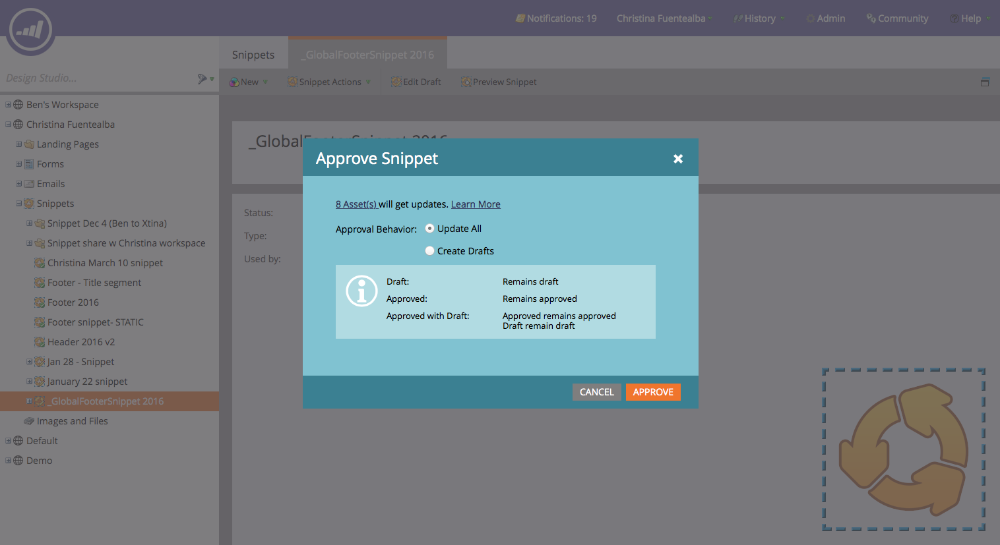

# Notes de mise à jour : printemps 16 {#release-notes-spring}

Les fonctionnalités suivantes sont incluses dans la version du printemps 16. Cliquez sur les liens de titre pour afficher des articles détaillés pour chaque fonctionnalité.

## [Email Insights](/help/marketo/product-docs/reporting/email-insights/email-insights-overview.md) {#email-insights}

Email Insights est une nouvelle expérience historique d’analyse des emails agrégés - repensée de bout en bout pour offrir des performances étonnantes et rapides. Il présente une nouvelle interface utilisateur entièrement optimisée pour répondre aux besoins et aux workflows des spécialistes du marketing par e-mail.

>[!NOTE]
>
>Nous lançons par lots Email Insights vers les clients, à compter du 3 juin. Notre objectif est d&#39;y parvenir au cours des prochains mois. Nous vous informerons par e-mail lorsque vous serez activé.

## [Sélectionneur de modèle d’e-mail](/help/marketo/product-docs/email-marketing/general/email-editor-2/email-template-picker-overview.md) {#email-template-picker}

Créez de beaux emails à l’aide de nos nouveaux modèles de démarrage ! De plus, localisez rapidement vos modèles à partir de leurs miniatures actives.

>[!NOTE]
>
>La version 2.0 de l’éditeur de courrier électronique (avec le sélecteur de modèle) sera progressivement déployée à partir du 3 juin. Nous allons terminer le déploiement d’ici le 30 juin. Contrairement à Email Insights, vous ne serez pas averti lorsque vous y aurez accès. Pour voir si vous le faites, suivez les étapes de [cet article](/help/marketo/product-docs/email-marketing/general/email-editor-2/transitioning-to-email-editor-2-0.md).

## [Edition d&#39;emails—Réinventé](/help/marketo/product-docs/email-marketing/general/email-editor-2/email-editor-v2-0-overview.md) {#email-editing-re-imagined}

C&#39;est vrai, un nouvel éditeur d&#39;email ! Utilisez la fonction de glisser-déposer légère pour ajouter et réorganiser du contenu. Les nouveaux éléments, y compris les images, les vidéos, les variables et les modules, ne manqueront pas d’améliorer votre expérience d’édition. Consultez également la prise en charge mise à jour de l’éditeur de code, de l’aperçu et du pré-titre.

## [Messages In-App mobiles](/help/marketo/product-docs/mobile-marketing/in-app-messages/understanding-in-app-messages.md) {#mobile-in-app-messages}

Créez des messages in-app étonnants pour votre application directement dans Marketo. Définissez exactement qui doit le voir et quand avec le programme de messages in-app. Contrôlez facilement ses performances à l’aide du tableau de bord du programme.

## [Aucun fragment de code](/help/marketo/product-docs/administration/users-and-roles/enable-no-draft-for-snippets.md) {#no-draft-snippets}

C&#39;est fini le jour où vous devez tout réapprouver chaque fois qu&#39;un fragment est mis à jour ! Avec No-Draft, tous les emails et landing pages utilisant un fragment de code recevront les mises à jour du fragment de code et conserveront leurs statuts antérieurs. Chaque fois que vous approuvez un fragment de code, vous avez la possibilité d’exécuter No-Draft et de tout mettre à jour ou de créer des brouillons. C&#39;est à toi de décider ! Aucun brouillon sera disponible pour tous les clients et contrôlé par une nouvelle autorisation dans l’administration.

## [Landing Page, Landing Page Template et API de formulaire](https://developers.marketo.com/blog/spring-2016-updates/) {#landing-page-landing-page-template-and-form-apis}

Les API REST Marketo prennent désormais en charge le contrôle des landing pages, des modèles de landing page et des formulaires Marketo. Les utilisateurs peuvent désormais créer, mettre à jour du contenu, approuver et supprimer ces ressources directement via l’API REST Marketo.

## [Liste autorisée IP pour l’accès à l’API](/help/marketo/product-docs/administration/additional-integrations/create-an-allowlist-for-ip-based-api-access.md) {#ip-allowlisting-for-api-access}

Tout comme la fonction d’liste autorisée d’adresses IP pour les connexions d’utilisateurs Marketo, les administrateurs Marketo peuvent désormais configurer une liste autorisée d’adresses IP qui peuvent accéder aux API Marketo SOAP et REST, bloquant ainsi l’accès à partir d’adresses IP non autorisées. Cela offre une couche de sécurité supplémentaire à votre instance Marketo et garantit que l’accès à l’API ne peut se produire que depuis le réseau de votre entreprise. Vous trouverez des détails sur la configuration sur le [site de documentation Marketo](/help/marketo/product-docs/administration/additional-integrations/create-an-allowlist-for-ip-based-api-access.md).

## [Nouveau connecteur de synchronisation Microsoft à haute vitesse ](/help/marketo/product-docs/crm-sync/microsoft-dynamics-sync/microsoft-dynamics-sync-details/sync-status.md) {#new-high-speed-microsoft-dynamics-sync-connector}

Le nouveau connecteur Dynamics à haute vitesse offre des vitesses jusqu’à 20 fois plus rapides pour la synchronisation initiale et jusqu’à 5 fois plus rapides pour la synchronisation incrémentielle. Tous les nouveaux clients embarqueront sur ce connecteur à la date de publication et nous le déploierons progressivement vers les clients existants au cours de la période de publication d’été.

**Actualiser les données pour les nouveaux champs** : vous pouvez désormais activer de nouveaux champs de synchronisation à tout moment et toutes les valeurs de données de ce champ seront actualisées de Dynamics CRM dans Marketo. Plus question de devoir sélectionner tous les champs lors de la configuration initiale. Si vous désactivez un champ de synchronisation existant et le réactivez ultérieurement, toutes les valeurs de données de ce champ seront actualisées de Dynamics CRM vers Marketo.

**Piste de synchronisation en tant que contact** : l’action de flux Piste de synchronisation vers Microsoft dispose d’une nouvelle option de synchronisation en tant que piste ou contact.

**Onglet d’administration des erreurs de synchronisation** : pistes de navigation, de recherche ou d’exportation (et autres objets) qui n’ont pas pu être synchronisées avec des détails tels que l’opération, la direction, le code d’erreur et le message d’erreur.

**Microsoft Dynamics 2016** : le connecteur est entièrement certifié pour les versions Dynamics 2016 en ligne et On-premise.

**Les mises à jour de plug-in sont maintenant documentées :** Voir l’ [ article sur la documentation des mises à jour de plug-in](/help/marketo/product-docs/crm-sync/microsoft-dynamics-sync/marketo-plugin-releases-for-microsoft-dynamics.md).

## [Nom d’instance convivial](/help/marketo/product-docs/administration/settings/edit-subscription-settings.md) {#friendly-instance-name}

Aujourd’hui, il est difficile de différencier les instances Marketo, par exemple les instances sandbox et de production. Cette fonctionnalité vous permet de savoir sur quelles instances vous travaillez actuellement.

## [Accès à temps limité pour les abonnements](/help/marketo/product-docs/administration/users-and-roles/managing-marketo-users.md) {#limited-time-access-for-subscriptions}

Aujourd’hui, les utilisateurs sont invités à s’abonner à Marketo pour une durée indéterminée. Cette fonctionnalité permet aux administrateurs d’inviter les utilisateurs à s’abonner pendant une période limitée, par exemple 2 semaines ou 1 mois.

## [Grille d’objets personnalisés](/help/marketo/product-docs/administration/marketo-custom-objects/understanding-marketo-custom-objects.md) {#custom-objects-grid}

Vous pouvez désormais afficher le nombre d’enregistrements et de champs pour tous les objets personnalisés publiés.

## Activités personnalisées {#custom-activities}

Les administrateurs Marketo peuvent désormais définir et gérer leurs types d’activité personnalisés via le modeleur Définition d’activité personnalisée de Marketo. Tout comme (et conjointement avec) le Modeler d’objet personnalisé de Marketo, les administrateurs peuvent désormais étendre le modèle de données en fonction de leurs besoins professionnels exacts. Pour plus d&#39;informations sur l&#39;utilisation de cette fonctionnalité, consultez le [site de documentation Marketo](/help/marketo/product-docs/administration/marketo-custom-activities/understanding-custom-activities.md).
