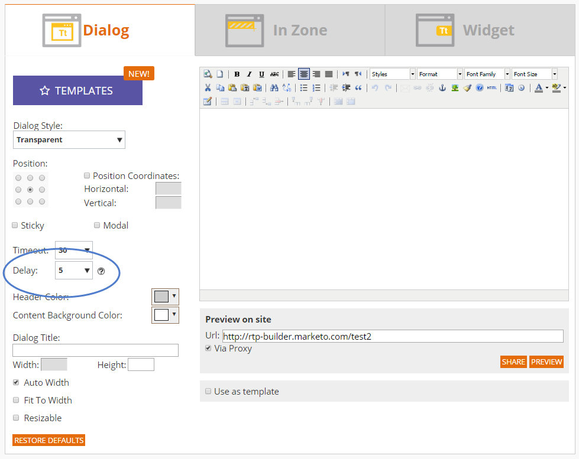

# Notes de mise à jour : Été 16 {#release-notes-summer}

Les fonctionnalités suivantes sont incluses dans la version de l’été 16. Vérifiez la disponibilité de vos fonctionnalités dans l’édition Marketo. Cliquez sur les liens de titre pour afficher des articles détaillés pour chaque fonctionnalité.

## [Account Based Marketing](https://docs.marketo.com/display/docs/account+based+marketing) {#account-based-marketing}

Marketo Account Based Marketing fournit toutes les informations essentielles sur une seule plateforme unifiée :

* **Target** - Découverte de compte, correspondance de piste vers compte et listes de comptes nommés
* **Engage** - Personalization basé sur les comptes, engagement cross-canal et workflows spécifiques aux comptes
* **Mesure** - Informations au niveau du compte et de la liste, note d’engagement du compte, impact sur le pipeline et les recettes

>[!NOTE]
>
>ABM est disponible en tant que module complémentaire de votre abonnement Marketo. Contactez votre représentant commercial pour sa mise en oeuvre.

## [Journal d’audit](/help/marketo/product-docs/administration/audit-trail/audit-trail-overview.md) {#audit-trail}

Le journal d’audit fournit un historique complet des modifications apportées à votre abonnement Marketo. Il créera des responsabilités parmi les utilisateurs et les administrateurs, aidera à identifier la cause d&#39;un comportement inattendu, et assurera la sécurité de savoir qui fait quoi et quand. Ces informations seront disponibles à tout moment et pourront être utilisées pour répondre à des questions telles que :

* Qu’est-il advenu de cette ressource ou de ce paramètre et qui l’a mise à jour pour la dernière fois ?
* Qu&#39;est-ce que l&#39;utilisateur X a fait ?
* Qui se connecte à notre compte ?

## [Intégration Marketo-Vibes SMS LaunchPoint](/help/marketo/product-docs/mobile-marketing/vibes-sms-messages/create-an-sms-message.md) {#marketo-vibes-sms-launchpoint-integration}

Créez facilement des SMS directement dans Marketo. Personnalisez et ciblez votre message à l&#39;aide de vos données Marketo riches, et surveillez facilement ses performances à l&#39;aide du tableau de bord des messages SMS.

>[!NOTE]
>
>Cette fonctionnalité nécessite que vous disposiez d’un compte SMS Vibes existant.

## [Améliorations des e-mails 2.0](/help/marketo/product-docs/email-marketing/general/email-editor-2/email-editor-v2-0-overview.md) {#email-enhancements}

**Variables au niveau du module**

Auparavant, toutes les variables spécifiées dans les Modèles d’e-mail 2.0 étaient de portée &quot;globale&quot;. Lorsque vous utilisez des variables dans des modules, cela n’est pas toujours souhaitable si vous envisagez d’utiliser plusieurs instances du module. Avec cette version, les variables peuvent désormais être spécifiées en tant que &quot;niveau module&quot;, ce qui vous permet d’indiquer que l’utilisateur doit être en mesure de définir des valeurs uniques pour chaque module dans lequel il est utilisé.

**Mises à jour de syntaxe**

* Vous pouvez désormais utiliser &quot;mktoAddByDefault&quot; sur les modules spécifiés dans les Modèles d&#39;email 2.0 afin d&#39;indiquer les modules qui doivent être affichés par défaut dans les nouveaux emails. Cela s’avère beaucoup plus pratique si vous créez un modèle d’email avec un grand nombre de modules.
* Sur les éléments d’image, vous pouvez maintenant spécifier si les propriétés &quot;height&quot; et &quot;width&quot; de l’élément d’HTML sous-jacent `` doivent être verrouillées ou modifiables pour l’utilisateur final. mktoLockImgSize=&quot;true&quot; entraîne le verrouillage de la hauteur/largeur (même si l’image est modifiée). De même, mktoLockImgStyle=&quot;true&quot; entraîne le verrouillage de la propriété &quot;style&quot;.

**Recherche de code**

Utilisez la nouvelle fonctionnalité de recherche pour rechercher et remplacer efficacement du contenu dans le code de votre email. Cette fonctionnalité est également disponible dans l’éditeur de modèles d’email.

**Prise en charge des jetons dans les éléments d’image**

Les jetons peuvent désormais être utilisés dans la zone &quot;URL externe&quot; de l’expérience d’insertion d’image ! Si vous avez spécifié des images avec `{{my.tokens}}`, vous pouvez désormais référencer ces jetons dans l’éditeur de messagerie 2.0. Notez que l’image apparaîtra toujours rompue dans le canevas de l’éditeur de messagerie 2.0. Mais vous verrez qu’elles sont rendues dans Aperçu et Envoyer un exemple avant d’envoyer votre email.

## Plusieurs noms de domaine {#multiple-branding-domains}

L’époque où les liens de suivi des emails ne pouvaient être marqués qu’avec un seul domaine de branding est révolue. Vous pouvez désormais ajouter plusieurs domaines de marque pour inspirer confiance aux consommateurs, créer une apparence plus rationalisée afin de vous concentrer sur la marque, améliorer la délivrabilité des emails et choisir, par email, le domaine de marque à utiliser pour les liens de suivi de chaque email.

## [Jetons de programme](/help/marketo/product-docs/demand-generation/landing-pages/personalizing-landing-pages/tokens-overview.md) {#program-tokens}

Nous avons créé un nouveau type de jeton pour les programmes. Vous pouvez désormais générer le nom, la description et l’identifiant du programme dans les ressources et les étapes de flux de campagne dynamique.

## [Clé d’entreprise](/help/marketo/product-docs/marketo-sales-insight/msi-outlook-plugin/authorize-the-marketo-outlook-plugin.md) {#enterprise-key}

Demander à chaque personne de votre équipe commerciale d’installer notre module externe Sales Insight for Outlook peut être fastidieux. Nous avons introduit une nouvelle méthode d’installation du module externe pour Outlook à distance à l’aide d’une clé d’entreprise. Envoyez à votre équipe informatique votre clé unique qui se trouve dans la section Marketo Sales Insight de l’administrateur et laissez-les effectuer le reste.

## [Campagnes de personnalisation Web](/help/marketo/product-docs/web-personalization/working-with-web-campaigns/create-a-new-dialog-web-campaign.md) {#web-personalization-campaigns}

Spécifiez un délai pour que les campagnes web réagissent sur votre site web.

## [Exportation de contenu Analytics et Recommendations](/help/marketo/product-docs/web-personalization/understanding-web-personalization/understanding-content-analytics.md) {#content-analytics-and-recommendations-export}

Affichez les données d’analyse de contenu et de recommandations hors ligne.

## [Prise en charge par l’API d’Email Editor 2.0](https://developer.adobe.com/marketo-apis/api/asset/) {#api-support-for-email-editor}

Les API Asset préexistantes, auparavant uniquement compatibles avec les modèles et les emails v1.0, sont désormais activées pour les ressources de messagerie v2.0.

## [Site des développeurs Marketo](https://experienceleague.adobe.com/fr/docs/marketo-developer/marketo/home) {#marketo-developers-site}

Nouveau et amélioré !

## [Paramètres de confidentialité](/help/marketo/product-docs/administration/settings/understanding-privacy-settings.md) {#privacy-settings}

Les marketeurs peuvent utiliser les paramètres de confidentialité pour décider d’effectuer le suivi des visiteurs à l’aide des fonctionnalités Munchkin et Web Personalization. Le niveau de suivi est contrôlé à l’aide du paramètre Ne pas suivre du navigateur, d’un cookie d’exclusion ou d’une adresse IP non spécifique. Ces méthodes peuvent avoir une incidence sur la valeur et la fonctionnalité de Marketo dans des zones spécifiques, mais si le marketeur ne change rien, la fonctionnalité de Marketo reste la même.

Cette fonctionnalité sera diffusée progressivement aux clients sur une période de six semaines. Si vous en avez besoin immédiatement, contactez le support Marketo.
