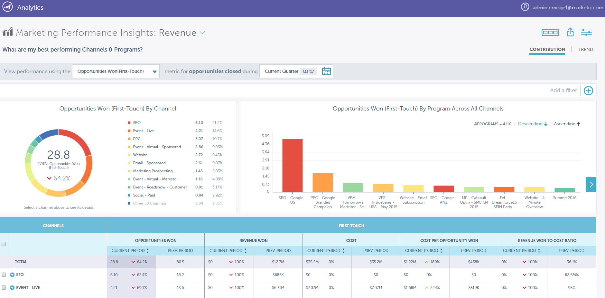

# Notes de mise à jour : hiver 18 {#release-notes-winter}

Les fonctionnalités suivantes sont incluses dans la version d’hiver 18. Vérifiez la disponibilité des fonctionnalités dans votre édition Marketo.

Cliquez sur les liens de titre pour afficher les articles détaillés de chaque fonctionnalité. **Remarque** : certaines fonctionnalités incluses dans cette version n’ont pas d’articles associés. Si une rubrique comporte plusieurs sous-titres, les liens y sont placés.

## Améliorations des performances et du débit de Campaign {#campaign-performance-and-throughput-enhancements}

Marketo tire parti de son architecture Big Data pour augmenter le débit des campagnes de déclenchement et améliorer le traitement des activités web, afin que vous puissiez réagir plus rapidement aux actions de votre audience.

## Améliorations de l’intégration CRM [!DNL Salesforce] de Marketo {#enhancements-to-marketo-s-salesforce-crm-integration}

Nous avons apporté deux améliorations à notre intégration CRM [!DNL Salesforce] :

* [Notifications Marketo Admin](/help/marketo/product-docs/core-marketo-concepts/miscellaneous/understanding-notifications/notification-types.md) pour certains échecs de synchronisation CRM (informations d’identification expirées, limites d’API atteintes, etc.)

* [Possibilité de désactiver les notifications par e-mail](/help/marketo/product-docs/crm-sync/salesforce-sync/setup/optional-steps/turn-off-email-notifications-to-lead-owner.md) aux propriétaires de lead lors de l’affectation de lead

Ces améliorations seront déployées au cours de 2018.

## [Marketo Performance Insights](/help/marketo/product-docs/reporting/performance-insights/performance-insights-overview.md) {#marketo-performance-insights}

>[!AVAILABILITY]
>
>[!UICONTROL Performance Insights] est un produit complémentaire. Veuillez contacter votre responsable du succès client ou votre chargé de compte Marketo pour obtenir un devis.

Découvrez comment vos campagnes et canaux influencent les résultats commerciaux grâce à l’analyse d’attribution, aux visualisations interactives et à un tableau de données détaillé.

## Améliorations marketing basées sur les comptes {#account-based-marketing-enhancements}

**[Hiérarchies ABM](/help/marketo/product-docs/target-account-management/target/named-accounts/tam-hierarchies.md)**

Pour les clients ABM disposant de [!DNL Salesforce] ou [!DNL Microsoft Dynamics], ABM hérite désormais automatiquement (et affiche) les relations parent-enfant établies dans le CRM. Vous pourrez utiliser ces relations à la fois dans le compte rendu des performances de cumul et l’exécution de campagne.

## Marketing par e-mail {#email-marketing}

**[Script de messagerie dynamique](/help/marketo/product-docs/email-marketing/general/using-tokens/create-an-email-script-token.md)**

Les scripts Velocity sont désormais pris en charge dans les e-mails utilisant du contenu dynamique. Combinez la vitesse et le contenu dynamique basé sur la segmentation pour créer des e-mails hautement personnalisés.

**Fuseau horaire du destinataire**

* **[Cadence mensuelle de l&#39;éducation](/help/marketo/product-docs/email-marketing/email-programs/email-program-actions/scheduling-with-recipient-time-zone/schedule-email-programs-with-recipient-time-zone.md)** : Nous avons ajouté la possibilité de planifier des programmes d&#39;éducation à une cadence mensuelle.

* **[Arrêter la diffusion](/help/marketo/product-docs/email-marketing/email-programs/email-program-actions/scheduling-with-recipient-time-zone/abort-delivery-of-email-programs-scheduled-with-recipient-time-zone.md)** : vous pouvez désormais arrêter tous les envois restants en cours d’exécution.

## Intégrations de réseau publicitaire {#ad-network-integrations}

**[Intégration du ciblage par liste de clients de Google](/help/marketo/product-docs/demand-generation/ad-network-integrations/add-google-customer-match-as-a-launchpoint-service.md)**

Grâce à cette intégration, vous pouvez envoyer une audience Marketo à Google pour qu’elle soit ciblée à l’aide de [!DNL Google AdWords], mais aussi cibler à nouveau des audiences sur [!DNL YouTube], Search et [!DNL Gmail].

**[[!DNL LinkedIn] Amélioration de l’API des audiences correspondantes](/help/marketo/product-docs/demand-generation/ad-network-integrations/add-linkedin-matched-audiences-as-a-launchpoint-service.md)**

Notre nouvelle API [!DNL LinkedIn] vous permet désormais de cibler à nouveau des personnes dans votre base de données Marketo sur plusieurs comptes [!DNL LinkedIn] Campaign Manager.

## Personnalisation Web {#web-personalization}

**Japanese Data Source for Web Personalization**

Marketo ajoute une source de données japonaise supplémentaire pour Web Personalization afin d’améliorer l’identification des visiteurs web (recherche IP inversée) et la personnalisation pour les visiteurs en provenance du Japon. Les noms des organisations s’affichent en japonais.

**[Création d’un segment Web avec des listes statiques](/help/marketo/product-docs/web-personalization/using-web-segments/create-a-segment-using-a-static-list.md)**

Web Personalization peut désormais personnaliser le contenu pour un visiteur web connu qui fait partie d’une liste statique définie dans les activités marketing (MLM). Grâce à cette amélioration, vous pouvez désormais commercialiser sur plusieurs canaux des listes statiques et cibler les personnes figurant sur ces listes avec du contenu personnalisé sur votre site web.

## IA dédiée au contenu {#contentai}

**Amélioration de l’algorithme prédictif**

Le contenu recommandé via les algorithmes ContentAI optimisés de Marketo génère jusqu’à deux fois plus de clics que le contenu aléatoire.

## Intégration {#integration}

**[Activer/désactiver l’API Campaign](https://developers.marketo.com/rest-api/assets/smart-campaigns/)**

Cette nouvelle API permet d’activer et de désactiver à distance les campagnes de déclenchement. Vous pouvez ainsi créer des modèles de programme entièrement automatisés. Créez un modèle de programme une fois, puis automatisez le clonage, les mises à jour de dérivés marketing et désormais l’activation/la planification des campagnes intelligentes.

## [!DNL ToutApp] {#toutapp}

**Mise à jour de la désinscription**

À compter du 1er mars 2018, tous les courriels envoyés à partir de [ToutApp.com](https://ToutApp.com) (et en utilisant le bouton « Envoyer par courriel avec [!DNL Tout] » en [!DNL Salesforce]) seront accompagnés d&#39;un lien de désabonnement en bas.

**Mise à jour du flux en direct**

Nous avons mis à jour l’aspect des onglets Engagement et Tâche afin qu’il soit plus facile et plus rapide pour les membres des ventes de répondre aux activités de leurs clients directement à partir du flux en direct.

**Mise à jour de la vue détaillée de personne**

La vue détaillée des personnes (PDV) améliorée offre une vue complète de vos contacts en rassemblant vos coordonnées [!DNL Tout] et [!DNL Salesforce] CRM.
