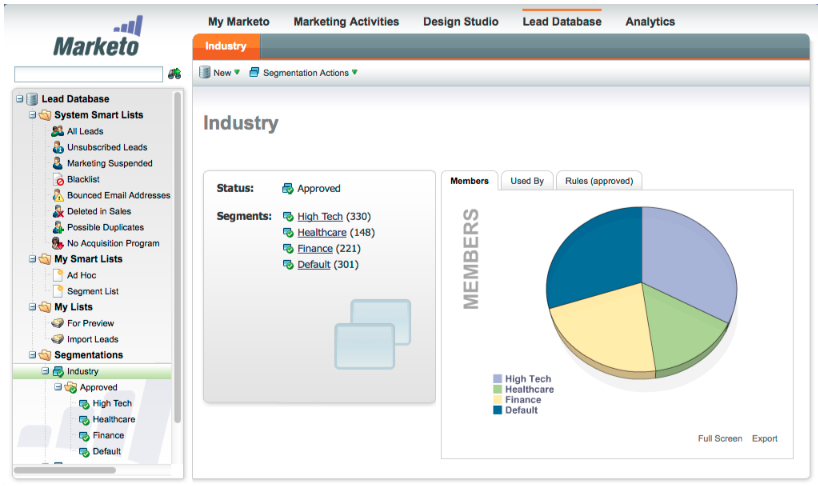
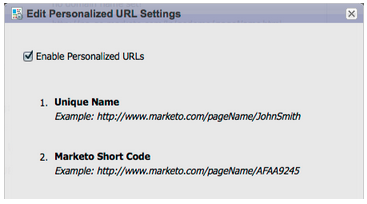
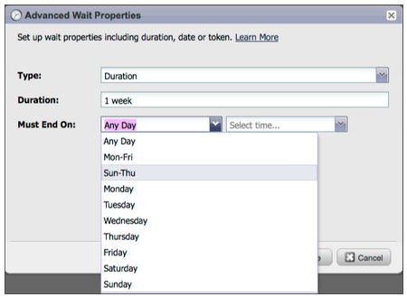
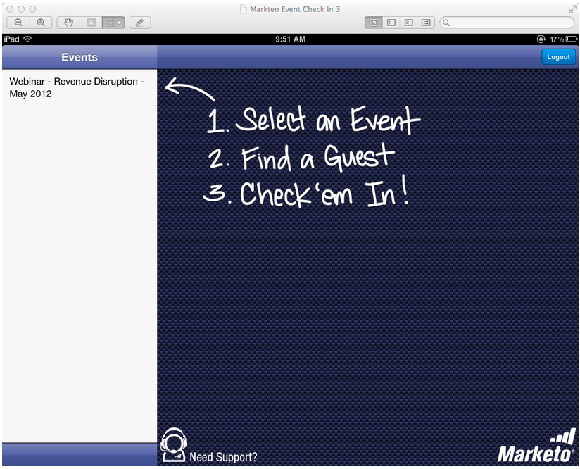
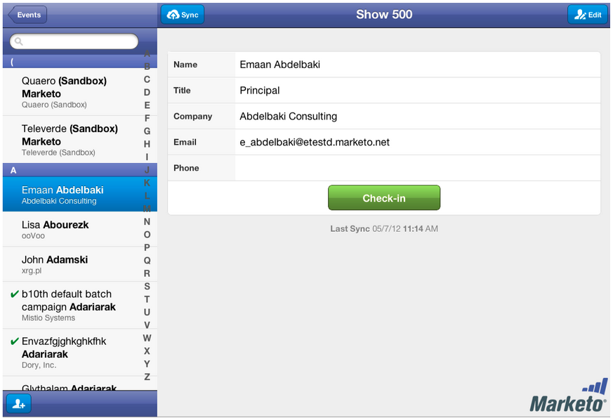
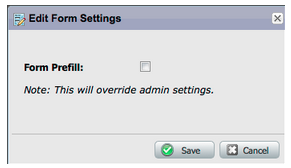
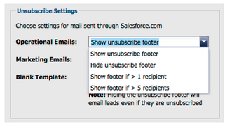
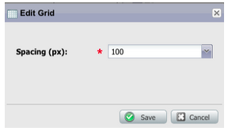
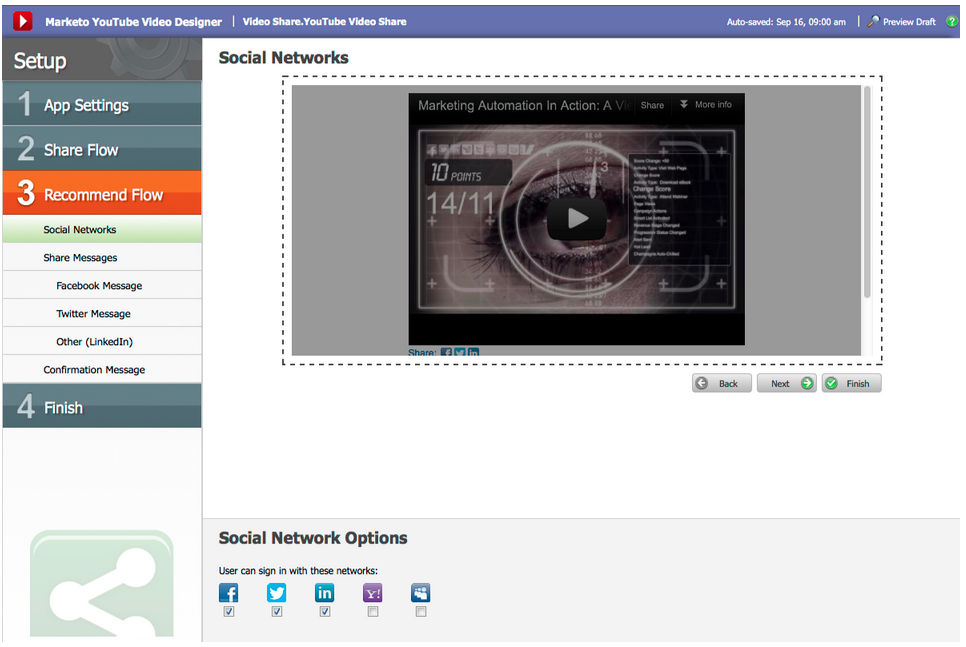
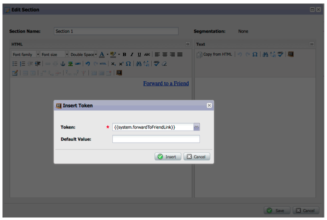

# 2012

## Janvier/Février 2012 {#january-february}

Les fonctionnalités suivantes sont incluses dans la version de janvier/février. Vérifiez la disponibilité des fonctionnalités dans votre édition Marketo. Revenez après la publication pour obtenir des liens vers la documentation détaillée sur les fonctionnalités.

## Contenu dynamique avancé {#advanced-dynamic-content}

_Disponible pour les versions Pro et Enterprise_

Grâce au contenu dynamique avancé, vous pouvez créer des communications par e-mail et des pages de destination attrayantes et pertinentes pour votre audience, sans avoir à créer plusieurs ressources pour le même message. Les prévisualiseurs mis à niveau vous permettent d’afficher chaque version unique en un seul écran.

## Segmentation  {#segmentation}

_Disponible pour les versions Pro et Enterprise_

La segmentation est un groupe de segments, qui sont un groupe ciblé d’individus auxquels vous commercialisez des produits. Les segments sont définis par des règles pilotées par des critères de filtre similaires aux listes dynamiques. Vos segments peuvent être basés sur des données démographiques, telles que la fonction ou le secteur, ou sur des comportements tels que les pages web visitées ou les liens ayant fait l’objet d’un clic.

## Extraits {#snippets}

_Disponible pour les versions Pro et Enterprise_

Stockez le contenu riche qui peut être utilisé à plusieurs reprises pour créer des e-mails et des pages de destination statiques ou dynamiques.

## PURLs {#purls}

_Disponible pour les versions Pro et Enterprise_

Grâce aux URL personnalisées (PURL), les marketeurs peuvent désormais créer des URL spécifiques aux contacts, afin de générer des réponses de personnalisation, de mesurabilité et d’effet élévateur dans les programmes marketing multi-touch pour les campagnes par publipostage direct et par e-mail.

## Compatibilité avec la directive UE sur la confidentialité {#eu-privacy-directive-support}

Les nouvelles fonctionnalités permettant de respecter les paramètres « Do Not Track » du navigateur incluent la possibilité de désactiver le suivi des leads anonymes ; cela facilite la conformité aux réglementations plus strictes de l’UE en matière de suivi de la confidentialité.

## Signature unique {#single-sign-on}

Les entreprises ont désormais la possibilité de prendre en charge une connexion transparente à l’application Marketo à l’aide de SAML 2.0 pour l’authentification unique à partir d’un portail d’entreprise.

## Mise à jour des éditeurs d’e-mail et de page de destination {#updated-email-and-landing-page-editors}

Les éditeurs d’e-mail et de page de destination ont été repensés avec une interface plus attrayante, une navigation intuitive et une expérience utilisateur considérablement améliorée, notamment :

HTML côte à côte et vue de texte

Le Nom de l’expéditeur, l’E-mail de l’expéditeur, la Réponse (NOUVELLE) et l’Objet s’affichent dans l’éditeur. Tous les autres paramètres sont accessibles via le bouton Modifier les paramètres .

## Prise en charge des navigateurs {#browser-support}

* [!DNL Mozilla Firefox] 9.0
* [!DNL Google Chrome] 16
* [!DNL Microsoft Internet Explorer] 8 &amp; 9
* **Remarque** : nous ne prenons plus en charge le [!DNL Internet Explorer] 7

## Gestion des programmes {#program-management}

La gestion simplifiée des programmes améliore la convivialité avec la suppression des jetons et la suppression plus facile des programmes.

## Se désabonner du rapport d’abonnement {#unsubscribe-from-subscription-report}

Vous pouvez maintenant vous désabonner de l’abonnement directement à partir du rapport !

## Mises à jour de Munchkin {#munchkin-updates}

Les nouveaux appels Munchkin réduisent les temps de chargement des pages web et offrent des performances plus cohérentes pour les événements de lien de clic.

## Analyse des opportunités du programme (RCA uniquement) {#program-opportunity-analysis-rca-only}

Comprendre la contribution marketing au chiffre d’affaires des opportunités individuelles

## Analyse des étapes du chiffre d’affaires du programme {#program-revenue-stage-analysis}

Intégrez insight à la vitesse d’avance des programmes en identifiant les programmes qui ont acquis les éléments rapides

## Mars 2012 {#march}

## Résoudre mes jetons {#resolve-my-tokens}

Mes jetons (jetons de programme) sont résolus lors de la prévisualisation d’un e-mail, de l’envoi d’un e-mail de test et de l’envoi d’un e-mail local via une seule action de flux. Vous n’aurez plus à créer une campagne intelligente dans le programme pour tester vos jetons My Tokens !

## Basculer entre la prévisualisation et l’éditeur dans les e-mails et les landing pages {#toggle-between-previewer-and-editor-in-emails-and-landing-pages}

En un seul clic, basculez facilement entre l’éditeur et la prévisualisation.

Éditeur vers le prévisualiseur :

Prévisualiseur en éditeur :

## Prévisualiseur de fragment de code {#snippet-previewer}

En sélectionnant « Aperçu du fragment de code » dans le menu, vous pouvez afficher un fragment de code, sans en faire un brouillon. De plus, si vous disposez d’un accès en lecture seule à un fragment de code partagé (via les espaces de travail), vous pouvez afficher le fragment de code avec cette action.

## Envoyer plusieurs e-mails de test {#send-multiple-test-emails}

Avec l’ajout de contenu dynamique, il devient de plus en plus important de prévisualiser et de tester toutes les variations des e-mails qui peuvent être envoyés à vos prospects. Lorsque vous prévisualisez à l’aide de l’option Afficher par détail de lead, vous avez la possibilité d’envoyer un test pour les variations de la liste de lead (jusqu’à 100 e-mails de test).

## Pages de destination dynamiques en fonction du paramètre d’URL {#dynamic-landing-pages-based-on-url-parameter}

Les prospects anonymes représentent une part importante de vos visites sur les pages de destination. Grâce à l’ajout de contenu dynamique et à la possibilité de placer une segmentation dans votre URL en tant que paramètre, vous pouvez afficher de manière dynamique le contenu de votre page de destination lorsqu’un prospect anonyme ou connu clique sur le lien.

## Avril 2012 {#april}

## Filtres et triggers de segmentation {#segmentation-filters-and-triggers}

Ciblez-vous systématiquement le même groupe de prospects ? Si tel est le cas, utilisez la segmentation dans vos listes intelligentes pour cibler les prospects. Grâce à la segmentation, l’ensemble de la base de données de prospects est toujours segmenté et peut être réutilisé dans l’ensemble de vos programmes par souci de cohérence. Les résultats de la segmentation sont extraits rapidement, car ils ne nécessitent pas que la liste dynamique s’exécute au moment de la requête.

## Insertion de valeurs externes dans le contenu de l’e-mail et d’autres étapes de flux, via les fonctionnalités étendues d’API {#insert-external-values-into-email-content-and-other-flow-steps-through-expanded-api-capabilities}

* L’API Request Campaign vous permet désormais d’envoyer des valeurs pour mes jetons pour cette exécution particulière de la campagne. Cela s’avère particulièrement utile pour renseigner le contenu d’e-mail via l’API
* Les nouvelles API Upload To List et Schedule Campaign prennent en charge les éléments ci-dessus pour les listes de leads et les campagnes par lots.

## Des e-mails de confirmation plus faciles pour [!DNL GoToWebinar] et [!DNL WebEx] (Adobe Connect et [!DNL ON24] bientôt disponibles !) {#easier-confirmation-emails-for-gotowebinar-and-webex-adobe-connect-and-on-coming-soon}

Nous avons simplifié l’URL de confirmation en créant un jeton de membre qui affiche l’URL de confirmation d’enregistrement unique pour chaque prospect. Vous n’aurez plus à créer cette URL à l’aide de jetons différents. Cette version est actuellement disponible pour les clients [!DNL GoToWebinar] et [!DNL WebEx]. Elle sera disponible pour Adobe Connect et [!DNL ON24] dans notre prochaine version.

## Téléchargez plusieurs images et fichiers en un seul clic ! {#upload-multiple-images-and-files-with-a-single-click}

Gagnez du temps et soyez plus efficace lors de l&#39;import d&#39;images et de fichiers dans Marketo ! Si vous utilisez [!DNL Firefox] ou [!DNL Google Chrome], vous pouvez sélectionner plusieurs fichiers et les charger tous en même temps. Bien qu’il n’y ait pas de limite au nombre de fichiers que vous pouvez charger, la taille individuelle maximale par fichier est de 50 Mo.

Remarque : pour le moment, cette fonctionnalité n’est pas prise en charge sur [!DNL Internet Explorer], en raison des limitations du navigateur.

## Déplacer le texte dans un e-mail {#move-text-in-an-email}

Vous pouvez réorganiser les blocs de texte dans un e-mail. Dans l’éditeur de texte, sélectionnez un bloc de texte ; lorsque vous cliquez sur l’icône d’édition, l’option permettant de déplacer le bloc vers le haut ou vers le bas s’affiche.

## [!DNL Salesforce] les références supprimées pour les utilisateurs non [!DNL Salesforce] {#salesforce-references-removed-for-non-salesforce-users}

Si vous ne synchronisez pas votre abonnement avec [!DNL Salesforce], vous remarquerez que tous les dossiers et actions de flux qui font référence à [!DNL Salesforce] sont supprimés.

## Marketo Revenue Cycle Analytics {#marketo-revenue-cycle-analytics}

**Étapes de point de contrôle améliorées dans le Modeler du cycle de revenus**

Permet aux utilisateurs de définir un ordre pour leurs règles de transition.

## Mai 2012 {#may}

## Reconception du rapport sur les performances des e-mails {#email-performance-report-redesign}

Remarque : le déploiement se fera par étapes, à partir de la version de mai

Nous avons accéléré l’exécution des rapports Performances des e-mails et Performances des e-mails de Campaign . Nous avons également amélioré les définitions de certaines mesures et consolidé les mesures « Messages envoyés » et « Leads envoyés » en une seule mesure, « Envoyés ». Nous avons fusionné « Messages diffusés » et « Leads diffusés » en « Diffusés ».

## Améliorations des étapes d’attente {#wait-step-enhancements}

À l’aide des nouvelles propriétés d’attente avancées, vous pouvez configurer l’étape d’attente dans une action de flux de campagne intelligente de sorte à « attendre jusqu’à » un jour spécifique de la semaine, le jour ouvrable suivant, une date ou une heure spécifique. Ces améliorations garantissent que vos e-mails de formation arrivent dans la boîte de réception pendant les heures de bureau.

Image 1. Spécifier l’étape d’attente pour se terminer un jour ouvrable

## Assets archivée masquée {#archived-assets-hidden}

Les ressources archivées sont automatiquement filtrées à partir des suggestions automatiques, des listes déroulantes et des rapports, ce qui facilite la recherche de ce que vous recherchez.

Image 2. Exemple de filtre d’e-mail archivé

## Nouvelle application d’enregistrement d’événement pour iPad {#new-event-check-in-app-for-ipad}

Simplifiez votre processus d’enregistrement d’événement à l’aide de notre nouvelle application iPad ! L’application Enregistrement des événements se synchronise avec votre programme Marketo et vous permet de vérifier facilement les inscrits à un événement, ainsi que d’ajouter de nouveaux prospects à la volée.

Nécessite iOS 5.1 ou une version ultérieure ; iPad uniquement.

Image 3. Page D’Accueil De L’Enregistrement D’Événement

Image 4. Enregistrement de l’événement : sélectionnez votre événement !

Image 5. Archiver

## URL de confirmation de webinaire améliorée {#enhanced-webinar-confirmation-url}

Désormais disponible pour [!DNL ON24] et Adobe Connect ! Insérez un lien unique dans l’e-mail de confirmation pour chaque participant enregistré à l’aide du nouveau jeton `{{member.webinar URL}}`. Les améliorations apportées à Adobe Connect comprennent également la possibilité d’activer/désactiver l’e-mail d’informations de compte Adobe qui inclut l’identifiant de connexion et le mot de passe de l’utilisateur.

Image 6. Faites participer les gens à votre webinaire

## Aperçu du modèle {#template-preview}

Vous recherchez un modèle spécifique lors de la création de votre e-mail ou page de destination, mais vous ne savez pas à quoi il ressemble ? Grâce à la nouvelle fonctionnalité d’aperçu de modèle, vous pouvez vérifier le modèle sélectionné avant d’enregistrer une nouvelle ressource.

Image 7. Prévisualiser le modèle sélectionné

## Préremplissage de formulaire configurable {#configurable-form-prefill}

Contrôlez le pré-remplissage des données de formulaire au niveau de l’abonnement et remplacez-les au niveau de la page de destination. Sans préremplissage, vous pouvez vous assurer que le prospect fournit les informations les plus récentes.

Image 8. Configuration du préremplissage de formulaire dans Admin

Image 9. Modifier le paramètre de préremplissage de formulaire sur une page de destination

## Marketo Treasure Chest {#marketo-treasure-chest}

Accédez aux fonctionnalités expérimentales développées par les ingénieurs Marketo pour améliorer votre expérience utilisateur. Cette version comprend la fonctionnalité d’annulation des e-mails, ainsi que la possibilité de saisir des commentaires et de collaborer avec d’autres utilisateurs sur vos pages de destination.

\

Image 10. Fonctionnalités de Manager Treasure Chest dans Admin

## Intégration CRM ®[!DNL Microsoft Dynamics] {#microsoft-dynamics-crm-integration}

Synchronisez les comptes, les contacts et les leads entre Marketo et [!DNL Microsoft Dynamics] CRM en ligne à l’aide de notre nouvelle intégration préconfigurée.

Image 11. configuration [!DNL Microsoft Dynamics]

## Améliorations de Marketo [!DNL Sales Insight] {#marketo-sales-insight-enhancements}

**Désabonner les options de pied de page**

Configurez quand et si le pied de page de désabonnement s’affiche pour les e-mails envoyés via [!DNL Sales Insight].

Figure 12. [!DNL Sales Insight] Paramètres dans Admin

## Dossiers pour les modèles de courriers électroniques de vente {#folders-for-sales-email-templates}

Vous pouvez désormais organiser les modèles d’e-mail partagés avec Marketo [!DNL Sales Insight] dans des dossiers spécifiés, ce qui facilite la recherche de l’adresse e-mail appropriée pour vos représentants commerciaux.

Image 13. Choisir un dossier pour vos e-mails

## Accéder à Opportunity Analyzer à partir de l’[!DNL Sales Insight] {#access-opportunity-analyzer-from-sales-insight}

Fournissez à vos représentants commerciaux insight les activités marketing qui stimulent l’engagement en leur permettant d’accéder directement à l’analyseur d’opportunités à partir de l’[!DNL Sales Insight] Marketo. Remarque. Nécessite une licence Revenue Cycle Analytics.

## Champ personnalisé pour le statut du contact {#custom-field-for-contact-status}

Vous pouvez désormais mapper un champ personnalisé dans [!DNL Salesforce] pour renseigner le champ Statut pour les contacts dans les vues Mes meilleurs résultats, Meilleurs résultats de mon équipe et Personnalisé .

Image 14. Mapper un champ personnalisé aux contacts

Voir Pages visitées par des prospects anonymes

Accédez aux pages affichées par un prospect anonyme à partir de la vue [!UICONTROL Activité web anonyme].

Image 15. Voir Activité web anonyme .

## Abonnement de lead et contact amélioré {#enhanced-lead-and-contact-subscribe}

Suivez un prospect ou contactez quelqu’un à tout moment à l’aide du nouveau bouton S’abonner de la page des détails de l’enregistrement.

## Juin 2012 {#june}

## Améliorations de la gestion des leads Marketo {#marketo-lead-management-enhancements}

### Renommer {#rename}

Vous pouvez renommer vos listes dynamiques, listes statiques et campagnes. Si vous utilisez ces ressources dans des filtres, des déclencheurs ou des flux, le nom y sera automatiquement mis à jour également. Vous avez toujours été en mesure de renommer vos e-mails, formulaires et dossiers.

En outre, nous avons amélioré la saisie et l’affichage du texte de description des ressources.

## Importer l&#39;appariement des champs {#import-field-mapping}

Nous avons rendu l’importation d’une liste dans Marketo beaucoup plus facile ! Au cours du processus d’importation, vous pouvez mapper le nom du champ Marketo au nom de l’en-tête de colonne dans le fichier d’importation. De plus, dans [!UICONTROL Admin] vous pouvez configurer des noms d’alias associés au nom du champ dans Marketo, en vous assurant que vos utilisateurs sélectionnent le champ correct à chaque fois.

Pendant que vous continuez à importer et à mapper des champs, Marketo mémorise et affiche les mappages pendant l’importation, pour plus de facilité d’utilisation. Et pour rendre la vie encore plus facile, vous pouvez cliquer sur l’en-tête Exemple de valeur pour afficher les différentes valeurs qui seraient renseignées dans le champ. Cela vous permet de mapper le champ correct à chaque fois.

## Page [!UICONTROL Résumé] pour les listes dynamiques et les listes statiques {#summary-page-for-smart-lists-and-static-lists}

Vous êtes-vous déjà demandé où sont utilisées vos listes ? Ou qui a créé la liste ou l’a modifiée pour la dernière fois ? La nouvelle page de résumé disponible sur les listes dynamiques et les listes statiques vous fournira ces détails importants.

Sur les pages de résumé du programme et de la campagne existantes, nous avons ajouté la date de création/l’utilisateur et les informations de date de dernière modification/l’utilisateur .

## [!UICONTROL Utilisé par] pour Assets {#used-by-for-assets}

Nous avons ajouté un nouvel onglet à notre ressource [!UICONTROL Résumé] Pages, appelé [!UICONTROL Utilisé par].

Exemple : [!UICONTROL utilisé par] pour les listes statiques

## Quadrillage de la page de destination {#landing-page-gridlines}

L’ajout d’un quadrillage de page de destination facilite considérablement l’alignement du texte, des graphiques et des formulaires sur votre page de destination. Activez et désactivez-la pour n’importe quelle page de destination donnée, et ajustez également la largeur entre les lignes.

## Leads bloqués dans les publipostages {#leads-blocked-from-mailings}

Lors de la planification d’une campagne, vous pouvez cliquer sur le lien pour afficher la liste des prospects qui sont bloqués de votre publipostage.

## Étape [!UICONTROL Attente] - Jeton de lead et mon jeton {#wait-step-lead-token-and-my-token}

Dans notre version de mai, nous avons ajouté des options avancées à l’étape de flux [!UICONTROL Attente]. Grâce à ces modifications, vous pouvez spécifier un jour ouvrable, une date et une heure. Dans cette version, nous avons ajouté la possibilité d’utiliser un jeton dans l’étape d’attente. Par exemple, vous pouvez utiliser `{{lead.Birthday}}` pour envoyer un e-mail le jour de leur anniversaire ou `{{my.Event Date}}` pour envoyer un dernier rappel de webinaire.

## [!UICONTROL Afficher] en tant que [!UICONTROL Miniatures] dans Design Studio {#view-as-thumbnails-in-design-studio}

Passez d’une liste d’images à une vue miniature.

Remarque : à compter de cette version, le tri précédent sur les grilles de liste dynamique ne s’appliquera pas à la prochaine liste dynamique que vous affichez. Par exemple, si vous triez une liste dynamique en fonction du nom de société, nous ne trierons pas automatiquement la prochaine liste dynamique affichée par ce même champ.

Rappel : la mise à niveau du rapport sur les performances des e-mails est en cours.

## Améliorations apportées à Marketo Revenue Cycle Analytics {#marketo-revenue-cycle-analytics-enhancements}

### Nouvelles mesures dans l’analyse des opportunités du programme  {#new-metrics-in-program-opportunity-analysis}

Vous pouvez désormais obtenir des informations sur le nombre moyen de contacts marketing avant la création ou la fermeture d’opportunités, ainsi que sur la valeur moyenne d’un contact marketing.

## Affichage de graphiques multiples {#displaying-multi-charts}

La fonction multigraphique permet d’afficher plusieurs graphiques dans un seul rapport de l’Explorateur du cycle du chiffre d’affaires. Vous pouvez, par exemple, utiliser cette fonctionnalité lorsque vous souhaitez afficher les mêmes données sur différents mois. Cette fonctionnalité vous évite également d’avoir à créer des filtres et des rapports distincts.

## Type de graphique de grille thermique  {#heat-grid-chart-type}

Les réseaux de chaleur vous permettent de visualiser les données afin d’identifier les modèles de performances marketing. Ce type de visualisation code les couleurs de vos résultats afin que vous puissiez afficher une analyse commerciale complexe dans une visualisation facile à comprendre.

## Type de graphique de dispersion  {#scatter-chart-type}

Les graphiques en nuages de points vous permettent de visualiser les données de plusieurs dimensions dans un graphique. Ce type de visualisation tracera une bulle sur un graphique en fonction des attributs utilisés. Vous pouvez ensuite utiliser une mesure pour coder la bulle en couleurs et/ou une mesure pour spécifier la taille de la bulle.

## Septembre 2012 {#september}

Cette version comprend des fonctionnalités sociales intégrées très attendues et des cadeaux de gestion des prospects ! Remarque : les fonctionnalités de réseaux sociaux sont disponibles sous la forme d’un module complémentaire ou dans le cadre de lots sélectionnés.

## Publication d’une vidéo YouTube avec le partage sur les réseaux sociaux {#publish-a-youtube-video-with-social-sharing}

Amplifiez l’audience de vos vidéos en encourageant vos visiteurs à les partager socialement, à l’aide du nouveau Partage de vidéo sur vos pages de destination.

## Ajouter un bouton Partager {#add-a-share-button}

Personnalisez entièrement les messages de partage et l&#39;apparence d&#39;un nouvel ensemble de boutons de partage sur les réseaux sociaux. De plus, capturez les données de profil social lorsque vos prospects partagent votre contenu.

## Connexion aux réseaux sociaux {#social-sign-on}

Bénéficiez d’insight et réduisez les frictions en permettant aux prospects de préremplir les formulaires avec des informations issues de leurs réseaux sociaux.

## Publier des pages de destination dans [!DNL Facebook] {#publish-landing-pages-to-facebook}

Étendez la portée de vos pages de destination en les publiant directement dans [!DNL Facebook], avec les applications de réseaux sociaux, les formulaires et toutes les fonctionnalités des pages de destination Marketo.

## Adaptateur d’événement [!DNL ReadyTalk] {#readytalk-event-adapter}

Connectez facilement un événement Marketo à une réunion [!DNL ReadyTalk]. Utilisez un formulaire Marketo pour capturer les personnes inscrites et les enregistrer automatiquement dans [!DNL ReadyTalk]. Une synchronisation bidirectionnelle permet aux informations de présence d’être renseignées dans Marketo.

## Microsoft [!DNL Dynamics] On-Premise {#microsoft-dynamics-on-premise}

Nous prenons désormais en charge Microsoft [!DNL Dynamics] 2011 On-Premise avec un déploiement orienté Internet.

## Webhooks (Treasure Chest) {#webhooks-treasure-chest}

Un Webhook est un rappel HTTP défini par l’utilisateur. Il s’agit d’un excellent moyen d’envoyer des données de Marketo vers tout autre service. Cette fonctionnalité est actuellement disponible dans le coffre au trésor et n’est actuellement prise en charge que dans les campagnes de déclenchement.

Voici quelques exemples d’utilisation des Webhooks : publication d’informations de nom d’utilisateur et de mot de passe sur un autre système pour créer un compte d’évaluation ; envoi d’un SMS lorsque vous obtenez un nouveau prospect.

## Mettre à jour pour obtenirPlusieursLeads API {#update-to-getmultipleleads-api}

De nouveaux critères de filtrage ont été ajoutés à l’appel API getMultipleLeads. Outre le filtrage par date, nous prenons désormais en charge des critères supplémentaires :

* Périodes
* Noms de listes statiques
* Tableaux de clés de lead

## Octobre 2012 {#october}

La version d’octobre comprend de nouvelles fonctionnalités plus intéressantes ! Les fonctionnalités de réseaux sociaux sont disponibles sous la forme d’un module complémentaire ou dans le cadre de lots sélectionnés.

## Importation de programmes et échange de programmes {#import-programs-and-program-exchange}

Un programme peut être importé d’un abonnement Marketo à un autre. Par exemple, vous pouvez créer un programme dans un sandbox, puis l’importer dans votre abonnement en direct. Vous pouvez également importer un programme préconfiguré à partir de la bibliothèque de programmes de Marketo.

>[!NOTE]
>
>Seuls les utilisateurs Marketo disposant d’une autorisation d’administration Marketo peuvent importer des programmes.
>
>Contactez l’assistance Marketo pour connecter un compte sandbox à votre abonnement actif.

## Notifications {#notifications}

Les notifications vous tiennent informé des événements système qui se produisent dans votre abonnement Marketo. Par exemple, le système vous avertit automatiquement lorsqu’une campagne échoue ou que la synchronisation de votre CRM requiert votre attention. Les notifications sont disponibles dans l’onglet Mon Marketo . De plus, vous pouvez vous abonner à une notification afin de pouvoir les recevoir en temps réel, dans votre e-mail.

## Sondages {#polls}

Créez des sondages pour impliquer vos prospects dans votre contenu ! Ils peuvent voter pour leur réseau ou film préféré, puis partager le sondage avec des amis via leurs réseaux sociaux. Vous pouvez rassembler des analyses riches sur ce pour quoi vos prospects ont voté.

## Suivi des activités sociales {#track-social-activities}

Découvrez qui partage votre contenu et vote dans vos sondages en créant des listes intelligentes basées sur des activités sociales spécifiques. Par exemple, créez une campagne intelligente pour augmenter le score des prospects qui partagent le plus votre contenu !

## Profils sociaux {#social-profiles}

Vous pouvez désormais rassembler des informations sur vos prospects lorsqu’ils partagent du contenu ou remplissent des formulaires à l’aide de leur profil de réseau social. Cela inclut les poignées [!DNL Facebook], [!DNL LinkedIn] et [!DNL Twitter], le nombre d’amis qu’elles ont, etc.

## [!UICONTROL Explorateur de revenus] Report Subscriptions {#revenue-explorer-report-subscriptions}

Créez des abonnements aux rapports et envoyez régulièrement des rapports [!UICONTROL Revenue Explorer] à vos principales parties prenantes, y compris les utilisateurs et utilisatrices ne faisant pas partie de Marketo. L’e-mail contient un aperçu de votre ou vos graphiques de données de rapport, ainsi qu’une feuille de calcul [!DNL Excel] contenant toutes les données du rapport.

>[!NOTE]
>
>Disponible uniquement pour les utilisateurs qui disposent de l’[!UICONTROL Explorateur de revenus] en achetant Revenue Cycle Analytics avec l’édition Enterprise ou Select.

## Décembre 2012 {#december}

La version de décembre comprend la fonctionnalité très attendue **Forward to Friend**, ainsi que plusieurs autres cadeaux ! Notez que les fonctionnalités marquées d’un astérisque (&#42;) sont disponibles uniquement dans l’édition Select et dans RCA (Revenue Cycle Analytics).

## Transférer à un ami {#forward-to-friend}

Activez le partage de contenu avec d’autres personnes en incluant un lien **Transférer à un ami** dans vos e-mails. L&#39;ajout de nouveaux filtres et triggers vous aidera à identifier vos influenceurs, en identifiant les utilisateurs qui ont transféré un e-mail, ainsi que ceux qui ont reçu les e-mails transférés.

Pour inclure une invitation **Transférer à un ami** dans votre e-mail, ouvrez-la dans l’éditeur et insérez le jeton de `{{system.forwardToFriendLink}}`.

Utilisez les déclencheurs et filtres correspondants pour identifier les utilisateurs qui ont utilisé le lien **Transférer à un ami** et ceux qui ont reçu l’e-mail.

## Autorisations d’administration granulaire {#granular-admin-permissions}

Notre dernière version vous donne un meilleur accès et contrôle sur les rôles [!UICONTROL Admin], en contrôlant l’accès à différentes fonctions dans la zone Marketo [!UICONTROL Admin] pour chaque rôle. Lorsque vous créez un rôle, vous pouvez affecter des fonctions [!UICONTROL Admin] spécifiques auxquelles le rôle peut accéder.

>[!NOTE]
>
>Par défaut, les rôles existants disposant de l’autorisation « [!UICONTROL Accès à l’administrateur] » ont accès à toutes les fonctions [!UICONTROL Administration] jusqu’à leur modification ou jusqu’à leur modification.

## Adaptateur [!UICONTROL BrightTALK] {#brighttalk-adapter}

L&#39;adaptateur Marketo [!UICONTROL BrightTALK] vous permet de capturer des informations de présence à partir d&#39;une webdiffusion en direct ou à la demande, directement dans un événement Marketo !

## [!DNL Sales Insight] Marketo pour [!DNL Microsoft Dynamics] {#marketo-sales-insight-for-microsoft-dynamics}

[!DNL Sales Insight] est maintenant disponible pour les clients [!DNL Microsoft Dynamics] !

## Synchronisation de l’opportunité [!DNL Dynamics] {#dynamics-opportunity-sync}

Synchronisez les données d’opportunité entre Marketo et [!DNL Microsoft Dynamics].

## Rapport Opportunités influencées par le marketing &#42; {#marketing-influenced-opportunities-report}

Affichez le pourcentage du pipeline et du chiffre d’affaires de votre entreprise qui a été influencé par vos programmes marketing. Dans l’**[!UICONTROL Explorateur de revenus]**, vous pouvez désormais créer des rapports personnalisés avec le nouveau point jaune « Opportunité influencée par le marketing » dans l’analyse des opportunités. Vous pouvez également utiliser les deux rapports suivants dans le dossier Standard :

* Influence marketing sur les opportunités créées
* Influence marketing sur les opportunités closes et confirmées

## Champs d’opportunité personnalisés dans l’analyse des opportunités du programme&#42; {#custom-opportunity-fields-in-program-opportunity-analysis}

Ajoutez des champs d’opportunité personnalisés pour enrichir vos rapports d’analyse des opportunités du programme dans [!UICONTROL l’Explorateur de revenus].

## Inspecteur de campagne {#campaign-inspector}

Vous êtes-vous déjà demandé quelles campagnes utilisent une action de flux spécifique, telle que [!UICONTROL Modifier le score] ou [!UICONTROL Demander la campagne] ? Ou lorsqu’un certain filtre est utilisé ? Le nouvel [!UICONTROL Inspecteur de campagne] (disponible à partir du Coffre au trésor) vous permet d’identifier ces campagnes, ainsi que les campagnes actives et les campagnes comportant des erreurs.

Accédez à **[!UICONTROL Admin]** > **[!UICONTROL Coffre au trésor]** pour activer l’**[!UICONTROL Inspecteur de campagne]**.

