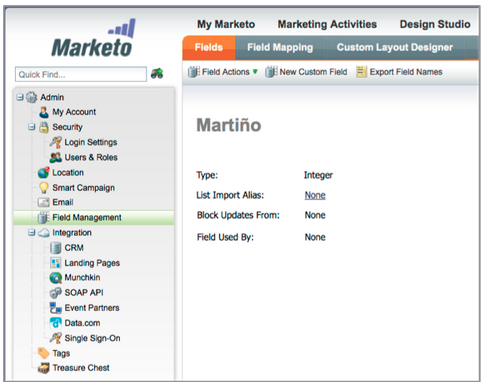
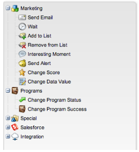
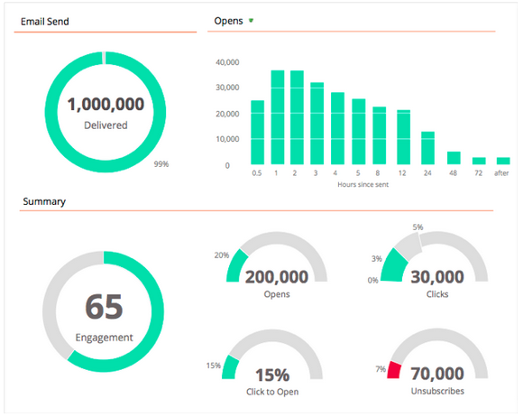

# 2013

## Janvier 2013 {#january}

La version de janvier étend notre offre sociale avec des **offres de référence**. En outre, les utilisateurs [!DNL Marketo Lead Management] peuvent définir leur fuseau horaire, leur langue et leurs préférences locales. Notez que les fonctionnalités marquées d’un &#42; sont disponibles uniquement dans l’édition Select.

## Offres de parrainage {#referral-offers}

Une **Offre de recommandation** incite vos prospects à recommander leurs amis. Créez des objectifs et des récompenses pour les parrainages réussis. Vous pouvez l’utiliser sur des landing pages, votre site web et même Facebook.

## Préférence de fuseau horaire {#time-zone-preference}

Vous pouvez modifier le fuseau horaire par défaut de votre compte Marketo personnel. Par exemple, même si la valeur par défaut de l’abonnement est Heure du Pacifique, vous pouvez la remplacer par Heure de l’Est pour votre propre compte.

## Sélectionner votre langue [!DNL Marketo Lead Management] {#select-your-marketo-lead-management-language}

Vous pouvez modifier la langue par défaut de votre compte utilisateur Marketo. Même si la valeur par défaut de l’abonnement est en anglais, vous pouvez la modifier en allemand ou en français pour votre propre usage.

## Messages d’erreur de formulaire multilingue {#multi-lingual-form-error-messages}

Lorsqu’un prospect remplit un formulaire Marketo, certains messages de validation sont automatiquement intégrés. Vous pouvez sélectionner une autre langue d’affichage pour ces messages d’erreur. Nous prenons maintenant en charge l’anglais, l’allemand et le français.

Exemple de formulaire en français :

## Sélectionnez votre langue [!DNL Sales Insight] ([!DNL Salesforce] uniquement) {#select-your-sales-insight-language-salesforce-only}

Si votre préférence de langue [!DNL Salesforce] est définie sur Français ou Allemand, Marketo [!DNL Sales Insight] respectera cette préférence. Téléchargez le dernier package MSI pour obtenir cette fonctionnalité (disponible la semaine du 14 janvier).

## Nom d’affichage du champ {#field-display-name}

Les noms d’affichage des champs peuvent afficher du texte dans différentes langues (par exemple, les caractères multi-octet sont pris en charge).

## Modifier les données du programme {#change-program-data}

L’étape de flux [!UICONTROL Modifier les données du programme] vous permet de modifier manuellement le statut [!UICONTROL Succès] et la [!UICONTROL Date de succès] d’un membre du programme par le biais d’une campagne. Vous pouvez utiliser cette étape de flux pour corriger une erreur ou pour modifier manuellement un membre qui n&#39;a peut-être pas participé au programme comme prévu.

## Février 2013 {#february}

La version de février comprend une fonctionnalité très demandée, la prise en charge de [!DNL Apple Safari] et d’autres petites améliorations.

## Soutien officiel à [!DNL Apple Safari] {#official-support-for-apple-safari}

Les dernières versions d’[!DNL Apple Safari] pour Mac et [!DNL Windows] sont entièrement prises en charge pour une utilisation avec la gestion des prospects Marketo. Remarque : [!DNL Safari] sur iOS n’est pas entièrement compatible.

## Améliorations des Webhooks {#webhooks-enhancements}

Webhooks est amélioré pour échapper les jetons dans l’URL/la payload et peut également mettre à jour les champs de prospect Marketo en analysant les réponses XML/JSON de systèmes tiers (non disponibles dans le [!DNL Spark SMB Edition]).

## Point d’entrée de l’API SOAP mis à jour {#updated-soap-api-endpoint}

Le point d’entrée préféré de l’API SOAP a été mis à jour. Il est affiché dans [!UICONTROL Admin] -> API SOAP. Mettez à jour vos appels pour utiliser ce nouveau point d’entrée. Les appels d’API vers l’ancien point d’entrée sont obsolètes, mais continueront à fonctionner. (API SOAP non disponible dans le [!DNL Spark SMB Edition])

## Prise en charge mobile des onglets [!DNL Facebook] {#mobile-support-for-facebook-tabs}

[!DNL Facebook] onglets publiés depuis Marketo détectent les appareils mobiles et les acheminent vers une page de destination. Cela permet de s’assurer que l’utilisateur obtient le contenu approprié sur les appareils mobiles sur lesquels les onglets [!DNL Facebook] ne sont pas pris en charge (disponibles dans [!DNL Spark], [!DNL Standard], [!DNL Select SMB Editions] et [!DNL Marketo Social Marketing]).

## Prochainement : prise en charge de plusieurs modèles {#coming-soon-support-for-multiple-models}

Nous jetons les bases pour soutenir de multiples modèles de cycle de revenus, avons voté #1 idée pour RCA dans la Communauté, dans une prochaine version. Dans cette version, vous remarquerez quelques modifications, y compris les filtres de liste dynamique et Ajouter des choix dans les étapes de flux pour prendre en charge la sélection d’un modèle et d’une étape. Nous déplaçons également les champs Étape de revenus de leads et Modèle de cycle de revenus de leads hors de l&#39;onglet Grille de leads de liste dynamique.

## Mars 2013 {#march}

Les fonctionnalités suivantes sont incluses dans la version de mars.

## Fichiers de calendrier Marketo {#marketo-calendar-files}

Créez un fichier de calendrier en tant que **Mon jeton** à utiliser dans vos e-mails de confirmation et de rappel d’événement. Ce fichier de calendrier intégré (par exemple, fichier .ics) effectue le rendu de tous les jetons, y compris Mes jetons et le jeton `{{member.webinar URL}}`.

## Attendre Jusqu’À +/- {#wait-until}

Créez des étapes d’attente pouvant s’exécuter un nombre spécifié de jours avant ou après un jeton de date. Par exemple, vous pouvez créer une étape d’attente qui attend 3 jours avant la date de l’événement, puis envoyer un rappel !

Vous pouvez créer une étape d’attente qui attend 14 jours avant l’anniversaire du prospect. En sélectionnant « Utiliser le prochain anniversaire de cette date », le système ignorera automatiquement l’année associée à la date et utilisera plutôt l’année civile en cours ou la prochaine année civile.

## Loteries sociales {#social-sweepstakes}

Un tirage au sort donne à vos prospects la chance de gagner un prix et de parler de vous à leurs amis. Vous sélectionnez des gagnants aléatoires parmi les participants et vous leur envoyez un e-mail.

## Formulaire supplémentaire [!UICONTROL &#x200B; Message d’erreur &#x200B;] Langues {#additional-form-error-message-languages}

Plus d’une douzaine de langues ont été ajoutées aux messages d’erreur du formulaire.

## Informations et alertes d’assistance {#support-news-and-alerts}

Restez connecté au service clientèle de Marketo en vous abonnant aux actualités et alertes de l’assistance pour les alertes P1, les problèmes connus, les conseils et astuces de nos experts de l’assistance et les mises à jour de l’assistance clientèle de Marketo.

## Avril 2013 {#april}

Les fonctionnalités suivantes sont incluses dans la version d’avril.

## Intégration [!DNL Box] {#box-integration}

Connectez Marketo à votre compte [!DNL Box] pour copier facilement des fichiers dans Design Studio.

## Plug-in [!DNL Gmail] {#gmail-plugin}

Si vous utilisez Marketo [!DNL Sales Insight], ainsi que [!DNL Gmail], vous pouvez installer notre nouveau plug-in [!DNL Gmail] via le magasin de [!DNL Chrome]. Le plug-in vous permet de consigner des messages avec Marketo, de charger des modèles d’e-mail Marketo et d’envoyer des messages à l’aide des fonctionnalités de suivi Marketo.

## Analyse d’e-mail {#email-analysis}

Créez des rapports d’e-mail avancés dans [!UICONTROL Revenue Explorer] tels que le rapport de grille thermique des clics d’activité. Ce rapport indiquera à insight le jour et l’heure où les utilisateurs cliquent sur des liens dans vos e-mails.

La fonctionnalité Analyse des e-mails dans son ensemble sera activée par phases en avril et mai, lorsque nous migrerons vos données d’e-mail de 2012 et 2013. En d’autres termes, certains clients auront accès à cette fonctionnalité plus tôt que d’autres.

## APIs du programme {#program-apis}

Prise en charge des programmes dans l’appel API SOAP, y compris l’accès en lecture seule aux données du programme, telles que : nombre d’adhésions au programme, acquis par, succès, paramètres, canaux, balises, jetons et coûts. Consultez la documentation de l’API SOAP pour plus d’informations.

## [!DNL ON24] Enhancement {#on-enhancement}

Le titre du poste et le nom de la société seront synchronisés avec [!DNL ON24] à partir de votre formulaire d’enregistrement Marketo.

## Mai 2013 {#may}

Les fonctionnalités suivantes sont incluses dans la version de mai.

## Fichiers de calendrier pour les pages de destination {#calendar-files-for-landing-pages}

Créez un fichier de calendrier en tant que jeton Mon jeton pouvant être ajouté à votre page de destination. Ce fichier de calendrier intégré (par exemple, fichier .ics) effectue le rendu de tous les jetons, y compris Mes jetons sur les pages de destination des ressources locales.

## Onglet du modèle d&#39;adhésion {#model-membership-tab}

Visualisez toutes les données des membres de votre modèle au même endroit afin de faciliter la surveillance et la résolution des problèmes. Le nouvel onglet [!UICONTROL Membres] est une vue en lecture seule disponible lorsque vous sélectionnez un modèle de cycle du produit approuvé.

## Arborescence d’actions de flux réorganisée {#reorganized-flow-action-tree}

Recherchez plus rapidement les actions de flux avec l’arborescence d’actions de flux nouvellement réorganisée.

## Actions de flux renommées {#renamed-flow-actions}

Modifier le statut de progression est désormais [!UICONTROL Modifier le statut du programme]. Modifier les données du programme est désormais [!UICONTROL &#x200B; Modifier la réussite du programme &#x200B;].

## Juin 2013 {#june}

Les fonctionnalités suivantes sont incluses dans la version de juin.

## Langues supplémentaires de l&#39;utilisateur {#additional-user-languages}

Affichez l’interface de gestion des prospects de Marketo dans la langue de votre choix, désormais en espagnol et en portugais.

## Interface utilisateur cobalt {#cobalt-user-interface}

Au cours des prochains mois, vous remarquerez un nouveau thème déployé dans différentes parties de l’application ; ayant un impact sur les fenêtres modales par exemple.

## Clonage de sous-dossiers {#subfolder-cloning}

Clonage de ressources dans des sous-dossiers.

## Modèles multiples {#multiple-models}

Cette fonctionnalité, qui est l’une des meilleures idées de Revenue Cycle Analytics (RCA) dans la communauté, vous permet de créer plusieurs modèles afin de mieux comprendre votre chiffre d’affaires funnel par ligne de produit, unité opérationnelle ou région. Les rapports Leads par étape de chiffre d’affaires, Analyseur de chemin de succès, Analyseur de programme et Explorateur de chiffre d’affaires prennent désormais en charge la possibilité de sélectionner un modèle spécifique pour le compte rendu des performances.

Par défaut, deux modèles sont disponibles pour Select SMB Edition et quinze pour Enterprise Edition. Vous pouvez également acheter des modèles supplémentaires.

## Juillet 2013 {#july}

Les fonctionnalités suivantes sont incluses dans la version de juillet, qui doit être déployée le vendredi 26 juillet.

## Widget de contenu épuisé dans le tableau de bord {#exhausted-content-widget-on-the-dashboard}

Fournit des informations sur le moment où les prospects épuiseront le contenu du flux. Le système vous fournira des informations sur le nombre de leads sur le point d’atteindre le contenu épuisé, ou sur la durée pendant laquelle les leads ont été épuisés.

## Limites de communication {#communication-limits}

Vous voulez arrêter de surenvoyer des leads ? Il est désormais facile de limiter automatiquement la fréquence à chaque individu. Il suffit de définir une limite de communication quotidienne et hebdomadaire, et le système fera le reste. Disponible dans Select, Enterprise et avec le package de module complémentaire pour les clients Standard.

## Interface utilisateur cobalt {#cobalt-user-interface-july}

Au cours des prochains mois, vous remarquerez que notre nouveau thème sera déployé dans différentes parties de l’application. Aucune fonctionnalité ne sera déplacée ou supprimée.

## Colonne de date du membre du programme {#program-member-date-column}

Affichez et triez la grille des membres en fonction de la date d&#39;ajout du prospect.

## Modifications de la vérification orthographique dans l’éditeur WYSIWYG {#changes-to-spell-check-in-wysiwyg-editor}

Le service utilisé par l’éditeur WYSIWYG pour la vérification orthographique a été arrêté. Nous avons supprimé le bouton Vérification orthographique de l’éditeur jusqu’à ce que nous trouvions un remplacement.

## Août 2013 {#august}

Les fonctionnalités suivantes sont incluses dans la version d’août 2013.

**E-mails texte uniquement**

Vous pouvez maintenant envoyer [uniquement la version texte](/help/marketo/product-docs/email-marketing/general/creating-an-email/create-a-text-only-email.md) d’un e-mail. Gardez à l’esprit que les liens ne seront pas décorés lors de l’utilisation de cette option.

## Améliorations du moteur d’engagement client {#customer-engagement-engine-enhancements}

### Ignorer le contenu épuisé {#ignore-exhausted-content}

Configurez le programme d’engagement pour [ignorer l’épuisement](/help/marketo/product-docs/email-marketing/drip-nurturing/using-engagement-programs/disable-and-enable-exhausted-content-notifications.md), y compris la suppression des notifications.

## Test des flux d’engagement {#engagement-stream-testing}

Utilisez la [nouvelle fonctionnalité de test](/help/marketo/product-docs/email-marketing/drip-nurturing/engagement-program-streams/test-an-engagement-stream.md) pour simuler un cast et tester le contenu nouvellement ajouté à un flux en direct.

## Tester un envoi personnalisé {#personalized-send-test}

Lorsque vous envoyez un test d’e-mail, vous pouvez sélectionner le nom d’un prospect pour personnaliser l’e-mail de test.

## Jetons système « Afficher l’e-mail en tant que page web » et « Se désabonner » {#view-email-as-web-page-and-unsubscribe-system-tokens}

Utilisez ces [nouveaux jetons](/help/marketo/product-docs/email-marketing/general/using-tokens/system-tokens-glossary.md) pour mieux contrôler leur emplacement dans les e-mails.

## Nettoyage automatique des campagnes à déclencheur {#automatic-trigger-campaign-cleanup}

Marketo vous avertira désormais régulièrement et [désactivera automatiquement les campagnes de déclenchement](/help/marketo/product-docs/core-marketo-concepts/smart-campaigns/using-smart-campaigns/automatic-trigger-campaign-cleanup.md) qui ne se sont pas exécutées au cours des six derniers mois.

## Amélioration de Marketo Financial Management {#marketo-financial-management-enhancement}

### Mise à jour des coûts du programme  {#program-cost-update}

La synchronisation des coûts du programme permet le suivi des coûts du programme sur plusieurs plateformes.

### Interface utilisateur cobalt {#cobalt-user-interface-august}

Nous poursuivons le déploiement de notre nouvelle interface Cobalt. Ce projet rendra tout ce qui se trouve dans Marketo super joyeux ! La mise à niveau se poursuivra tout au long de l’année.

## Septembre 2013 {#september}

Les fonctionnalités suivantes sont incluses dans la version de septembre.

## URL courtes {#shorter-urls}

Les URL des e-mails sont désormais plus courtes et plus agréables pour le destinataire, mais elles conservent leur fonctionnalité de suivi.

>[!CAUTION]
>
>Lorsque nous passerons aux URL courtes, les liens dans les e-mails envoyés avant la version de septembre expireront 90 jours après cette version.

Utilisez des données provenant d’objets personnalisés Marketo ou ajoutez une logique conditionnelle au contenu de votre e-mail à l’aide du langage de modèle Velocity.

## Remplacer Envoyer le test par Envoyer l’exemple {#change-send-test-to-send-sample}

Nous avons renommé l’action Envoyer le test en Envoyer l’exemple

## Personnalisé [!UICONTROL Envoyer un exemple d’e-mail] {#personalized-send-sample-email}

Lorsque vous envoyez un exemple d’e-mail, vous pouvez sélectionner le nom d’un prospect pour personnaliser l’exemple d’e-mail.

## Synchronisation de champ supplémentaire pour [!DNL GoToWebinar] {#additional-field-sync-for-gotowebinar}

Vous pouvez synchroniser le nom de la société et le titre du poste de votre formulaire Marketo avec [!DNL GoToWebinar]. Pour activer ces champs supplémentaires, accédez à Partenaires d’événement et cochez la case « Activer les champs supplémentaires ».

## Restreindre la connexion de l&#39;utilisateur à l&#39;authentification unique {#restrict-user-login-to-sso-only}

Configurez les abonnements pour autoriser uniquement les utilisateurs de Marketo à se connecter via l’authentification unique et non via l’écran de connexion classique

## Recherche des virus dans les fichiers téléchargés {#virus-scan-of-uploaded-files}

Les fichiers téléchargés dans Design Studio sont automatiquement scannés et bloqués s&#39;ils contiennent des virus.

## Exporter l&#39;analyseur d&#39;influence sur l&#39;opportunité {#export-opportunity-influence-analyzer}

Vous pouvez désormais exporter les données dans l’analyseur d’influence d’opportunité vers [!DNL Excel]. Chaque fichier [!DNL Excel] exporté contient toutes les interactions marketing pour tous les prospects (y compris ceux sans rôle dans l’opportunité) ainsi que toutes les opportunités sous le compte sélectionné dans l’analyseur. Les lignes d’opportunité sont surlignées en vert. Vous pouvez utiliser les fonctionnalités natives de filtrage des données de [!DNL Excel] si vous devez vous concentrer sur des prospects ou des activités marketing spécifiques.

## Paramètres d&#39;attribution du programme {#program-attribution-settings}

Vous pouvez modifier la façon dont Marketo lie les contacts et les opportunités pour les mesures d’attribution Première touche et Touche multiple, y compris la possibilité d’effectuer une attribution basée sur les comptes. Ces paramètres auront un impact sur les mesures d’attribution dans les rapports [!UICONTROL Explorateur de revenus] sous la zone Analyse des opportunités du programme et la zone Analyse des opportunités. Cela affectera également les mesures d’attribution dans l’analyseur de programme.

Vous pouvez modifier les paramètres d’attribution du programme selon l’un des trois choix suivants. La modification de ce paramètre ne modifie aucune donnée Marketo ou CRM ; elle modifie simplement la manière dont vos rapports s’exécutent et peut être annulée à tout moment.

Le paramètre Explicite examine uniquement les contacts ayant des rôles (comportement actuel). Implicite examinera tous les contacts associés au compte, quel que soit leur rôle. Nous vous recommandons vivement d’utiliser le mode Explicite si possible. L’utilisation d’Implicite peut créer des faux positifs, c’est-à-dire des personnes qui ont du crédit pour une opportunité même si elles n’ont aucune influence réelle sur celle-ci.

## [!UICONTROL Sales Insight] disponible en français et en allemand ([!DNL Salesforce] uniquement) {#sales-insight-available-in-french-and-german-salesforce-only}

Téléchargez la dernière version de Marketo Lead Management et de Marketo [!UICONTROL Sales Insight] à partir de [!DNL AppExchange] afin que vos vendeurs français et allemands puissent voir le contenu [!UICONTROL Sales Insight] dans leur langue préférée.

## Interface utilisateur cobalt {#cobalt-user-interface-september}

Au cours des prochains mois, un nouveau thème sera déployé dans différentes parties de l’application. Ce mois-ci, vous remarquerez peut-être d’autres nouvelles fenêtres modales bleues.

## Octobre 2013 {#october}

Les fonctionnalités suivantes sont incluses dans la version d’octobre 2013.

## templates.marketo.com {#templates-marketo-com}

[Templates.marketo.com](/help/marketo/product-docs/demand-generation/landing-pages/landing-page-templates/guided-landing-page-template-list.md) présente des modèles d’e-mails et de pages de destination (y compris des modèles d’e-mails mobiles réactifs) que vous pouvez télécharger à partir du [!DNL Marketo Program Library]. Nous ajouterons des modèles tous les mois, revenez souvent !

## developers.marketo.com {#developers-marketo-com}

[Developer.adobe.com](https://experienceleague.adobe.com/fr/docs/marketo-developer/marketo/home) est destiné aux développeurs qui souhaitent créer des intégrations dans Marketo. Vous pouvez référencer différentes options d’intégration, notamment les API Munchkin JavaScript, des exemples de code d’API SOAP, des Webhooks et des scripts d’e-mail. Un SDK Java est également disponible sur [GitHub](https://github.com/Marketo/SOAP-API-Java-Client).

## Mise À Jour De L&#39;Adaptateur D&#39;Événement [!DNL BrightTALK] {#updated-brighttalk-event-adapter}

Synchronisez les champs supplémentaires de [!DNL BrightTALK] vers Marketo, y compris le nom de la société, le titre de la fonction, le secteur et la taille de la société.

## Application d’enregistrement d’événement de tablette Android {#android-tablet-event-check-in-app}

Intégrez les inscrits à votre événement à l’aide de notre nouvelle application d’enregistrement basée sur Android disponible sur Google Play.

## Décembre 2013 {#december}

Les fonctionnalités suivantes sont incluses dans la version de décembre.

Après la publication, veillez à consulter l’onglet Nouvelle version dans la Communauté pour obtenir des articles détaillés de la base de connaissances pour chaque fonctionnalité !

## Programme d’e-mail {#email-program}

Envoyer un email n&#39;a jamais été aussi facile. Utilisez le nouveau [programme de messagerie électronique](/help/marketo/product-docs/email-marketing/email-programs/creating-an-email-program/understanding-email-programs.md) pour envoyer un message par lots, au lieu du programme par défaut. Définissez la liste dynamique, l’e-mail, planifiez-la, et vous êtes en congé !

Consultez également le nouveau [tableau de bord des mesures par e-mail](/help/marketo/product-docs/email-marketing/email-programs/email-program-data/view-the-email-program-dashboard.md) pour voir les performances de votre e-mail.

## A/B Testing pour l&#39;email {#email-a-b-testing}

Dans le nouveau programme d’e-mail, exécutez un test [A/B](/help/marketo/product-docs/email-marketing/email-programs/email-program-actions/email-test-a-b-test/add-an-a-b-test.md) sur un pourcentage de la population globale d’envoi d’e-mail. Choisissez parmi 4 types de tests différents : Objet, Adresse de l’expéditeur, Date/Heure et E-mail complet. Vous pouvez même choisir de promouvoir manuellement le gagnant ou de laisser le système le promouvoir en fonction d&#39;un critère de gain prédéfini. Le nouveau programme d’e-mail, y compris le test A/B, peut être imbriqué dans les Événements et le Programme par défaut pour rendre cet e-mail si simple à envoyer !

## Test du champion/du challenger d’e-mail {#email-champion-challenger-testing}

Le [test Champion/Challenger](/help/marketo/product-docs/email-marketing/general/functions-in-the-editor/email-tests-champion-challenger/add-an-email-champion-challenger.md) est similaire au test A/B, mais la différence est qu’il est utilisé pour les e-mails déclenchés et que vous n’envoyez pas automatiquement de gagnant. Ce test vous permet de remettre en question une méthode établie de faire quelque chose, appelée le Champion, et vous testez si c&#39;est toujours le meilleur en introduisant un Challenger. En outre, les tests d’e-mail Champion/Challenger peuvent être utilisés dans les flux du programme d’engagement.

## Détails du lead dans [!UICONTROL Analyse des e-mails] {#lead-details-in-email-analysis}

Nous avons ajouté des attributs de prospect et d’entreprise supplémentaires dans [!UICONTROL Analyse des e-mails]. Vous pouvez désormais afficher les statistiques de vos e-mails regroupées par nouveaux attributs tels que [!UICONTROL Secteur] et [!UICONTROL Source de lead].

## Adaptateur d&#39;événement [!DNL BrightTALK] amélioré {#enhanced-brighttalk-event-adapter}

Vous pouvez désormais extraire des inscrits dans Marketo à partir de votre canal et de votre événement [!DNL BrightTALK]. Vous pouvez utiliser ces informations pour informer d’autres campagnes marketing.

