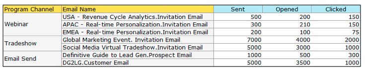
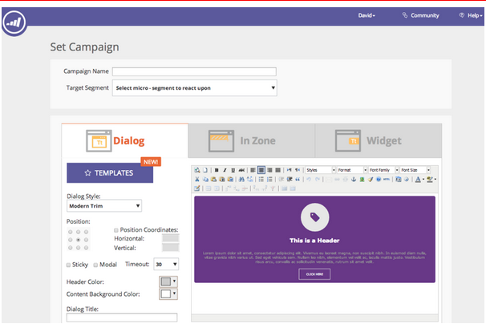
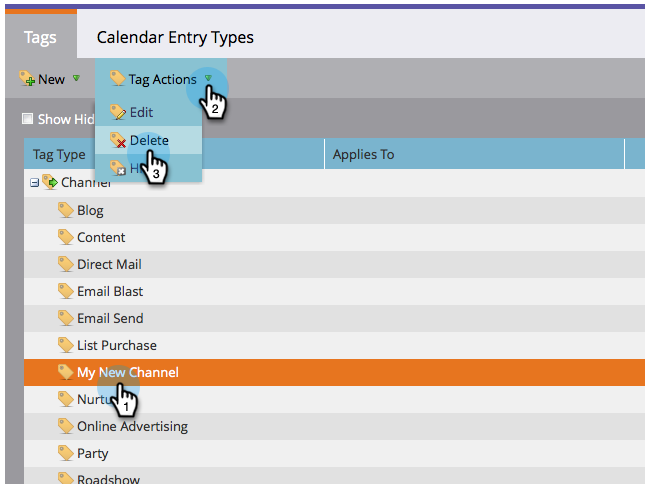
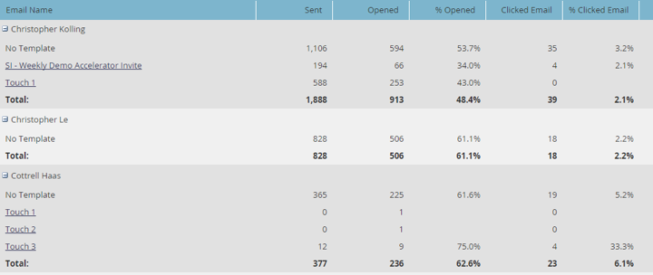
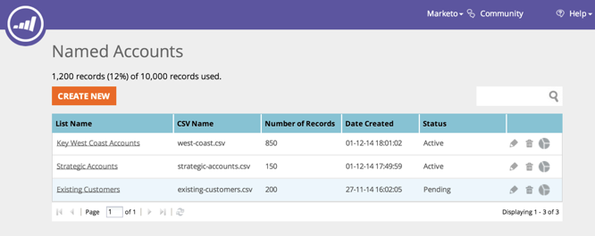
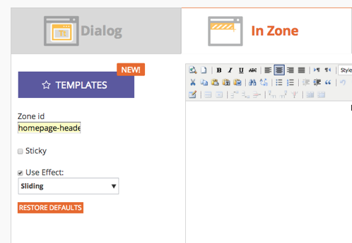

# 2014

## Janvier 2014 {#january}

Les fonctionnalités suivantes sont incluses dans la version de janvier 2014. Vérifiez la disponibilité des fonctionnalités dans votre [édition &#x200B;](https://www.marketo.com/pricing/).

## Formulaires 2.0 {#forms}

Attention : la documentation de Forms 2.0 sera bientôt disponible !

Prenez le contrôle du processus de création de formulaires et offrez une pause à vos développeurs web. Forms 2.0 est conçu pour permettre aux marketeurs de créer des formulaires fiables sur le plan visuel et fonctionnel, sans avoir besoin de connaissances en programmation.

**Donnez à votre Forms la retouche visuelle qu’elle mérite :**

La conception des thèmes, la personnalisation des boutons et les dispositions flexibles vous permettent de concevoir des formulaires d’aspect moderne qui s’adaptent parfaitement à l’aspect de votre site.

**Logique de la visibilité conditionnelle et de la page de suivi :**

Voulez-vous que le terme « État » s’affiche uniquement si un utilisateur sélectionne les États-Unis comme « Pays » ? Que diriez-vous de présenter différents livres blancs aux clients en fonction de la manière dont ils répondent aux questions sur votre formulaire ? Intégrez une logique conditionnelle à vos formulaires directement à partir de l’éditeur. Aucune [!DNL javascript] requise !

**Incorporez facilement Forms à vos propres pages de destination :**

L’époque où l’on levait le code HTML des formulaires placés sur les pages de destination de Marketo et on les déposait dans un [!DNL iFrame] est révolue. Il vous suffit d’attraper le code incorporé et de le placer sur votre page de destination où vous souhaitez que le formulaire s’affiche. Deux modes (normal et lightbox) vous offrent encore plus de flexibilité avec les formulaires Marketo sur votre site.

## Limites de communication pour le programme de messagerie {#communication-limits-for-email-program}

[Définissez des limites de communication sur un programme de messagerie](/help/marketo/product-docs/email-marketing/email-programs/email-program-actions/enable-disable-communication-limits-in-an-email-program.md) pour vous assurer de ne pas communiquer de manière excessive à votre base de données. Si une personne dépasse la limite définie, elle ne recevra pas l’e-mail.

## Champs supplémentaires dans l&#39;analyse de l&#39;adhésion au programme {#additional-fields-in-program-membership-analysis}

Vous pouvez désormais ajouter et regrouper vos mesures d’analyse de l’appartenance à un programme par attributs de prospect et d’entreprise. Par exemple, vous pouvez ajouter le champ Secteur pour afficher la répartition des membres et des succès de votre programme.

## Février 2014 {#february}

Les fonctionnalités suivantes sont incluses dans la version de février 2014. Consultez votre édition Marketo pour connaître la disponibilité des fonctionnalités. Après la publication, veillez à revenir pour trouver des liens vers des articles détaillés de la base de connaissances pour chaque fonctionnalité.

## [!UICONTROL score de l’engagement] comme critères gagnants {#engagement-score-as-winning-criteria}

[Utilisez le score d’engagement](/help/marketo/product-docs/email-marketing/email-programs/email-program-actions/email-test-a-b-test/define-the-a-b-test-winner-criteria.md) pour déterminer la variante gagnante de votre test de partage A/B ou de votre test Champion/Challenger. Le test doit durer au moins 24 heures pour obtenir un score d’engagement adéquat.

## Programme d&#39;e-mail [!UICONTROL onglet Résultats] {#email-program-results-tab}

[Affichez les résultats](/help/marketo/product-docs/email-marketing/email-programs/email-program-data/view-email-program-results.md) et les activités consignés pour le programme de messagerie.

## Personnes/[!UICONTROL Leads] interdits de publipostage {#people-leads-blocked-from-mailing}

[Cliquez sur le numéro personnes/prospects dont l’envoi a été bloqué](/help/marketo/product-docs/email-marketing/email-programs/managing-people-in-email-programs/define-an-audience-with-a-smart-list.md) pour savoir qui ne recevra pas l’e-mail en raison d’un désabonnement, d’une mise sur liste noire, d’une adresse e-mail non valide ou vide ou d’une suspension du marketing.

## Exporter les données du programme de messagerie {#export-email-program-data}

[Exporter les mesures e-mail vers [!DNL Excel]](/help/marketo/product-docs/email-marketing/email-programs/email-program-data/export-email-program-dashboard-to-excel.md), y compris les données de variante de test AB.

## [!UICONTROL score de l’engagement] dans le rapport [!UICONTROL performances du volet Engagement] {#engagement-score-in-engagement-stream-performance-report}

Nous avons ajouté le score de l’engagement au rapport [[!UICONTROL Performances du flux d’engagement] &#x200B;](/help/marketo/product-docs/email-marketing/drip-nurturing/reports-and-notifications/engagement-stream-performance-report.md) pour vous aider à évaluer l’efficacité du contenu de votre programme d’engagement.

## Détails des programmes dans l’analyse des e-mails {#program-details-in-email-analysis}

Vous pouvez désormais regrouper vos mesures d’e-mail par nom de programme, canal et balises. Le nom du programme est ajouté au champ Nom de l’e-mail lorsque l’e-mail est une ressource locale du programme. Le nouveau champ Nom du programme affiche le nom du programme de la campagne intelligente qui a envoyé l’e-mail. Elle peut être différente du programme dans le champ Nom de l’e-mail si l’e-mail est une ressource locale d’un autre programme.

## Mettre à jour vers les filtres de lien de clics et le déclencheur {#update-to-clicks-link-filters-and-trigger}

Les noms de filtre et de déclencheur suivants ont été mis à jour :

* Clics Lier à [!UICONTROL Clics sur le lien d’une page web]
* A cliqué sur Lien vers [!UICONTROL A cliqué sur Lien sur la page web]
* Non cliqué Lier à [!UICONTROL Non cliqué Lien sur la page web]

## Améliorations des formulaires 2.0 {#forms-enhancements}

Cette version de Forms 2.0 contient plusieurs mises à jour relatives à la « qualité de vie ». Outre l’activation du profilage progressif sur les formulaires incorporés, nous avons apporté des modifications aux workflows et à l’expérience utilisateur afin de faciliter l’utilisation des fonctionnalités plus avancées de l’éditeur, [notamment les règles de visibilité](/help/marketo/product-docs/demand-generation/forms/form-fields/dynamically-toggle-visibility-of-a-form-field.md), les pages de remerciement avancées et les champs masqués.

## Mars 2014 {#march}

Les fonctionnalités suivantes sont incluses dans la version de mars 2014. Consultez votre édition Marketo pour connaître la disponibilité des fonctionnalités. Après la publication, veillez à revenir pour obtenir des liens vers les articles de la base de connaissances pour chaque fonctionnalité.

## Bouton d’actualisation du tableau de bord du programme de messagerie électronique {#email-program-dashboard-refresh-button}

Utilisez le bouton [actualiser](/help/marketo/product-docs/email-marketing/email-programs/email-program-data/use-the-email-program-dashboard.md) pour obtenir des mesures par e-mail à la minute près concernant l’envoi de vos e-mails ou votre test AB.

## Annuler/rétablir dans l’éditeur d’e-mail et l’éditeur de fragment de code {#undo-redo-in-the-email-editor-and-snippet-editor}

[Annuler ou rétablir](/help/marketo/product-docs/email-marketing/general/email-editor-2/edit-elements-in-an-email.md) jusqu’à 50 actions pour la session en cours.

## Colonnes d’état du programme dans le rapport de performance du programme {#program-status-columns-in-program-performance-report}

Lorsque vous utilisez le [rapport de performance du programme](/help/marketo/product-docs/core-marketo-concepts/programs/program-performance-report/add-program-status-columns-to-a-program-report.md), vous pouvez désormais voir combien de personnes se trouvent dans chaque statut de programme.

## Programmes opérationnels et inclusifs pour les analyses {#inclusive-and-operational-programs-for-analytics}

Vous pouvez désormais inclure des programmes sans coûts de période dans [!UICONTROL Revenue Explorer] et les analyseurs en définissant l’option de comportement d’Analytics sur « Inclusif » lorsque vous modifiez les canaux de programme. Vous pouvez également exclure les programmes opérationnels du compte rendu des performances en sélectionnant « Opérationnel ».

## Options hybrides et implicites pour la conversion des leads {#hybrid-and-implicit-options-for-lead-conversion}

Vous pouvez modifier la façon dont Marketo lie les contacts et les opportunités pour les mesures de conversion des prospects dans l’analyse des prospects. Vous pouvez [modifier le paramètre d’attribution](/help/marketo/product-docs/administration/settings/change-attribution-settings-for-analytics.md) sur l’un des trois choix suivants. La modification de ce paramètre ne modifie aucune donnée Marketo ou CRM ; elle modifie simplement la manière dont vos rapports s’exécutent et peut être annulée à tout moment.

Le paramètre Explicite traite uniquement les contacts ayant des rôles dans une opportunité comme des prospects convertis (comportement par défaut). Implicite traite tous les contacts associés au compte dans l’opportunité, quel que soit leur rôle, comme convertis. Hybride traitera les contacts avec des rôles comme convertis s’ils sont disponibles ; si aucun, nous traiterons tous les contacts du compte comme convertis.

Pour rappel, ce paramètre modifie également les mesures d’attribution du programme.

## Langue d&#39;utilisateur supplémentaire {#additional-user-language}

Sélectionnez Votre [Langue D&#39;Application &#x200B;](/help/marketo/product-docs/administration/settings/change-time-zone.md). Affichez l’interface de gestion des prospects de Marketo dans la langue de votre choix, désormais en japonais.

## Blog des développeurs Marketo {#marketo-developer-blog}

Le blog du développeur de Marketo [&#128279;](https://developers.marketo.com/blog/) est dédié aux développeurs web et aux ingénieurs en logiciels qui prennent en charge les besoins en rapide évolution du marketeur moderne. Vous pouvez vous abonner aux annonces sur les nouvelles options d’intégration, les mises à jour de versions d’API et une nouvelle série d’articles pratiques qui incluent des exemples de code et des bonnes pratiques sur l’intégration à la plateforme Marketo.

Le [premier article](https://developers.marketo.com/blog/retrieving-customer-and-prospect-information-from-marketo-using-the-api/) de cette série vous explique comment récupérer efficacement des informations sur les personnes (clients/contacts/prospects) stockées dans Marketo à l’aide de l’API.

## Mai 2014 {#may}

Les fonctionnalités suivantes sont incluses dans la version de mai 2014. Consultez votre édition Marketo pour connaître la disponibilité des fonctionnalités. Après la publication, veillez à revenir pour trouver des liens vers des articles détaillés de la base de connaissances pour chaque fonctionnalité.

## Supprimer l&#39;espace de travail {#delete-workspace}

Vous pouvez maintenant [supprimer un espace de travail inutilisé](/help/marketo/product-docs/administration/workspaces-and-person-partitions/delete-a-workspace.md). Veillez à déplacer toutes les ressources dans un autre espace de travail avant d’essayer de supprimer l’espace de travail.

## Planifier le premier lancer {#schedule-first-cast}

Dans les programmes d’engagement, vous pouvez planifier la date de la [première diffusion](/help/marketo/product-docs/email-marketing/drip-nurturing/engagement-program-streams/set-stream-cadence.md). Par exemple, spécifiez la cadence toutes les 2 semaines et sélectionnez la date du premier cast.

## Programmes d’engagement améliorés {#enhanced-engagement-programs}

Maintenant, tout le monde obtient plusieurs programmes, flux et limites de communication.

## Suivi des liens dans les e-mails texte {#link-tracking-in-text-emails}

[Ajoutez des crochets doubles](/help/marketo/product-docs/email-marketing/general/functions-in-the-editor/add-tracked-links-to-a-text-email.md) autour des URL dans la version texte de vos e-mails, pour indiquer quand les liens doivent être convertis en liens de suivi Marketo redirigés.

>[!NOTE]
>
>**Exemple**
>
>`[[https://www.marketo.com]]`

Par défaut, aucun lien ne sera suivi dans la version texte des e-mails. Ajoutez cette nouvelle syntaxe pour indiquer à quel moment un lien doit être converti en lien de suivi. Le comportement des liens HTML est inchangé.  Pour ajouter des liens suivis à vos e-mails :

* **Version d’HTML :** il vous suffit d’insérer votre lien. Il sera suivi par défaut.
* **Version texte :** saisissez l’URL entourée de doubles crochets.

Pour ajouter des liens non suivis à vos e-mails :

* **Version d’HTML :** insérez votre lien et ajoutez la classe « mktNoTrack » au lien.
* **Version texte :** il vous suffit de saisir l’URL. Il ne sera pas suivi par défaut.

## Balisage de lien dans les exemples d’e-mails {#link-markup-in-sample-emails}

Découvrez comment vos liens se comporteront dans les e-mails à l’avance. Les exemples d’e-mails affichent désormais les liens tels qu’ils apparaîtraient à vos prospects. Prévisualisez les liens qui ont été convertis en liens de suivi, ce qui vous permet de mieux comprendre comment le message apparaîtra réellement aux destinataires.

## [!UICONTROL Abandonner la campagne] {#abort-campaign}

Pas de panique ! Si vous trouvez une erreur, utilisez le nouveau bouton [abandonner la campagne](/help/marketo/product-docs/core-marketo-concepts/smart-campaigns/using-smart-campaigns/abort-a-smart-campaign.md) pour arrêter immédiatement les campagnes dont ils sont le siège. Vous recevrez une notification indiquant le nombre de leads en attente à chaque étape de flux lorsque la campagne a été arrêtée.

## [!UICONTROL Sales Insight] en japonais, portugais et espagnol {#sales-insight-in-japanese-portuguese-and-spanish}

Téléchargez la dernière version d’[!UICONTROL Sales Insight] depuis AppExchange afin que vos agents commerciaux parlant le japonais, le portugais et l’espagnol voient le contenu [!UICONTROL Sales Insight] dans leur langue préférée.

## Statut du programme et calendrier de réussite dans l’analyse des adhésions au programme {#program-status-and-success-timeframe-in-program-membership-analysis}

Affichez le nombre de membres présents dans chaque statut de programme et le moment où ils sont passés à chaque statut, y compris la date à laquelle ils ont atteint le succès du programme.

## E-mails de test A/B dans [!UICONTROL Analyse des e-mails] {#a-b-test-emails-in-email-analysis}

Générez un rapport sur chacune des variantes de vos e-mails de test A/B dans [!UICONTROL Analyse des e-mails].

## Modifications du package Analytics {#analytics-packaging-changes}

Revenue Cycle Modeler et Success Path Analyzer sont désormais inclus dans l’édition standard de MA.

## Informations sur la plateforme mobile {#mobile-platform-info}

[Segmenter et déclencher](/help/marketo/product-docs/reporting/basic-reporting/report-activity/build-a-people-performance-report-with-mobile-platform-columns.md) hors des prospects ouvrant et cliquant sur des e-mails à partir de leurs appareils mobiles.

## Juin 2014 {#june}

Les fonctionnalités suivantes sont incluses dans la version de juin 2014. Consultez votre édition Marketo pour connaître la disponibilité des fonctionnalités.

## Mise à jour de l’interface utilisateur - Bientôt disponible ! {#updated-ui-coming-soon}

Une nouvelle apparence, y compris la navigation pour [!DNL Marketo Lead Management], sera bientôt disponible dans une version ultérieure !

## Plug-in [!DNL Sales Insight] pour [!DNL Outlook] 2013 {#sales-insight-plugin-for-outlook}

Cela nécessitera un téléchargement du nouveau plug-in. Vous pouvez le télécharger [ici](/help/marketo/product-docs/marketo-sales-insight/msi-outlook-plugin/install-the-marketo-email-add-in-for-outlook-with-a-registration-code.md).

## Résolution de jeton {#token-resolution}

Lorsque vous envoyez un e-mail de test à partir de [!DNL Sales Insight], les jetons présents dans l’e-mail ne sont actuellement pas résolus et la valeur par défaut est envoyée. Cette amélioration garantit que les jetons sont résolus dans les messages électroniques de test.

## Personnaliser les pourcentages pour les étoiles et les flammes {#customize-percentages-for-stars-and-flames}

[Définissez le pourcentage](/help/marketo/product-docs/marketo-sales-insight/msi-for-salesforce/features/stars-and-flames/customize-stars-and-flames.md) de leads qui obtiennent 1, 2 ou 3 étoiles et des flammes.

## API REST de lead {#lead-rest-api}

Créez, lisez et mettez à jour les leads par programmation grâce à notre nouvelle API ReST. Pour commencer à utiliser ReST, vous devez [créer un service personnalisé](/help/marketo/product-docs/administration/additional-integrations/create-a-custom-service-for-use-with-rest-api.md) dans Marketo. Rendez-vous ensuite sur le [site des développeurs](https://experienceleague.adobe.com/fr/docs/marketo-developer/marketo/rest/rest-api) pour obtenir plus d’informations sur l’utilisation de cette API.

## Mise à jour de la page de campagnes Real-Time Personalization (RTP) de Marketo {#marketo-real-time-personalization-rtp-campaigns-page-update}

Les campagnes RTP incluent désormais une nouvelle conception avec des vues de miniatures et des performances de campagne. De plus, vous pouvez [organiser vos campagnes](/help/marketo/product-docs/web-personalization/working-with-web-campaigns/sort-web-campaigns-by-latest-or-top-performing.md) en fonction de la date ou des meilleures performances.

## Intégrations de Web Analytics {#web-analytics-integrations}

Ajoutez toutes vos données RTP dans votre plateforme d’analyse web.

L&#39;intégration avec [&#128279;](/help/marketo/product-docs/web-personalization/reporting-for-web-personalization/web-analytics-integrations/integrate-rtp-with-google-analytics.md) (GA) est désormais activée par défaut. Sous Paramètres du compte, activez donc le commutateur pour les données que vous souhaitez envoyer aux variables et événements personnalisés GA.

Nous avons également terminé l’intégration avec [&#128279;](/help/marketo/product-docs/web-personalization/reporting-for-web-personalization/web-analytics-integrations/integrate-with-adobe-analytics.md).

## Juillet 2014 {#july}

Les fonctionnalités suivantes sont incluses dans la version de juillet 2014. Consultez votre édition Marketo pour connaître la disponibilité des fonctionnalités. Revenez après la publication pour obtenir des liens vers la documentation détaillée sur les fonctionnalités.

## Calendrier marketing {#marketing-calendar}

Afficher l’ensemble des événements, des e-mails et bien plus dans les programmes. [Ce nouveau produit](/help/marketo/product-docs/core-marketo-concepts/marketing-calendar/understanding-the-calendar/navigating-the-marketing-calendar.md) sera disponible gratuitement pour les clients disposant de 10 utilisateurs de [!DNL Marketo Lead Management] ou de boîte de dialogue ou moins.

La documentation relative au calendrier marketing sera disponible au moment de la publication.

## Nouvelles présentation et fonctionnalités {#new-look-and-feel}

[!DNL Marketo Lead Management] sera mis à jour avec une nouvelle apparence, moderne et élégante, qui comprend une navigation mise à jour.

## Opérateurs de date {#date-operators}

[Filtres avancés](/help/marketo/product-docs/core-marketo-concepts/smart-lists-and-static-lists/creating-a-smart-list/smart-list-filter-operators-glossary.md) pour « [!UICONTROL &#x200B; dans le passé avant &#x200B;] », « [!UICONTROL &#x200B; dans le futur &#x200B;] » et « [!UICONTROL &#x200B; dans le futur après &#x200B;] ». Par exemple, trouvez les prospects dont la date de naissance se situe dans les 3 prochains mois ou dont le contrat expire après 6 mois.

## Vue Planning du programme {#program-schedule-view}

Outre le calendrier marketing avec lequel vous gérez vos événements et programmes par défaut, une nouvelle vue de planning est disponible directement sur le programme.

* Replanifier toutes les dates simultanément
* Nouvelles dates provisoires - faites-le figurer au crayon !
* Types d’entrée personnalisés - À faire, Communiqué de presse, tout ce que vous voulez

## Liste des opérations dans l’API REST {#list-operations-in-the-rest-api}

Nous avons ajouté les appels ci-dessous liés aux opérations de liste dans ReST. Voir [&#128279;](https://experienceleague.adobe.com/fr/docs/marketo-developer/marketo/rest/rest-api) pour consulter la documentation complète.

* Obtenir la liste par ID
* Obtenir plusieurs listes
* Importer dans la liste
* Obtenir le statut d’importation dans la liste

## Importation de liste rapide {#fast-list-import}

Plus de **50 fois plus rapide**, vos fichiers zoomeront sur Marketo ! Les anciennes options d’importation « Normal » et « Optimisé pour les nouveaux prospects » ont été remplacées par « Par défaut (importation rapide) ».

L’option « Ignorer les nouveaux leads et les mises à jour » reste inchangée.

## Nouveau Munchkin amélioré ! {#new-improved-munchkin}

Le déploiement commencera à la mi-juillet et se poursuivra au cours des prochains mois.

* Supprime le [!DNL jQuery] de dépendance pour une compatibilité complète et future
* Plus compatible avec les autres JavaScript de votre site
* Entièrement testé sur de nombreux sites au cours de l’année écoulée !

## RTP : Real-Time Personalization Campaign Templates {#rtp-real-time-personalization-campaign-templates}

La page Définir la campagne de RTP [comprend désormais des modèles prêts à l’emploi](/help/marketo/product-docs/web-personalization/using-templates/using-templates-to-create-web-campaigns.md). Choisissez parmi une variété de styles, y compris des webinaires, des études de cas, des livres électroniques.

## RTP : améliorations de l’API JavaScript {#rtp-javascript-api-enhancements}

Nouvel appel API RTP pour obtenir des données visiteur en temps réel telles que la correspondance de l’organisation, du secteur, de l’emplacement et du code segment. En outre, le survol d’un nom de segment dans la page Segments affiche une info-bulle indiquant le code segment. Consultez notre [site destiné aux développeurs](https://experienceleague.adobe.com/en/docs/marketo-developer/marketo/javascriptapi/rich-media-recommendation) pour obtenir une documentation complète.

## RTP : prise en charge d’HTML5 dans l’éditeur de contenu de Campaign {#rtp-html-support-in-campaign-content-editor}

L’éditeur de WYSIWYG de contenu de la page Définir les campagnes est désormais entièrement compatible avec HTML5. Cliquez sur l’icône « HTML » dans l’éditeur pour insérer du code HTML5.

## Août 2014 {#august}

Les fonctionnalités suivantes sont incluses dans la version d’août 2014. Vérifiez la disponibilité des fonctionnalités dans votre édition Marketo. Revenez après la publication pour obtenir des liens vers la documentation détaillée sur les fonctionnalités.

## Licences du calendrier marketing {#marketing-calendar-licenses}

Après le 5 septembre 2014, seuls 5 utilisateurs pourront accéder gratuitement au calendrier marketing. Veillez à [Émettre/Révoquer une licence de calendrier marketing](/help/marketo/product-docs/core-marketo-concepts/marketing-calendar/understanding-the-calendar/issue-revoke-a-marketing-calendar-license.md) pour les utilisateurs de votre choix avant cette date afin d’obtenir un accès ininterrompu.

## Nouvelles autorisations d’utilisateurs {#new-user-permissions}

Les nouvelles autorisations utilisateur suivantes ont été ajoutées :

| Autorisation | Description |
|---|---|
| Accéder à l’explorateur de recettes | Si vous avez acheté RCA, vous aurez désormais le contrôle sur qui peut y accéder. |
| Importer la liste | Empêcher les utilisateurs d&#39;importer des listes dans la base de données de leads. |
| Importer une liste | Empêchez les utilisateurs d’importer des listes via un programme dans les activités marketing. |
| Activer la campagne à déclencheurs | Contrôlez qui peut et ne peut pas activer les campagnes de déclenchement. |
| Programmer une campagne par lot | Contrôler qui peut et ne peut pas planifier des exécutions de campagnes par lots. |

## Exporter des utilisateurs et des rôles depuis [!UICONTROL Admin] {#export-users-and-roles-from-admin}

Vous pouvez désormais [Exporter une liste d’utilisateurs et de rôles](/help/marketo/product-docs/administration/users-and-roles/export-a-list-of-users-and-roles.md) à partir de Marketo. Vous pouvez également inclure un horodatage « Dernière connexion » à inclure avec l’exportation.

## Supprimer les canaux et les balises {#delete-channels-and-tags}

Vous pouvez désormais supprimer tous les canaux et statuts inutilisés. Comme toujours, vous ne pouvez masquer qu’un seul élément en cours d’utilisation.

## Automated [!DNL DKIM] {#automated-dkim}

Pour une meilleure délivrabilité, tous les e-mails sortants seront [!DNL DKIM] (DomainKeys Identified Mail) signés. Par défaut, les e-mails utiliseront la signature [!DNL DKIM] partagée Marketo. Vous aurez la possibilité de personnaliser cette signature.

>[!NOTE]
>
>[!DNL DKIM] sera déployé lentement, il se peut que vous ne le voyiez pas avant quelques semaines.

## Mises À Jour Du Personalization En Temps Réel {#real-time-personalization-updates}

Nous avons ajouté des libellés à la page de campagne afin que vous puissiez ajouter des balises au contenu de vos cœurs.

## Ciblage mobile {#mobile-targeting}

Vous avez demandé à la communauté et nous avons tenu parole ! Vous pouvez désormais inclure, exclure ou définir un call to action spécifique pour les utilisateurs d’appareils mobiles et de tablettes.

## Segmentation et ciblage 1:1 améliorés {#enhanced-segmentation-and-targeting}

Vous pouvez désormais utiliser des opérateurs de filtre avancés pour cibler les visiteurs connus.

## Partage de campagne {#campaign-sharing}

Vous avez désormais la possibilité de partager rapidement et facilement un lien d’aperçu de campagne RTP.

## Rapport du moteur de recommandations de contenu {#content-recommendation-engine-report}

Nous avons ajouté un nouveau rapport sur le moteur de recommandation de contenu pour que vous puissiez en voir un bon résumé.

## Amélioration de l’administration des utilisateurs {#enhanced-user-administration}

Les utilisateurs administrateurs peuvent désormais verrouiller les utilisateurs en raison de plusieurs échecs de tentative de connexion. Vous pouvez également déverrouiller ces utilisateurs ou utilisatrices si vous le souhaitez.

## Contrôle de suivi {#tracking-control}

Vous pouvez désormais exclure des adresses IP spécifiques de l’ensemble du suivi et des rapports dans Real-Time Personalization.

## Octobre 2014 {#october}

Vérifiez la disponibilité des fonctionnalités dans votre édition Marketo. La documentation sera fournie au moment de la publication.

## Focus sur le programme dans le calendrier marketing {#program-focus-in-marketing-calendar}

[Créez et modifiez des entrées](/help/marketo/product-docs/core-marketo-concepts/marketing-calendar/understanding-the-calendar/understand-enable-program-focus.md) directement à partir du calendrier marketing.

## Nouveaux appels de l’API REST {#new-rest-api-calls}

Utilisez l’API pour extraire de nouvelles activités ou modifications vers les prospects :

* Obtenir les modifications du lead
* Obtenir les activités du lead
* Obtenir les types d’activités
* Obtenir le jeton de pagination

Des détails complets seront disponibles après la publication sur [&#128279;](https://experienceleague.adobe.com/fr/docs/marketo-developer/marketo/rest/rest-api).

## MSI - Envoyer un e-mail Marketo pour [!DNL Microsoft Dynamics] {#msi-send-marketo-email-for-microsoft-dynamics}

[Envoyez et suivez des e-mails de vente](/help/marketo/product-docs/marketo-sales-insight/msi-for-microsoft-dynamics/setting-up-and-using/send-a-marketo-sales-email-from-microsoft-dynamics.md) aux prospects et aux contacts de [!DNL Microsoft Dynamics].

## MSI - Ajouter aux campagnes Marketo pour [!DNL Microsoft Dynamics] {#msi-add-to-marketo-campaigns-for-microsoft-dynamics}

[Ajoutez des prospects et des contacts aux campagnes intelligentes Marketo](/help/marketo/product-docs/marketo-sales-insight/msi-for-microsoft-dynamics/setting-up-and-using/add-a-lead-contact-to-a-marketo-campaign-from-microsoft-dynamics.md) directement depuis [!DNL Microsoft Dynamics]. Marketing peut choisir les campagnes Marketo disponibles pour les ventes.

## Prise en charge des entités personnalisées pour la synchronisation des [!DNL Microsoft Dynamics] {#custom-entity-support-for-microsoft-dynamics-sync}

[Utilisez des données d’objet personnalisées](/help/marketo/product-docs/crm-sync/microsoft-dynamics-sync/microsoft-dynamics-sync-details/enable-sync-for-a-custom-entity.md) à partir de [!DNL Microsoft Dynamics] pour le filtrage et le déclenchement dans les listes intelligentes, les campagnes intelligentes, les programmes...

## Prise en charge des actionnaires pour la synchronisation des [!DNL Microsoft Dynamics] {#shareholder-support-for-microsoft-dynamics-sync}

Synchronisez les données d’actionnaire de l’opportunité à partir de [!DNL Dynamics]. Sont également prises en charge les opportunités connectées à un compte à l’aide du champ « Compte de Principal » ainsi que les opportunités connectées à un contact à l’aide de la synchronisation « Contact de Principal ».

## RTP - Améliorations apportées au tableau de bord {#rtp-dashboard-enhancements}

Le tableau de bord a été amélioré afin d’inclure plus de données en un coup d’œil :

* Nombre total de visites dans l’organisation
* Les 5 secteurs les plus performants
* Nombre total de visiteurs engagés

## RTP - Nouveaux modèles mobiles pour les campagnes {#rtp-new-mobile-templates-for-campaigns}

Créez rapidement et facilement [campagnes mobiles](/help/marketo/product-docs/web-personalization/using-templates/using-templates-to-create-web-campaigns.md) avec ces nouveaux modèles.

## RTP - API de contexte utilisateur {#rtp-user-context-api}

Utilisez un nouvel appel qui suit l’historique des visites passées du visiteur. Personnalisez les campagnes en fonction de :

* Pages passées vues
* Produits intéressés par
* Quelles campagnes RTP ont-ils vues ?

Consultez [&#128279;](https://experienceleague.adobe.com/en/docs/marketo-developer/marketo/javascriptapi/rich-media-recommendation) pour plus de détails.

## Décembre 2014 {#december}

Les fonctionnalités suivantes sont incluses dans la version de décembre 2014. Consultez votre édition Marketo pour connaître la disponibilité des fonctionnalités. Après la publication, veillez à revenir pour trouver des liens vers des articles détaillés pour chaque fonctionnalité.

## [!DNL Sales Insight] Reports {#sales-insight-reports}

Le [[!DNL Sales Insight]  Rapport sur les performances des e-mails &#x200B;](/help/marketo/product-docs/marketo-sales-insight/msi-for-salesforce/features/performance-reports/sales-insight-email-performance-report.md) permet d’afficher les mesures par e-mail et par représentant commercial. Il prend en charge les e-mails envoyés par le biais de [!DNL Salesforce], [!DNL Microsoft Dynamics], le plug-in [!DNL Outlook] et le plug-in [!DNL Gmail].

## [!DNL Facebook] d’audiences personnalisées {#facebook-custom-audiences}

Une fois que votre administrateur Marketo a ajouté des [[!DNL Facebook] via [!UICONTROL Admin] > [!UICONTROL LaunchPoint]](/help/marketo/product-docs/demand-generation/ad-network-integrations/add-facebook-custom-audiences-as-a-launchpoint-service.md), vous pouvez facilement créer, mettre à jour ou [remplacer une audience personnalisée [!DNL Facebook] par des prospects provenant d’une liste dynamique ou statique Marketo](/help/marketo/product-docs/demand-generation/facebook/create-a-custom-audience-in-facebook.md). Recherchez la nouvelle icône [!DNL Facebook] au bas de la grille de prospect de toute liste statique ou dynamique.

## Clonage Amélioré Sur Plusieurs Espaces De Travail  {#improved-cloning-across-workspaces}

[Clonage d’un programme](/help/marketo/product-docs/core-marketo-concepts/programs/working-with-programs/clone-a-program.md) vers un autre espace de travail n’a jamais été aussi facile ! Lorsque vous cliquez sur cloner, vous sélectionnez l’espace de travail de destination. Plus besoin de cloner un dossier, puis de le déplacer !

>[!NOTE]
>
>Actuellement, cette nouvelle fonctionnalité de clonage n’est disponible que pour les programmes.

## Liste dynamique de référence {#reference-smart-list}

[Les listes dynamiques partagées avec un autre espace de travail peuvent être référencées](/help/marketo/product-docs/core-marketo-concepts/smart-lists-and-static-lists/using-smart-lists/reference-a-list-or-smart-list-across-workspaces.md) lors de la création d’une liste dynamique ou d’un flux.

## Amélioration de l’importation des listes {#list-import-improvements}

[Importer des fichiers](/help/marketo/getting-started/quick-wins/import-a-list-of-people.md) codés en UTF-16, Shift-JIS ou EUC-JP. Nous continuons à prendre en charge les fichiers codés au format UTF-8.

## Suivi des liens dans les scripts d’e-mail {#link-tracking-in-email-scripting}

Les liens inclus dans les scripts d’e-mail seront désormais suivis et disponibles dans le rapport Performance du lien d’e-mail.

## Paramètre d’encodage de jeton {#token-encoding-setting}

Nous avons déployé une nouvelle fonctionnalité de sécurité pour coder automatiquement les jetons HTML, qui sera activée par défaut en mars 2015. D’ici là, activez cette fonctionnalité dans Gestion des champs pour tester le comportement à l’avance. Tous les jetons de prospect et d’entreprise seront codés lorsqu’ils seront insérés dans des e-mails ou des landing pages. Des options seront également disponibles pour chaque champ.

## Nouveaux appels de l’API REST {#new-rest-api-calls-december}

Trois nouveaux appels pour l’API REST de lead et d’activité :

· Obtenir les partitions de lead

· Responsable associé

· Fusionner le prospect

Des détails complets seront disponibles après la publication sur [&#128279;](https://experienceleague.adobe.com/fr/docs/marketo-developer/marketo/home)

## Améliorations de la compatibilité [!DNL Munchkin Javascript] {#munchkin-javascript-compatibility-enhancements}

Nous avons apporté plusieurs améliorations mineures à [!DNL Munchkin] pour nous assurer qu’il continue à se charger rapidement et à fonctionner comme souhaité dans les cas avec d’autres JavaScript sur la page.

Le déploiement commencera à la mi-décembre et se poursuivra au cours des prochains mois.

## [!UICONTROL Explorateur de chiffre d’affaires] mise à niveau de l’apparence {#revenue-explorer-upgraded-look-and-feel}

## RTP : module de liste de comptes nommés {#rtp-named-account-list-module}

Gérez et surveillez vos comptes clés à haut rendement dans la nouvelle page [!UICONTROL Comptes nommés]. Chargez de nouvelles listes de comptes nommés pour identifier et cibler ces organisations. Nous avons automatisé le processus pour vous offrir plus de contrôle et de flexibilité afin de mettre en œuvre vos plans marketing basés sur les comptes et de cibler vos comptes clés sur différents canaux (web et publicité).

## RTP : effet glissant pour les campagnes In Zone {#rtp-sliding-effect-for-in-zone-campaigns}

Ajout d’un nouvel effet Glissant pour les campagnes In Zone. Votre contenu personnalisé peut ainsi glisser jusqu’à sa position au chargement de la page.

