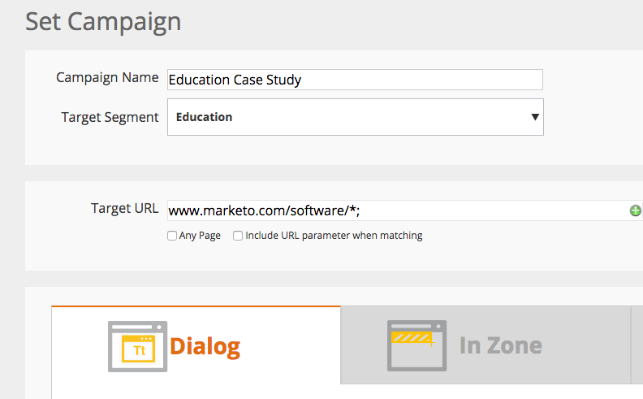
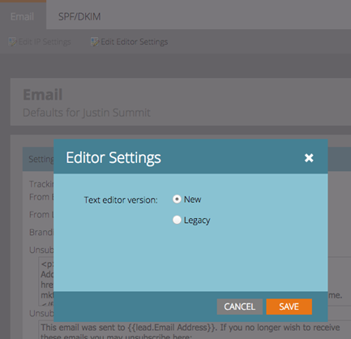

# 2015

## Janvier 2015 {#january}

Les fonctionnalités suivantes sont incluses dans la version de janvier 2015. Consultez votre édition Marketo pour connaître la disponibilité des fonctionnalités. Après la publication, veillez à revenir pour trouver des liens vers des articles détaillés pour chaque fonctionnalité.

## Mises à jour de l’automatisation du marketing {#marketing-automation-updates}

**Pages de destination compatibles avec les appareils mobiles**

Vous pouvez désormais [créer des vues mobiles pour les pages de destination](/help/marketo/product-docs/demand-generation/landing-pages/free-form-landing-pages/add-a-mobile-view-for-your-free-form-landing-page.md) à partir de l’éditeur de page de destination. Diffusez votre message efficacement, quel que soit l’appareil et augmentez l’engagement en personnalisant votre contenu pour une consommation facile en déplacement. Cette fonctionnalité sera déployée progressivement tout au long de la semaine suivant la publication de la version.

[-Vidéo de présentation de la page de destination-](https://youtu.be/aPQHlG2X6c0)

**Nouveaux appels de l’API REST**

Trois nouveaux appels pour l’API REST de lead et d’activité :

* Supprimer un lead
* Obtenir les leads par ID de programme
* Obtenir les leads supprimés

Il existe également une nouvelle option pour le prospect de synchronisation, permettant d’écrire le changement de prospect de manière asynchrone pour un appel API plus rapide. Des détails complets seront disponibles après la publication sur [&#128279;](https://experienceleague.adobe.com/fr/docs/marketo-developer/marketo/home)

**Prise en charge des objets personnalisés dans le script d’e-mail**

Accédez maintenant aux objets personnalisés associés à l’objet Compte dans les scripts d’e-mail.

## Personnalisation en temps réel {#real-time-personalization}

**Remarketing personnalisé pour Google et[!DNL Facebook]**

Le remarketing présente des publicités destinées aux personnes qui ont visité votre site web. Vous pouvez désormais personnaliser vos campagnes de remarketing sur [&#128279;](/help/marketo/product-docs/web-personalization/website-retargeting/personalized-remarketing-in-google.md) et [[!DNL Facebook]](/help/marketo/product-docs/web-personalization/website-retargeting/personalized-remarketing-in-facebook.md) à l’aide des données de Real-Time Personalization. Remarquez les audiences de différents secteurs d’activité, les listes de comptes nommés, les tailles d’entreprise ou toute donnée provenant de prospects connus.

[Module de liste de comptes nommés](/help/marketo/product-docs/web-personalization/account-based-web-marketing/create-a-new-account-list.md)

Les améliorations apportées au module Comptes nommés amélioreront les taux de correspondance et les validations pour les utilisateurs. Les ajouts incluent :

* Correspondance des organisations de votre liste de comptes nommés à l’aide de l’adresse e-mail du prospect (également pour les clients RTP uniquement)
* Prise en charge de 100 000 enregistrements maximum par compte
* Modèle de fichier CSV à afficher et à télécharger


**Mise à jour des options de balise RTP**

Les options de balise RTP sous Paramètres du compte ont été mises à jour pour inclure les éléments suivants :

1. Réseau CDN et asynchrone (balise recommandée)
1. Réseau CDN et synchrone (haute vitesse)
1. Balise asynchrone sans réseau CDN
1. Balise synchrone sans réseau CDN

Pour de meilleures performances, il est recommandé de placer la balise en haut de l’en-tête de votre page web après `<head>`. Toutes les balises permettent d’utiliser l’[API RTP](https://experienceleague.adobe.com/en/docs/marketo-developer/marketo/javascriptapi/rich-media-recommendation). Pour plus d’informations sur le déploiement de la balise RTP, voir [ici](/help/marketo/product-docs/web-personalization/rtp-tag-implementation/deploy-the-rtp-javascript.md).


## Février 2015 {#february}

Les fonctionnalités suivantes sont incluses dans la version de février 2015. Consultez votre édition Marketo pour connaître la disponibilité des fonctionnalités. Après la publication, veillez à revenir pour trouver des liens vers des articles détaillés pour chaque fonctionnalité. Rouleau de tambour...

## Améliorations de l’automatisation du marketing {#marketing-automation-enhancements}

**[Déplacer une campagne intelligente](/help/marketo/product-docs/core-marketo-concepts/smart-campaigns/using-smart-campaigns/move-a-smart-campaign.md)**

Hourra ! Vous pouvez désormais insérer ou extraire les campagnes intelligentes des programmes grâce à la fonction glisser-déposer ou Déplacer dans l’arborescence.

**[[!DNL Dynamics] 2015 (en ligne)](https://docs.marketo.com/display/docs/microsoft+dynamics+2013+on-premises)** - pris en charge !

**Modifications du certificat HTTPS**

Afin de préserver la confidentialité et l’intégrité des données clients et des services SaaS, Marketo applique les bonnes pratiques du secteur SaaS

et remplacera les protocoles de sécurité actuellement utilisés (SHA-1 et SSL) par des versions plus sécurisées (SHA-2 (également appelées SHA-256) et TLS) pour les domaines suivants :

* marketo.net (trafic [!DNL Munchkin] chiffré)

* [marketo.com](https://marketo.com) (principales applications SaaS)

Cela se produira peu de temps après cette version. Le protocole SHA-1 sera temporairement pris en charge sur le domaine [mktoapi.com](https://mktoapi.com) jusqu&#39;en décembre 2015 pour permettre aux propriétaires de systèmes et d&#39;applications hérités de mettre à jour leurs systèmes avec la compatibilité SHA-2.

[!DNL Munchkin]&#x200B;**sécurisé**

Nous supprimons notre prise en charge de SSL3. Nous avons maintenu SSL3 jusqu’à présent pour maintenir la prise en charge des anciens navigateurs web, mais en 2015, nous ne voyons plus de trafic web important provenant de ces navigateurs. Cela n’affecte que les [!DNL Munchkin] lorsqu’elles sont utilisées sur des pages sécurisées et se déploie lentement après la version de février.

## Améliorations Du Personalization En Temps Réel {#real-time-personalization-enhancements}

**[URL cible pour les campagnes](/help/marketo/product-docs/web-personalization/working-with-web-campaigns/adding-a-target-url-to-a-web-campaign.md)**

Sélectionnez les pages que votre campagne en temps réel doit afficher à l’aide de l’option Ajouter une URL Target . Cette fonctionnalité fonctionne avec tous les types de campagne (boîte de dialogue, dans la zone, widgets), mais elle est particulièrement utile pour les campagnes dans la zone, où une campagne s’affiche dans l’identifiant de zone pour l’URL cible sélectionnée uniquement. Elle prend en charge l’ajout de plusieurs URL pour cibler différentes pages web.



**Pays et état ajoutés au ciblage basé sur les comptes**

Les valeurs Pays et État peuvent désormais être ajoutées à vos Listes de comptes nommés. Cibler de futurs comptes clés à partir de lieux spécifiques.

## Mars 2015 {#march}

Les fonctionnalités suivantes sont incluses dans la version de mars 2015. Consultez votre édition Marketo pour connaître la disponibilité des fonctionnalités. Après la publication, veillez à revenir pour trouver des liens vers des articles détaillés pour chaque fonctionnalité.

## Calendrier HD {#calendar-hd}

Affichez les activités marketing de votre équipe avec le nouveau mode de présentation du calendrier. Ils sont parfaits pour les téléviseurs ou les moniteurs géants autour du bureau ! Définit et affiche des objectifs en fonction d’une liste dynamique ou de mesures personnalisées.

>[!NOTE]
>
>Cette fonctionnalité n’est pas disponible pour les éditions Spark et [!DNL Standard].


## Intégration [!DNL Google Adwords] {#google-adwords-integration}

Liez votre [[!DNL Google AdWords] compte à Marketo](/help/marketo/product-docs/administration/additional-integrations/add-google-adwords-as-a-launchpoint-service.md) pour charger automatiquement les données de conversion hors ligne de Marketo vers [!DNL Google AdWords]. Ensuite, à partir de l’interface utilisateur de [!DNL AdWords], vous pourrez facilement voir quels clics ont donné lieu à des leads qualifiés, à des opportunités et à de nouveaux clients (ou toutes les étapes de chiffre d’affaires que vous souhaitez suivre).


## [!UICONTROL Explorateur de chiffre d’affaires] reconcevoir {#revenue-explorer-redesign}

[!UICONTROL Revenue Explorer] a une toute nouvelle apparence, ainsi que le nouveau type de graphique Sunburst ! Son lancement est prévu pour les deux premières semaines d’avril.

## Nouvel actif API REST {#new-asset-rest-apis}

[Nouvel actif API REST](https://experienceleague.adobe.com/en/docs/marketo-developer/marketo/rest/assets/assets)

La création et la modification d’e-mails, de modèles, de mes jetons, de fichiers et de fragments de code sont désormais prises en charge [via l’API](https://developer.adobe.com/marketo-apis/api/asset/) !

## [!DNL Microsoft Dynamics] 2015 On-Premise {#microsoft-dynamics-on-premise}

Pris en charge avec le dernier programme d’installation désormais [accessible via l’application](/help/marketo/product-docs/crm-sync/microsoft-dynamics-sync/sync-setup/update-the-marketo-solution-for-microsoft-dynamics.md).


## RTP - Engagement Web personnalisé avec des données de lead {#rtp-personalized-web-engagement-with-lead-data}

Tirez parti des [champs de données de prospect](/help/marketo/product-docs/web-personalization/using-web-segments/manage-person-data.md) que vous avez dans votre base de données de prospect Marketo pour créer une segmentation en temps réel et des campagnes de contenu personnalisées. Gérer les champs de données de lead dans RTP et ajouter/supprimer les champs de lead pertinents.

## RTP - Personnaliser le contenu Web selon le nom de la campagne par e-mail ou du programme {#rtp-personalize-web-content-by-email-or-program-campaign-name}

Poursuivez la conversation avec votre prospect sur plusieurs canaux, de l’e-mail au Web. [Personnalisez le contenu entrant en fonction de la campagne ou du programme par e-mail](/help/marketo/product-docs/web-personalization/using-web-segments/web-segments.md) du nom utilisé dans les activités marketing Marketo.

## Avril 2015 {#april}

Les fonctionnalités suivantes sont incluses dans la version d’avril 2015. Consultez votre édition Marketo pour connaître la disponibilité des fonctionnalités. Après la publication, veillez à revenir pour trouver des liens vers des articles détaillés pour chaque fonctionnalité.

## Redéfinition de l’écran d’accueil d’Analytics

[Redéfinition de l’écran d’accueil d’Analytics](/help/marketo/product-docs/reporting/basic-reporting/creating-reports/navigating-the-analytics-home-page.md)

>[!NOTE]
>
>Cette fonctionnalité sera publiée le mardi 28 avril.

La nouvelle page d’accueil [[!UICONTROL Analytics] &#x200B;](/help/marketo/product-docs/reporting/basic-reporting/creating-reports/navigating-the-analytics-home-page.md) permet un accès rapide pour l’exécution de rapports ad hoc sur tous les types de rapports disponibles.


En outre, l’organisation de rapports privée ou partagée est désormais disponible. Créez des rapports ou faites-les glisser dans votre dossier [!UICONTROL Mes rapports] pour empêcher d’autres utilisateurs de les afficher, de les modifier ou de les supprimer. [!UICONTROL Rapports de groupe] est partagé entre tous les utilisateurs.

## Marketo Mobile Engagement {#marketo-mobile-engagement}

**Engagement Mobile**

Avec Marketo Mobile Engagement, il est facile de fournir des expériences mobiles attrayantes. Créez des campagnes hautement personnalisées qui diffusent du contenu attrayant sans jamais avoir à compter sur une équipe de développement d’applications. De nouveaux filtres et triggers permettent d&#39;écouter et de répondre sur le canal mobile par le biais de notifications push.


## Intégration de l’accélérateur de leads [!DNL LinkedIn]

[Intégration de l’accélérateur de leads [!DNL LinkedIn]](/help/marketo/product-docs/demand-generation/social/social-functions/use-a-marketo-list-or-smart-list-as-a-linkedin-audience-segment.md)

Étendez votre stratégie d’entretien des prospects à l’affichage payant et aux publicités sociales. L’intégration réseau [ad](/help/marketo/product-docs/demand-generation/ad-network-integrations/add-linkedin-matched-audiences-as-a-launchpoint-service.md) avec [!DNL LinkedIn]’accélérateur de leads vous permet de créer en toute sécurité un segment d’audience dans [!DNL LinkedIn] en fonction des membres de n’importe quelle liste dynamique ou statique. Les membres d’un segment d’audience [!DNL LinkedIn] peuvent ensuite être encouragés avec une séquence d’annonces pertinentes.


## [!DNL Sales Insight] Marketo pour [!DNL Salesforce1] {#marketo-sales-insight-for-salesforce}

Vos fonctionnalités de [!DNL Sales Insight] préférées (flux de leads, meilleurs paris, moments intéressants et ajout à Marketo Campaign), toutes disponibles sur l’application [!DNL Salesforce1].

 

## Protocole RTP : analyse marketing basée sur les comptes client {#rtp-account-based-marketing-analytics}

**Protocole RTP : analyse marketing basée sur les comptes client**

Obtenez une visibilité instantanée des performances de vos listes de comptes nommés clés en fonction de chaque étape du cycle d’achat, avec le nouveau graphique de performances pour vos listes de comptes nommés. Le graphique montre l’étape de la visite, de l’organisation clé, de la sensibilisation à l’action, en fonction du nombre de visites et du statut du visiteur.

## Mai 2015 {#may}

Les fonctionnalités suivantes sont incluses dans la version de mai 2015. Consultez votre édition Marketo pour connaître la disponibilité des fonctionnalités. Après la publication, veillez à revenir pour trouver des liens vers des articles détaillés pour chaque fonctionnalité.

## Pages de destination entièrement réactives

[Pages de destination entièrement réactives](/help/marketo/product-docs/demand-generation/landing-pages/guided-landing-pages/create-a-guided-landing-page.md)

Nous publions un nouveau mode de modification de la page de destination et une nouvelle syntaxe de modèle. Contrairement à notre éditeur de page de destination « Structure libre », le nouvel éditeur de page de destination « Guidé » fournit une expérience d’édition structurée pour des pages de destination entièrement réactives.


## Abandonner le programme d’e-mail

[Abandonner le programme d’e-mail](/help/marketo/product-docs/email-marketing/email-programs/email-program-actions/abort-email-program.md)

Avez-vous cliqué sur Envoyer avant qu&#39;un programme de messagerie ne soit prêt à être lancé ? Appuyez sur les freins avec le nouveau bouton d’abandon du programme de messagerie. Les programmes de messagerie en cours d’exécution ne pourront plus fonctionner correctement.

## Délivrabilité des e-mails  {#email-deliverability}

Marketo exécutera désormais des vérifications automatisées hebdomadaires de [!DNL SPF] et de [!DNL DKIM] sur les domaines que vous avez ajoutés. Tenez-vous au courant en consultant vos notifications.

## Modification du comportement du modèle d’e-mail {#email-template-behavior-change}

Depuis cette version, les commentaires HTML valides sont désormais autorisés et non supprimés lors de la création de nouveaux e-mails.

## RTP : éditeur de segments par glisser-déposer {#rtp-drag-and-drop-segment-editor}

RTP : [Glisser-déposer l’éditeur de segment](/help/marketo/product-docs/web-personalization/using-web-segments/web-segments.md)

Faites glisser et déposez vos critères dans le créateur de segments, définissez la valeur, et vous êtes sur la bonne voie pour créer un segment en temps réel.

## RTP : recommandations du contenu prévisible {#rtp-predictive-content-recommendations}

[Recommandations de contenu prédictif](/help/marketo/product-docs/predictive-content/enabling-predictive-content/enable-predictive-content-for-web-rich-media.md)

Utilisez le machine learning et les algorithmes d’analyse prédictive de RTP pour recommander le contenu approprié au prospect approprié. Améliorez vos ressources de contenu visuellement avec des images et des descriptions textuelles et recommandez plusieurs ressources de contenu.

## Juin 2015 {#june}

Les fonctionnalités suivantes sont incluses dans la version de juin 2015. Consultez votre édition Marketo pour connaître la disponibilité des fonctionnalités. Après la publication, veillez à revenir pour trouver des liens vers des articles détaillés pour chaque fonctionnalité.

## Rapport d’e-mail d’attribution {#attribution-email-report}

[Rapport d’e-mail d’attribution](/help/marketo/product-docs/web-personalization/reporting-for-web-personalization/email-reports.md)

Affichez la personnalisation de valeur et le contenu recommandé fournis à vos activités marketing. [Le rapport Attribution par e-mail](/help/marketo/product-docs/web-personalization/reporting-for-web-personalization/email-reports.md) affiche les prospects directs et assistés attribués à partir des campagnes de personnalisation et de contenu recommandées de RTP. Dans les RTP, Paramètres utilisateur et Rapport sur les e-mails, ajoutez le Rapport sur les e-mails d’attribution pour recevoir des e-mails mensuels ou trimestriels.

## Juillet 2015 {#july}

## [!DNL Marketo Moments] {#marketo-moments}

Sorti le midi mais vous avez besoin de reprogrammer un email ? L’application [!DNL Marketo Moments], disponible à partir d’App Store ou de [!DNL Google Play], vous permet de voir comment vos campagnes par e-mail et événementielles se comportent en temps réel, ainsi que les performances à venir, à partir de votre téléphone iPhone, iPad ou Android.


## Mise à jour de l’éditeur de texte enrichi {#rich-text-editor-update}

Mise à jour de l’éditeur de texte pour moderniser l’aspect, notamment la mise en forme rationalisée du texte, la modification des images, l’insertion de liens et la modification dans HTML. L’éditeur HTML offre désormais une validation minimale, ce qui permet une modification de code moins restrictive.
`<iframe width="420" height="315" src="https://www.youtube.com/embed/LmmBN6IQrII" frameborder="0" allowfullscreen></iframe>` Cette mise à jour sera automatiquement déployée dans les jours qui suivront la publication de juillet. Ensuite, vous pourrez basculer entre les versions nouvelle et héritée de l’éditeur à partir de **[!UICONTROL Admin] > [!UICONTROL E-mail] > [!UICONTROL Modifier les paramètres de l’éditeur]**.


Mise à jour des boîtes de dialogue de lien et d’image.


Activez/désactivez la version de l’éditeur de texte.



## Authentification unique pour la délivrabilité des e-mails {#email-deliverability-single-sign-on}

Lorsque vous cliquez sur la mosaïque délivrabilité des e-mails, vous n’avez plus besoin de fournir vos informations de connexion.

## Hiérarchisation des campagnes {#campaign-prioritization}

Avez-vous mis en place plusieurs campagnes RTP personnalisées et remarqué que certaines d’entre elles peuvent se chevaucher ? Continuez et définissez une priorité pour laquelle le RTP des campagnes doit s’afficher par rapport aux autres.


## API d’entreprise {#company-api}

**Accès aux objets de la société via l’API REST** : l’API REST permet désormais d’accéder à l’objet Société Marketo (ou compte). Cela signifie que vous pouvez lire, mettre à jour et supprimer des objets société que vous avez créés dans Marketo et associer des prospects à ces sociétés à l’aide de l’API [!DNL Lead] mise à jour.

En savoir [plus]<https://developer.adobe.com/marketo-apis/api/mapi/#tag/Companies>) dans notre guide de référence pour l’API d’entreprise.

## Accéder à la délivrabilité des e-mails {#access-email-deliverability}

**Accéder à l’outil de délivrabilité des e-mails** : cette nouvelle autorisation permet aux administrateurs d’accorder aux utilisateurs l’accès à l’outil de délivrabilité des e-mails.

## Automne 2015 {#fall}

Les fonctionnalités suivantes sont incluses dans la version de l’automne 15. Consultez votre édition Marketo pour connaître la disponibilité des fonctionnalités.

## S’abonner à une liste intelligente {#subscribe-to-a-smart-list}

[S’abonner à une liste intelligente](/help/marketo/product-docs/reporting/basic-reporting/report-subscriptions/subscribe-to-a-smart-list.md)

S’abonner à la liste dynamique permet aux marketeurs d’exporter une liste dynamique et de l’envoyer par e-mail aux parties prenantes qui n’utilisent pas Marketo, par exemple les équipes de vente ou de télémarketing.

L’exportation peut être planifiée tous les jours, toutes les semaines ou tous les mois, comporter une date de fin de diffusion et être personnalisée pour partager un nombre limité de colonnes.


Plusieurs abonnements peuvent être créés sur une liste dynamique. Le nombre d’abonnements est limité à 100 avec 100 000 prospects par abonnement, pour tous les espaces de travail et par instance Marketo.


## Objets personnalisés Marketo {#marketo-custom-objects}

[Objets personnalisés Marketo](/help/marketo/product-docs/administration/marketo-custom-objects/understanding-marketo-custom-objects.md)

Créez facilement des objets personnalisés à partir de l’interface utilisateur d’administration. Nous prenons actuellement en charge la possibilité de créer un objet personnalisé 1:N dans Marketo et de le connecter à un prospect ou à une entreprise.

>[!NOTE]
>
>Les objets personnalisés Marketo ne sont pas disponibles pour Spark.


## Marketo Insights pour [!DNL Google Chrome] {#marketo-insights-for-google-chrome}

[Marketo Insights pour  [!DNL Google Chrome]](/help/marketo/product-docs/marketo-sales-insight/msi-chrome-plugin/using-marketo-insights-for-google-chrome.md)

Nous sommes ravis d’annoncer la publication d’une mise à jour de notre extension [!DNL Google Mail] [!DNL Sales Insight] ! Affichez-le dans la [[!DNL Chrome Store]](https://chrome.google.com/webstore/detail/marketo-insights-for-goog/jjkfbhajlmoeegbjgjipliamplidmbjb).

Cette mise à jour comprend de nombreuses nouvelles fonctionnalités :

* Avant de s’engager, les vendeurs et vendeuses peuvent consulter des informations pertinentes sur leurs prospects directement dans [!DNL Google Mail], notamment les intitulés de poste, les profils Twitter, les informations sur l’entreprise, des photos, etc.
* Les vendeurs peuvent voir en temps réel avec quel contenu les prospects interagissent sur l’ensemble des canaux, comme les e-mails ouverts ou sur lesquels ils cliquent, les événements en ligne ou en personne auxquels ils assistent, les pages web visitées, les livres électroniques téléchargés, etc.
* Les e-mails envoyés via [!DNL Google Mail] sont consignés dans Marketo et suivis en temps réel. Cela permet aux vendeurs de voir quand les prospects consultent leurs e-mails afin qu’ils puissent faire un suivi au bon moment. Marketo [!DNL Sales Insight] for [!DNL Google Mail] permet également aux vendeurs de tirer facilement parti des modèles créés par le marketing pour envoyer de belles invitations, offres et autres types de contenu.


## Engagement mobile Marketo - Jetons, exemple d’envoi et prévisualisation {#marketo-mobile-engagement-tokens-send-sample-preview}

* [Jetons](/help/marketo/product-docs/mobile-marketing/push-notifications/configure-mobile-push-notification.md)
* [Envoyer un échantillon](/help/marketo/product-docs/mobile-marketing/push-notifications/send-a-push-notification-sample.md)
* [Prévisualiser](/help/marketo/product-docs/mobile-marketing/push-notifications/preview-a-push-notification.md)

Personnalisez facilement les notifications push avec des [jetons](/help/marketo/product-docs/mobile-marketing/push-notifications/configure-mobile-push-notification.md).


Vous pouvez également [prévisualiser](/help/marketo/product-docs/mobile-marketing/push-notifications/preview-a-push-notification.md) ou envoyer une notification push [exemple](/help/marketo/product-docs/mobile-marketing/push-notifications/send-a-push-notification-sample.md) avant de la déployer auprès des clients.


## Campagnes intelligentes en quelques instants {#smart-campaigns-in-moments}

[Campagnes intelligentes en quelques instants](/help/marketo/product-docs/core-marketo-concepts/mobile-apps/marketo-moments/understanding-moments/understanding-smart-campaign-cards.md)

Les statistiques sur les e-mails envoyés par le biais de campagnes intelligentes sont désormais disponibles dans Moments. Les autres fonctionnalités de cette mise à niveau sont les suivantes :

* Balayer vers la fin. Vous avez trop de cartes dans votre flux ? Vous pouvez maintenant les faire glisser !
* Envoyer un échantillon directement depuis l’écran de prévisualisation
* Détails de liste dynamique ajoutés aux cartes de programme d’e-mail
* Ajout de la prise en charge du statut Abandonné pour les programmes de messagerie


## RTP - Content Analytics et recommandations {#rtp-content-analytics-and-recommendations}

[&#128279;](/help/marketo/product-docs/web-personalization/understanding-web-personalization/understanding-content-analytics.md) et Recommendations

RTP Content Analytics vous montre les performances de vos ressources de contenu web à partir de visites web régulières et aussi des visites générées à partir du moteur de recommandation de contenu de RTP.

* Identifiez le contenu qui présente les meilleures performances et qui attire le plus de prospects
* Augmentez votre consommation de contenu en activant le contenu dans le moteur de contenu prédictif de RTP pour recommander automatiquement le meilleur contenu aux bons visiteurs
* Explorez chaque ressource de contenu pour afficher des mesures, des graphiques et des performances plus détaillés

La page Assets de RTP est maintenant divisée en Content Analytics et Recommandations de contenu.

* **Content Analytics :** affiche les vues et les prospects directs de tout le contenu web découvert et défini, ce qui vous aide à analyser votre contenu le plus performant
* **Recommandations de contenu :** affiche les impressions et les clics provenant du contenu recommandé par le RTP et de l’attribution de prospect associée. Vous pouvez également modifier et activer les recommandations de contenu de cette page pour les recommandations [bar](/help/marketo/product-docs/predictive-content/enabling-predictive-content/enable-the-content-recommendation-bar.md) et [médias riches](/help/marketo/product-docs/predictive-content/enabling-predictive-content/enable-predictive-content-for-web-rich-media.md).

* Toutes les données de prospect direct de ces deux pages ont été mises à jour rétrospectivement depuis le début de l’année (1er janvier 2015).

## RTP - Cloner une campagne RTP {#rtp-clone-an-rtp-campaign}

[RTP - Cloner une campagne RTP](/help/marketo/product-docs/web-personalization/working-with-web-campaigns/clone-a-web-campaign.md)

Le clonage d’une campagne RTP permet de créer plus rapidement et plus efficacement des campagnes web plus personnalisées. Utilisez la fonction de clonage de la page de campagne de RTP pour copier les paramètres de la campagne et modifier le contenu pour l’optimisation du test de partage, ou clonez une campagne avec le même contenu et ciblez-la vers un autre segment. Créez des campagnes en quelques secondes !


## Améliorations de l’éditeur de texte enrichi {#rich-text-editor-improvements}

Nous apportons plusieurs améliorations à l’éditeur de texte enrichi. Après la publication de la mise à jour de l’éditeur en juillet, nous avons reçu d’excellents commentaires et avons pu appliquer ces modifications à cette mise à niveau. Il y a beaucoup d&#39;autres choses à venir au cours des prochains mois. Voici une liste des nouveautés du 4e trimestre :

* VML est désormais pris en charge dans votre code HTML :

```
<v:background xmlns:v="urn:schemas-microsoft-com:vml" fill="t">
<v:fill type="tile" src="<a href="https://i.imgur.com/YJOX1PC.png" rel="nofollow">https://i.imgur.com/YJOX1PC.png</a>" color="#7bceeb"/>
</v:background>
```

* Tout peut désormais être inséré dans un commentaire HTML valide (certaines syntaxes comme celles présentées ci-dessous ont été supprimées) :

`<!--[if gte mso 9]> <![endif]-->`

* Ne remplissez pas les cellules vides du tableau avec des `&nbsp;`

* Bouton Agrandir/Réduire ajouté à l’éditeur source d’HTML
* Les propriétés de tableau préexistantes sont désormais identifiées et affichées dans la boîte de dialogue Propriétés du tableau .
* Les deux lignes de boutons s’affichent désormais par défaut.
* L’éditeur accepte désormais n’importe quel élément (même les éléments obsolètes ou non standard) :

`<myCustomElement>Hello World!</myCustomElement>`

* L’éditeur accepte désormais tous les attributs (même les attributs obsolètes ou non standard) :

```
<myCustomElement myCustomAttribute="foo">Hello World!</myCustomElement>
<td background="someImage.png">
```

## [!DNL Microsoft Dynamics] - Valider la synchronisation {#microsoft-dynamics-validate-sync}

[[!DNL Microsoft Dynamics] - Valider la synchronisation](/help/marketo/product-docs/crm-sync/microsoft-dynamics-sync/sync-setup/validate-microsoft-dynamics-sync.md)

Ce nouvel outil d’administration exécute une série de vérifications pour vérifier si vos configurations de synchronisation ont été correctement configurées.


## Ajouter des champs à la synchronisation d’objet personnalisé CRM {#add-fields-to-crm-custom-object-sync}

Ajoutez facilement de nouveaux champs aux objets personnalisés synchronisés à partir de [!DNL Salesforce] et [!DNL Dynamics]. Vous pouvez désormais ajouter de nouveaux champs à la synchronisation de votre objet personnalisé sans désactiver ni activer l’ensemble de votre objet personnalisé.

## Modification des fonctions de sécurité {#changes-to-security-features}

* Les tentatives de mot de passe sont limitées à 5. Après la cinquième tentative, l’utilisateur sera verrouillé.
* La temporisation de session inactive peut désormais être configurée pour l’abonnement.


## Prise en charge d’IE 11 (et obsolescence de la prise en charge d’IE 9) {#ie-support-and-deprecating-support-for-ie}

Nous prenons désormais officiellement en charge le navigateur [!DNL Microsoft Internet Explorer] 11 et supprimons la prise en charge du navigateur [!DNL Microsoft Internet Explorer] 9.

## Prise en charge de l’interface utilisateur Lightning pour MSI {#lightning-ui-support-for-msi}

Le dernier package MSI sur App Exchange fonctionne avec les versions Lightning et Legacy de l&#39;interface utilisateur de [!DNL Salesforce].

## Nouveau plug-in [!DNL Dynamics] {#new-dynamics-plug-in}

Ce nouveau plug-in exécute diverses actions en mode asynchrone pour améliorer les performances.

## Recherche par URL de page de destination dans Design Studio {#search-by-url-of-landing-page-in-design-studio}

Dans la grille de page de destination de Design Studio, vous pouvez désormais rechercher vos pages de destination par URL de page. Il peut également être exporté.

