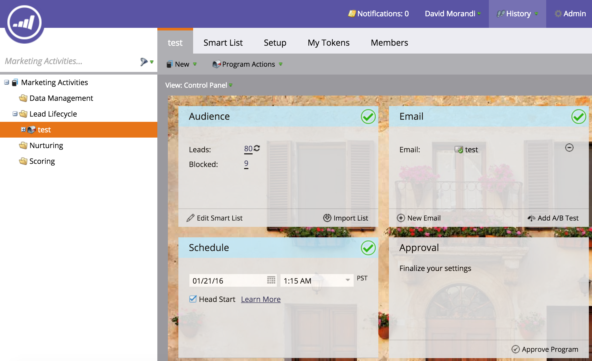
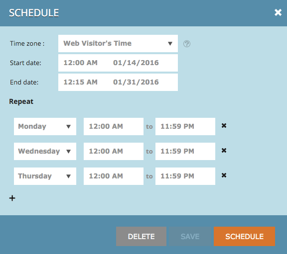
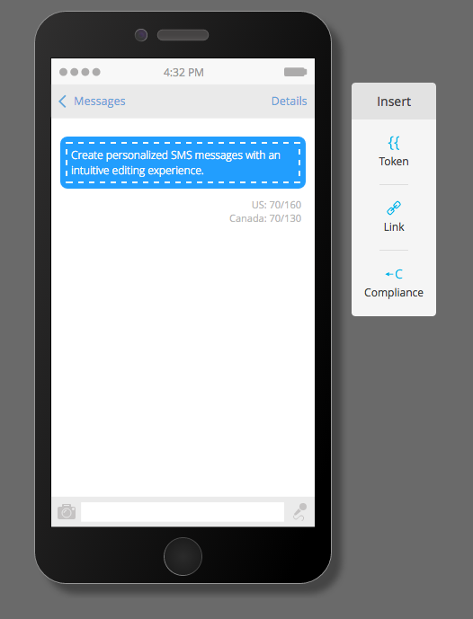
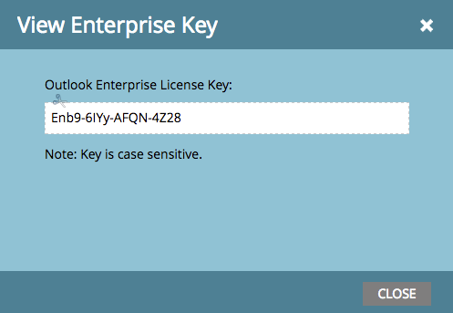

# 2016

## Hiver 2016 {#winter}

Les fonctionnalités suivantes sont incluses dans la version d’hiver 16. Cliquez sur les liens de titre pour afficher les articles détaillés de chaque fonctionnalité.

## [Filtre anonyme ](/help/marketo/product-docs/administration/additional-integrations/add-munchkin-tracking-code-to-your-website/next-generation-munchkin-tracking-faq.md) {#is-anonymous-filter}

Le filtre Est anonyme a été supprimé pour les listes dynamiques. Consultez le document [FAQ sur le suivi de Munchkin de nouvelle génération](/help/marketo/product-docs/administration/additional-integrations/add-munchkin-tracking-code-to-your-website/next-generation-munchkin-tracking-faq.md) pour plus d’informations. Cette modification n’a aucune incidence sur le Personalization Web (RTP), qui continue d’identifier les visiteurs web anonymes et connus et de personnaliser le contenu en temps réel pour ces visiteurs.

## [Tableau de bord de la base de données](/help/marketo/product-docs/core-marketo-concepts/smart-lists-and-static-lists/managing-people-in-smart-lists/database-dashboard.md)  {#database-dashboard}

La [!UICONTROL base de données des leads] a un tableau de bord récapitulatif mis à jour qui inclut la taille totale de la base de données des personnes, le nombre de leads commercialisables et une répartition des leads par cinq principales sources.

## [Navigateur Microsoft Edge](/help/marketo/product-docs/administration/setup-administration/supported-browsers.md) {#microsoft-edge-browser}

Nous avons ajouté [!DNL Microsoft Edge] à la [liste des navigateurs](https://docs.marketo.com/display/public/DOCS/Supported+Browsers) pris en charge par Marketo.

## [Microsoft Outlook 2016](/help/marketo/product-docs/marketo-sales-insight/msi-outlook-plugin/install-the-marketo-email-add-in-for-outlook-with-a-registration-code.md) {#microsoft-outlook}

[[!DNL Microsoft Outlook] 2016](/help/marketo/product-docs/marketo-sales-insight/msi-outlook-plugin/install-the-marketo-email-add-in-for-outlook-with-a-registration-code.md) est désormais pris en charge.

## [Programme d’e-mail Head Start](/help/marketo/product-docs/email-marketing/email-programs/email-program-actions/head-start-for-email-programs.md) {#email-program-head-start}

Utilisez [!UICONTROL Démarrage rapide] pour indiquer que le traitement de votre envoi doit avoir lieu à l’avance. Au lieu de qualifier les leads et de préparer les e-mails au moment prévu du programme, [!UICONTROL Démarrage rapide] s&#39;assure que ces tâches sont effectuées à l&#39;avance. Ainsi, votre audience commencera à recevoir des e-mails à l’heure planifiée.

Pour utiliser cette fonctionnalité, le programme de messagerie doit être planifié au moins 12 heures à l’avance et la liste dynamique sera verrouillée 12 heures avant l’envoi.

>[!NOTE]
>
>Cette fonctionnalité sera déployée progressivement pendant une semaine à compter de la version d’hiver 16. Elle ne peut pas être utilisée avec les campagnes intelligentes ou l’API.

## [Améliorations du marketing mobile](/help/marketo/product-docs/mobile-marketing/admin/add-a-mobile-app.md) {#mobile-marketing-enhancements}

Assistance **[!DNL PhoneGap]:** nous proposons désormais une assistance [!DNL PhoneGap] pour votre application mobile. [En savoir plus](https://developers.marketo.com/documentation/mobile/phonegap-plugin/).

**Prise en charge des applications Sandbox** :

## [Programmation et API](https://developers.marketo.com/documentation/programs/) {#program-api}

Créer, mettre à jour et cloner des programmes via l’API REST. Cela n’inclut pas la création ou la mise à jour de listes intelligentes et de campagnes intelligentes au sein d’un programme.

## [Améliorations de Microsoft Dynamics](/help/marketo/product-docs/crm-sync/microsoft-dynamics-sync/microsoft-dynamics-sync-details/sync-status.md) {#microsoft-dynamics-enhancements}

**[[!UICONTROL Statut de la synchronisation]](/help/marketo/product-docs/crm-sync/microsoft-dynamics-sync/microsoft-dynamics-sync-details/sync-status.md)** : suivez le débit actuel et la liste d’attente du processus de synchronisation. Ventilez-la en fonction du nombre d&#39;insertions et de mises à jour par objet.

**[[!UICONTROL Notifications]](/help/marketo/product-docs/core-marketo-concepts/miscellaneous/understanding-notifications/notification-types.md)** : recevez des notifications pour les erreurs de synchronisation courantes, ainsi qu’une liste des prospects présentant cette erreur.

## [Améliorations des objets personnalisés](/help/marketo/product-docs/administration/marketo-custom-objects/create-marketo-custom-objects.md) {#custom-objects-enhancements}

Vous pouvez désormais créer des relations multiples-à-multiples entre les prospects/comptes et un objet personnalisé à l’aide d’un objet intermédiaire avec plusieurs champs de lien.

## [Publicités de lead Facebook](/help/marketo/product-docs/demand-generation/facebook/set-up-facebook-lead-ads.md) {#facebook-lead-ads}

[[!UICONTROL Les annonces de leads Facebook]](https://www.facebook.com/business/a/lead-ads) sont un moyen plus direct pour une entreprise d’exécuter des campagnes de génération de leads sur [!DNL Facebook]. Les gens remplissent un formulaire pour exprimer leur intérêt pour un produit ou un service, afin que l&#39;entreprise puisse faire un suivi auprès d&#39;eux. L’intégration de Marketo à [!UICONTROL Facebook Lead Ads] capture automatiquement les informations fournies par un prospect dans le formulaire de prospect publicitaire. Les actions de suivi et les notifications peuvent ensuite être automatisées à l’aide du nouveau déclencheur [!UICONTROL Remplit les publicités du lead Facebook].

## [Planificateur De Campagnes Web (Real-Time Personalization)](/help/marketo/product-docs/web-personalization/working-with-web-campaigns/schedule-a-web-campaign.md) {#web-real-time-personalization-campaign-scheduler}

Planifiez votre campagne à l’avance. Configurez des dates de début et de fin pour le contenu web personnalisé et des campagnes répétées à des jours et heures spécifiques. Personnalisez le planning pour afficher la campagne en fonction de l’heure du visiteur web ou d’un fuseau horaire sélectionné.

## Printemps 2016 {#spring}

Les fonctionnalités suivantes sont incluses dans la version du printemps 16. Cliquez sur les liens de titre pour afficher les articles détaillés de chaque fonctionnalité.

## [Email Insights](/help/marketo/product-docs/reporting/email-insights/email-insights-overview.md) {#email-insights}

Les informations sur les e-mails représentent une toute nouvelle expérience d’analyse des e-mails de données agrégées historiques, repensée de bout en bout pour des performances ultra-rapides. Il présente une toute nouvelle conception d’interface utilisateur optimisée pour s’adapter aux besoins et au workflow des e-mails marketing.

>[!NOTE]
>
>Nous lançons par lots, à partir du 3 juin, les Insights par e-mail à destination des clients. Notre objectif est d&#39;y parvenir au cours des prochains mois. Nous vous avertirons par e-mail lorsque vous serez activé.

## [Sélectionneur de modèle d’e-mail](/help/marketo/product-docs/email-marketing/general/email-editor-2/email-template-picker-overview.md) {#email-template-picker}

Créez de beaux e-mails à l’aide de nos nouveaux modèles de démarrage ! En outre, localisez rapidement vos modèles à partir de leurs miniatures actives.

>[!NOTE]
>
>Email Editor 2.0 (avec le sélecteur de modèle) sera progressivement déployé à partir du 3 juin. Nous terminerons le déploiement d’ici le 30 juin. Contrairement aux Insights sur les e-mails, vous ne serez pas averti lorsque vous aurez accès à . Pour savoir si c’est le cas, suivez les étapes décrites dans [cet article](/help/marketo/product-docs/email-marketing/general/email-editor-2/transitioning-to-email-editor-2-0.md).

## [Modification des e-mails : repensée](/help/marketo/product-docs/email-marketing/general/email-editor-2/email-editor-v2-0-overview.md) {#email-editing-re-imagined}

Un tout nouvel éditeur d&#39;email ! Utilisez la fonctionnalité légère de glisser-déposer pour ajouter et réorganiser du contenu. Les nouveaux éléments, notamment les images, les vidéos, les variables et les modules, amélioreront certainement votre expérience de modification. Consultez également les mises à jour de l’éditeur de code, du prévisualiseur et de la prise en charge du pré-titre.

## [Messages In-App Mobiles](/help/marketo/product-docs/mobile-marketing/in-app-messages/understanding-in-app-messages.md) {#mobile-in-app-messages}

Créez de superbes messages in-app pour votre application directement dans Marketo. Définissez exactement qui doit le voir et quand avec le programme de message in-app. Surveillez facilement ses performances avec le tableau de bord du programme.

## [Aucun fragment de code de brouillon](/help/marketo/product-docs/administration/users-and-roles/enable-no-draft-for-snippets.md) {#no-draft-snippets}

Les jours sont révolus où vous deviez tout approuver à nouveau chaque fois qu’un fragment de code était mis à jour. Avec l’option Sans brouillon, tous les e-mails et toutes les pages de destination utilisant un fragment de code recevront les mises à jour des fragments de code et conserveront leur statut précédent. Chaque fois que vous approuvez un fragment de code, vous avez le choix entre exécuter Pas de brouillon et tout mettre à jour, ou créer des brouillons. C&#39;est à toi de voir ! Aucun brouillon ne sera disponible pour tous les clients et sera contrôlé par une nouvelle autorisation dans Admin.

## [Page de destination, modèle de page de destination et API de formulaire](https://developers.marketo.com/blog/spring-2016-updates/) {#landing-page-landing-page-template-and-form-apis}

Les API REST Marketo prennent désormais en charge le contrôle des pages de destination, modèles de page de destination et formulaires Marketo. Les utilisateurs peuvent désormais créer, mettre à jour le contenu, approuver et supprimer ces ressources directement via l’API REST Marketo.

## Liste autorisée IP pour l’accès à l’API](/help/marketo/product-docs/administration/additional-integrations/create-an-allowlist-for-ip-based-api-access.md) {#ip-allowlisting-for-api-access}[

Tout comme la fonction de limitation des adresses IP pour les connexions des utilisateurs de Marketo, les administrateurs de Marketo peuvent désormais configurer une place sur la liste autorisée d’adresses IP qui peut accéder aux API Marketo SOAP et REST, bloquant ainsi l’accès à partir d’adresses IP non autorisées. Cela ajoute une couche de sécurité à votre instance Marketo et garantit que l’accès à l’API ne peut se faire qu’à partir du réseau de votre entreprise. Des détails sur la configuration sont disponibles sur le site de documentation de .

## [Nouveau Connecteur De Synchronisation Microsoft Dynamics Haute Vitesse](/help/marketo/product-docs/crm-sync/microsoft-dynamics-sync/microsoft-dynamics-sync-details/sync-status.md) {#new-high-speed-microsoft-dynamics-sync-connector}

Le nouveau connecteur Dynamics à grande vitesse offre des vitesses jusqu’à 20 fois plus rapides pour la synchronisation initiale et jusqu’à 5 fois plus rapides pour la synchronisation incrémentielle. Tous les nouveaux clients intégreront ce connecteur à la date de publication de la version. Nous le déploierons progressivement pour les clients existants pendant la période de publication estivale.

**Actualiser les données pour les nouveaux champs** : vous pouvez désormais activer de nouveaux champs de synchronisation à tout moment et toutes les valeurs de données de ce champ seront actualisées depuis [!DNL Dynamics] CRM vers Marketo. Plus de soucis à propos de devoir sélectionner tous les champs pendant la configuration initiale. Si vous désactivez un champ de synchronisation existant et que vous le réactivez ultérieurement, toutes les valeurs de données de ce champ sont actualisées à partir [!DNL Dynamics] CRM dans Marketo.

**Synchroniser le lead en tant que contact** : l’action de flux [!UICONTROL Synchroniser le lead avec Microsoft] offre une nouvelle option pour synchroniser le lead ou le contact.

**Onglet Administration des erreurs de synchronisation** : parcourez, recherchez ou exportez les prospects (et autres objets) dont la synchronisation a échoué avec des détails tels que l’opération, le sens, le code d’erreur et le message d’erreur.

**[!DNL Microsoft Dynamics]2016** Connector est entièrement certifié pour les versions [!DNL Online] et [!DNL On-premise] de [!DNL Dynamics] 2016.

**Les mises à jour des plug-ins sont désormais documentées :** consultez l’article [documentation des mises à jour des plug-ins](/help/marketo/product-docs/crm-sync/microsoft-dynamics-sync/marketo-plugin-releases-for-microsoft-dynamics.md).

## [Nom d’instance convivial](/help/marketo/product-docs/administration/settings/edit-subscription-settings.md) {#friendly-instance-name}

Aujourd’hui, il est difficile de faire la distinction entre les instances Marketo, par exemple, les instances Sandbox et de production. Cette fonctionnalité vous permet de savoir sur quelles instances vous travaillez actuellement.

## Accès à durée limitée aux abonnements {#limited-time-access-for-subscriptions}

Aujourd’hui, les utilisateurs sont invités à s’abonner à Marketo pour une durée indéterminée. Cette fonctionnalité permet aux administrateurs d’inviter les utilisateurs à s’abonner pour une période limitée, par exemple 2 semaines ou 1 mois.

## [Grille d’objets personnalisés](/help/marketo/product-docs/administration/marketo-custom-objects/understanding-marketo-custom-objects.md) {#custom-objects-grid}

Vous pouvez désormais afficher le nombre d’enregistrements et de champs pour tous les objets personnalisés publiés.

## Activités personnalisées {#custom-activities}

Les administrateurs Marketo peuvent désormais définir et gérer leurs types d’activités personnalisés via le modéliseur de définition d’activité personnalisée Marketo. De la même manière que le Modeler d’objet personnalisé Marketo (et conjointement avec lui), les administrateurs peuvent désormais étendre le modèle de données pour répondre exactement aux besoins de leur entreprise. Des informations détaillées sur l’utilisation de cette fonctionnalité sont disponibles sur le site de documentation de .

## Été 2016 {#summer}

Les fonctionnalités suivantes sont incluses dans la version d’été 16. Vérifiez la disponibilité des fonctionnalités dans votre édition Marketo. Cliquez sur les liens de titre pour afficher les articles détaillés de chaque fonctionnalité.

## [Account Based Marketing](https://docs.marketo.com/display/docs/account+based+marketing) {#account-based-marketing}

Le marketing basé sur les comptes Marketo fournit tous les éléments essentiels dans une seule plateforme unifiée :

* **Target** - Découverte de compte, correspondance entre les prospects et les comptes et listes de comptes nommés
* **Engage** - Personalization basé sur les comptes, engagement cross-canal et workflows spécifiques aux comptes
* **Mesure** - Informations au niveau du compte et de la liste, score de l’engagement du compte et impact sur le pipeline et le chiffre d’affaires

>[!NOTE]
>
>ABM est disponible sous la forme d’un module complémentaire pour votre abonnement Marketo. Vous devez donc contacter votre représentant commercial pour qu’il l’implémente.

## [Journal d’audit](/help/marketo/product-docs/administration/audit-trail/audit-trail-overview.md) {#audit-trail}

Le journal d&#39;audit fournit un historique complet des modifications apportées à votre abonnement Marketo. Il créera une responsabilisation parmi les utilisateurs et les administrateurs, aidera à identifier la cause du comportement inattendu et fournira la sécurité de savoir qui fait quoi et quand. Ces informations seront disponibles à tout moment et pourront être utilisées pour répondre à des questions telles que :

* Qu’est-il advenu de cette ressource ou de ce paramètre et qui l’a mis à jour pour la dernière fois ?
* Qu&#39;a fait l&#39;utilisateur X ?
* Qui se connecte à notre compte ?

## Intégration Marketo-Vibes SMS LaunchPoint

Créez facilement des SMS directement dans Marketo. Personnalisez et ciblez votre message à l’aide de vos données Marketo enrichies et surveillez facilement ses performances à l’aide du tableau de bord des messages SMS.

>[!NOTE]
>
>Cette fonctionnalité nécessite que vous disposiez d’un compte [!DNL Vibes SMS] existant.

## [Améliorations des e-mails 2.0](/help/marketo/product-docs/email-marketing/general/email-editor-2/email-editor-v2-0-overview.md) {#email-enhancements}

**Variables au niveau du module**

Auparavant, toutes les variables spécifiées dans les modèles d’e-mail 2.0 avaient une portée « globale ». L’utilisation de variables dans des modules n’est pas toujours souhaitable si vous envisagez d’utiliser plusieurs instances du module. Avec cette version, les variables peuvent désormais être spécifiées comme « niveau du module », ce qui vous permet d’indiquer que l’utilisateur doit être en mesure de définir des valeurs uniques pour chaque module dans lequel elles sont utilisées.

**Mises à jour de la syntaxe**

* Vous pouvez désormais utiliser « mktoAddByDefault » sur les modules spécifiés dans les modèles d’e-mail 2.0 afin d’indiquer quels modules doivent être affichés par défaut dans les nouveaux e-mails. Cela s’avère beaucoup plus pratique si vous créez un modèle d’e-mail avec un grand nombre de modules.
* Sur les éléments d’image, vous pouvez maintenant spécifier si les propriétés « height » et « width » de l’élément d’HTML `` sous-jacent doivent être verrouillées ou modifiables par l’utilisateur final. mktoLockImgSize=« true » entraîne le verrouillage de la hauteur/largeur (même si l’image est modifiée). De même, mktoLockImgStyle=« true » entraîne le verrouillage de la propriété « style ».

**Recherche de code**

Utilisez la nouvelle fonctionnalité de recherche pour rechercher et remplacer efficacement le contenu dans le code de votre e-mail. Cette fonctionnalité est également disponible dans l’éditeur de modèles d’e-mail.

**Prise en charge des jetons dans les éléments d’image**

Les jetons peuvent désormais être utilisés dans la zone « URL externe » de l’expérience d’insertion d’images. Si vous avez spécifié des images avec `{{my.tokens}}`, vous pouvez désormais référencer ces jetons dans l’éditeur d’e-mail 2.0. Notez que l’image apparaîtra toujours endommagée dans la zone de travail de l’éditeur d’e-mail 2.0. Cependant, vous les verrez rendues dans Aperçu et Envoyer un exemple avant d’envoyer votre e-mail.

## Plusieurs noms de domaine {#multiple-branding-domains}

Nous sommes loin de l&#39;époque où les liens de tracking e-mail ne pouvaient être marqués qu&#39;avec un seul domaine de marque. Vous pouvez désormais ajouter plusieurs domaines de marque pour inspirer confiance aux consommateurs, créer une apparence plus rationalisée pour vous concentrer sur la marque, améliorer la délivrabilité des e-mails et choisir, par e-mail, le domaine de marque à utiliser pour les liens de suivi de chaque e-mail.

## [Jetons de programme](/help/marketo/product-docs/demand-generation/landing-pages/personalizing-landing-pages/tokens-overview.md) {#program-tokens}

Nous avons créé un nouveau type de jeton pour les programmes. Vous pouvez désormais effectuer le rendu du nom, de la description et de l’identifiant du programme dans les étapes de ressources et de flux de campagne intelligent.

## [Clé d’entreprise](/help/marketo/product-docs/marketo-sales-insight/msi-outlook-plugin/authorize-the-marketo-outlook-plugin.md) {#enterprise-key}

Exiger que chaque personne de votre équipe de vente installe notre plug-in [!DNL Sales Insight] pour [!DNL Outlook] peut être fastidieux. Nous avons introduit une nouvelle méthode pour installer le plug-in pour [!DNL Outlook] à distance à l’aide d’une clé d’entreprise. Envoyez à votre équipe informatique la clé unique qui se trouve dans la section [!DNL Sales Insight] de Marketo de [!UICONTROL Admin] et laissez-la faire le reste.

## [Campagnes de personnalisation Web](/help/marketo/product-docs/web-personalization/working-with-web-campaigns/create-a-new-dialog-web-campaign.md) {#web-personalization-campaigns}

Spécifiez un délai pour que les campagnes web réagissent sur votre site web.

## [Exportation de Content Analytics et Recommendations](/help/marketo/product-docs/web-personalization/understanding-web-personalization/understanding-content-analytics.md) {#content-analytics-and-recommendations-export}

Affichez les données d’analyse de contenu et de recommandations hors ligne.

## [Prise en charge par l’API d’Email Editor 2.0](https://developers.marketo.com/documentation/asset-api/) {#api-support-for-email-editor}

Les API de ressources préexistantes, auparavant uniquement compatibles avec les e-mails et les modèles v1.0, sont désormais activées pour les ressources de messagerie v2.0.

## [Site des développeurs ](https://developers.marketo.com/) {#marketo-developers-site}

Nouveau et amélioré !

## [Paramètres de confidentialité](/help/marketo/product-docs/administration/settings/understanding-privacy-settings.md) {#privacy-settings}

Les marketeurs peuvent utiliser les paramètres de confidentialité pour décider d’effectuer ou non le suivi des visiteurs à l’aide des fonctionnalités de [!DNL Munchkin] et de Web Personalization. Le niveau de suivi est contrôlé à l’aide du paramètre Ne pas suivre du navigateur, d’un cookie d’exclusion ou d’une adresse IP non spécifique. Ces méthodes peuvent avoir une incidence sur la valeur et la fonctionnalité de Marketo dans des zones spécifiques, mais si le marketeur ne modifie rien, la fonctionnalité de Marketo reste la même.

Cette fonctionnalité sera progressivement disponible pour les clients sur une période de six semaines. Si vous en avez besoin immédiatement, contactez l’assistance Marketo.

## Automne 2016 {#fall}

Les fonctionnalités suivantes sont incluses dans la version de l’automne 16. Vérifiez la disponibilité des fonctionnalités dans votre édition Marketo. Cliquez sur les liens de titre pour afficher les articles détaillés de chaque fonctionnalité.

## [!UICONTROL Contenu prédictif] dans les e-mails {#predictive-content-in-email}

Notre application [!UICONTROL Contenu prédictif] offre une nouvelle expérience utilisateur permettant de suivre, de gérer et de recommander votre contenu par le biais de notre machine learning et de nos algorithmes prédictifs sur les canaux web et e-mail.

>[!NOTE]
>
>Tous les clients disposant du module Prédictive seront activés d’ici le 10 janvier.

Vous pouvez désormais ajouter du contenu prédictif à votre e-mail. Lorsque l’e-mail est ouvert, le destinataire reçoit automatiquement le contenu pertinent et recommandé qui permet d’augmenter l’engagement et les conversions de contenu.

## [Conversions hors ligne Facebook ](/help/marketo/product-docs/demand-generation/facebook/understanding-facebook-offline-conversions.md) {#facebook-offline-conversions}

Grâce à [!DNL Facebook]’intégration des conversions hors ligne, les données de conversion dans Marketo (pour les leads publicitaires) sont automatiquement renvoyées à [!DNL Facebook] afin que votre équipe publicitaire puisse mieux optimiser ses dépenses publicitaires. Dans ce rapport [!DNL Facebook] Ad Manager, les conversions hors ligne sont mises en surbrillance.

## Identifiant universel {#universal-id}

Un identifiant universel vous permet d’accéder à plusieurs abonnements Marketo avec une seule connexion et de passer rapidement d’un abonnement à l’autre. Vous pouvez utiliser un seul profil de communauté pour tous vos abonnements.

>[!NOTE]
>
>Veuillez contacter le support technique de Marketo pour activer cette fonctionnalité.

## Améliorations marketing basées sur les comptes Marketo {#marketo-account-based-marketing-enhancements}

Désormais, vous pouvez affecter des équipes de compte à des comptes nommés dans Account Based Marketing (ABM), par exemple, le propriétaire du compte, le représentant du développement des ventes, le représentant du développement commercial et le responsable du succès client. Vous pouvez également créer des listes de comptes spécifiques au propriétaire du compte et envoyer des rapports hebdomadaires personnalisés sur ABM à l’équipe du compte.

**API REST**

Cette version vous permet également de gérer les attributs de compte nommés et les scores de compte dans AEM à l’aide de l’API REST Marketo. Pour plus d’informations sur les opérations de l’API, consultez le [site web du développeur de ](https://developers.marketo.com/rest-api/lead-database/named-accounts).

## [Améliorations du journal d’audit](/help/marketo/product-docs/administration/audit-trail/change-details-in-audit-trail.md) {#audit-trail-enhancements}

Le journal d&#39;audit fournit un historique complet des modifications apportées à votre abonnement Marketo. Nous avons ajouté des fonctionnalités de suivi supplémentaires pour les programmes et nous avons fait apparaître les détails des modifications importantes pour les campagnes intelligentes, les listes intelligentes et les modifications apportées aux utilisateurs et aux rôles.

## Nouvelles autorisations

**Rendre l’e-mail opérationnel**

L’époque où vous deviez vous inquiéter des utilisateurs qui envoyaient des e-mails transactionnels à des personnes de votre base de données qui s’étaient désabonnées est révolue. Vous pouvez désormais spécifier quels utilisateurs peuvent rendre un e-mail opérationnel ou modifier les e-mails opérationnels.

**Modifier les restrictions de campagne**

Pourquoi définir des [restrictions de campagne](/help/marketo/product-docs/administration/email-setup/enable-person-restrictions-for-smart-campaigns.md) si vous ne pouvez pas les appliquer ? Lorsque vous définissez les Paramètres des limites de campagne pour limiter le nombre de personnes de votre base de données qui peuvent être ciblées avec une seule campagne, vous avez désormais la possibilité de limiter les utilisateurs qui peuvent remplacer ces paramètres lors de la planification d’une campagne.

## [Son pour les notifications push mobiles](/help/marketo/product-docs/mobile-marketing/push-notifications/configure-mobile-push-notification.md) {#sound-for-mobile-push-notifications}

Donnez plus de richesse à votre notification push iOS en activant le son. Cette nouvelle fonctionnalité vous permet de déclencher un son lorsque la notification push s’affiche sur l’appareil mobile.

>[!NOTE]
>
>* Les propriétaires d’appareils peuvent choisir d’empêcher la lecture de sons dans les paramètres de l’appareil et les développeurs d’applications peuvent donner aux propriétaires d’appareils des options dans l’application pour empêcher la lecture de sons.
>* Les sons sont automatiquement émis lorsqu’une notification push est affichée sur un appareil Android.

## [Ventes Insight compatibles avec le chiffrement Salesforce](/help/marketo/product-docs/marketo-sales-insight/msi-for-salesforce/installation/install-marketo-sales-insight-package-in-salesforce-appexchange.md) {#sales-insight-compatible-with-salesforce-encryption}

Market [!DNL Sales Insight] est désormais compatible avec le chiffrement [!DNL Salesforce] Shield. Tous les clients [!DNL Sales Insight] doivent effectuer une mise à niveau vers ce dernier package géré (version 1.4359.2), [disponible sur le [!DNL Appexchange]](https://appexchange.salesforce.com/listingDetail?listingId=a0N30000001SVZmEAO).

## [API de comptes nommés](https://developers.marketo.com/rest-api/lead-database/named-accounts/) {#named-accounts-apis}

Avec cette version, les utilisateurs de Marketo ABM peuvent gérer les comptes nommés via l’API des comptes nommés. Les utilisateurs peuvent créer, mettre à jour et supprimer des comptes nommés, ainsi que lire et mettre à jour les scores des comptes nommés ABM.

## [Prise en charge de l’API de l’éditeur d’e-mail v2.0](https://developers.marketo.com/rest-api/assets/emails/) {#email-editor-v-api-support}

Gérez les variables et les modules pour les e-mails au format v2.0 à l’aide de l’API REST Marketo.

## [Modifications apportées à la synchronisation de Marketo Salesforce](https://nation.marketo.com/docs/DOC-3840) {#changes-to-marketo-salesforce-sync}

L’intégration de Marketo [!DNL Salesforce] évolue pour améliorer la manière dont les champs Marketo sont synchronisés avec [!DNL Salesforce]. Désormais, au lieu d’avoir à synchroniser un grand groupe de champs dont vous avez besoin ou non, vous pouvez choisir les champs que vous souhaitez inclure. Consultez notre documentation ici pour plus d’informations : .

