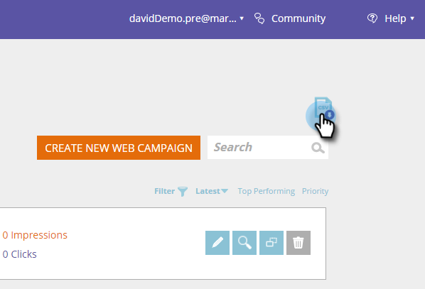
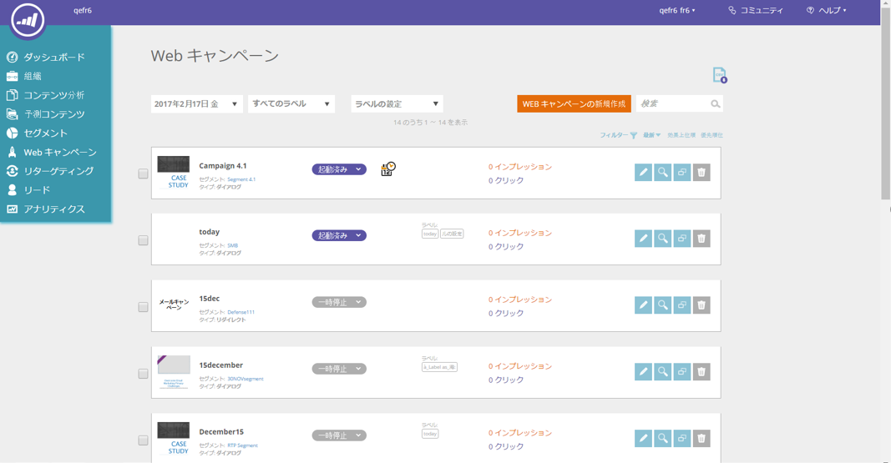
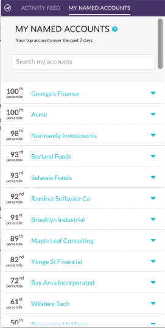

# 2017

## Hiver 2017 {#winter}

Les fonctionnalités suivantes sont incluses dans la version d’hiver 17. Vérifiez la disponibilité des fonctionnalités dans votre édition Marketo.

Cliquez sur les liens de titre pour afficher les articles détaillés de chaque fonctionnalité.

>[!NOTE]
>
>Si une rubrique comporte plusieurs sous-titres, les liens y sont placés.

## [Correspondance avancée pour les Audiences personnalisées Facebook](/help/marketo/product-docs/demand-generation/ad-network-integrations/add-facebook-custom-audiences-as-a-launchpoint-service.md) {#advanced-matching-for-facebook-custom-audiences}

La correspondance de base utilise uniquement les adresses e-mail, mais la nouvelle correspondance avancée utilise sept champs supplémentaires, ce qui augmente le taux de correspondance pour davantage de conversions.

## [API d’importation de l’objet personnalisé](https://developers.marketo.com/rest-api/lead-database/custom-objects/) {#custom-object-import-api}

Cette API fournit une interface plus rapide pour synchroniser les objets personnalisés dans Marketo. Vous pouvez importer des fichiers de feuille de calcul CSV, TSV ou SSV dans Marketo en tant qu’objets personnalisés.

## [Exportation de campagnes Web Personalization](/help/marketo/product-docs/web-personalization/working-with-web-campaigns/export-web-campaign-data.md) {#web-personalization-campaigns-export}

Exportez tous les détails et analyses de vos campagnes web au format CSV. Vous pouvez ensuite afficher vos données dans une disposition pratique.

## Localisation {#localization}

Les applications Web Personalization, [!UICONTROL Contenu prédictif] et Informations sur les e-mails sont désormais disponibles en japonais, en allemand et en espagnol. Vous [sélectionnez votre langue et vos paramètres régionaux](/help/marketo/product-docs/administration/settings/change-time-zone.md) pour afficher votre contenu dans ces langues.

## Améliorations marketing basées sur les comptes {#account-based-marketing-enhancements}

**[Importer des comptes nommés](/help/marketo/product-docs/target-account-management/target/named-accounts/import-named-accounts.md)**

Avec l’option d’importation [!UICONTROL Compte nommé], créez ou mettez à jour plusieurs enregistrements à la fois par le biais d’un téléchargement CSV.

**[Prise en charge des informations sur les e-mails](/help/marketo/product-docs/reporting/email-insights/filtering-in-email-insights.md)**

Utilisez [!UICONTROL Compte nommé] ou [!UICONTROL Liste de comptes] comme dimensions dans les informations sur les e-mails.

## [!UICONTROL Contenu prédictif] améliorations {#predictive-content-enhancements}

**[Filtrer par [!UICONTROL Source activé]](/help/marketo/product-docs/predictive-content/working-with-predictive-content/understanding-predictive-content.md)**

Filtrez [!UICONTROL Contenu prédictif] les éléments activés pour [!UICONTROL E-mail], [!UICONTROL Média enrichi] ou la [!UICONTROL Barre de recommandations].

**[Filtrer [!UICONTROL Analytics par Source]](/help/marketo/product-docs/predictive-content/working-with-predictive-content/understanding-predictive-content.md)**

Filtrez [!UICONTROL Contenu prédictif] l’analyse de sources spécifiques — [!UICONTROL E-mail], [!UICONTROL Média enrichi] ou [!UICONTROL Barre de recommandations].

**[!UICONTROL Contenu prédictif] éditeur**

[!UICONTROL &#x200B; L’expérience de modification et la mise en page ont été améliorées et la préparation du contenu est fractionnée par source (e-mail], [!UICONTROL médias riches] ou [!UICONTROL barre de recommandations].

**[Découverte automatique pour Predictive Content](/help/marketo/product-docs/predictive-content/getting-started/enable-content-discovery.md)**

L’URL de l’image et les métadonnées sont désormais utilisées dans le processus de découverte automatique du contenu.

## [Améliorations De &#x200B;](https://developers.marketo.com/mobile/) {#sdk-enhancements}

Les développeurs ont désormais un contrôle supplémentaire sur la diffusion des notifications push avec l’ajout d’un nouvel appel API SDK qui permet aux développeurs de supprimer les jetons push.

## Intégration de Vibes SMS LaunchPoint

Améliorez votre ciblage avec une nouvelle option de filtre, « Membre de la liste Vibes ».

## [Obsolescence de l’ancien éditeur de texte enrichi et de l’éditeur de formulaire 1.0](https://nation.marketo.com/docs/DOC-4315)

À compter du 1er août 2017, les clients qui utilisent toujours l’ancien éditeur de texte enrichi et l’éditeur de formulaire 1.0 passeront automatiquement à la nouvelle expérience .

## [API d’activité Marketo](https://developers.marketo.com/blog/important-change-activity-records-marketo-apis/) {#marketo-activity-apis}

Une modification importante va être apportée aux API d’activité Marketo. Êtes-vous prêt ?

## Printemps 2017 {#spring}

Les fonctionnalités suivantes sont incluses dans la version du printemps 17. Vérifiez la disponibilité des fonctionnalités dans votre édition Marketo.

Cliquez sur les liens de titre pour afficher les articles détaillés de chaque fonctionnalité. **Remarque** : si une rubrique comporte plusieurs sous-titres, les liens y sont placés.

## Forms de génération de leads LinkedIn[&#128279;](/help/marketo/product-docs/demand-generation/social/social-functions/set-up-linkedin-lead-gen-forms.md) {#linkedin-lead-gen-forms}

[[!UICONTROL LinkedIn Lead Gen] Forms](https://business.linkedin.com/marketing-solutions/native-advertising/lead-gen-ads) sont un moyen plus direct pour une entreprise d’exécuter des campagnes de génération de pistes sur [!DNL LinkedIn]. Les utilisateurs peuvent remplir des formulaires pour exprimer leur intérêt pour un produit ou un service, ce qui permet à l’entreprise de capturer les détails de la personne et de les synchroniser dans Marketo, où des processus de suivi automatisés et des activités de routage de pistes peuvent avoir lieu.

L’intégration de Marketo au Forms [!UICONTROL LinkedIn Lead Gen] capture automatiquement les informations fournies par un prospect dans le formulaire de Lead Gen. Les actions de suivi et les notifications peuvent ensuite être automatisées à l’aide du nouveau déclencheur et filtre **Remplir [!DNL LinkedIn Lead Gen] formulaire**.

## [Faire expirer le modèle MSI](/help/marketo/product-docs/marketo-sales-insight/msi-for-salesforce/features/actions-in-the-msi-panel/send-marketo-email/publish-an-email-to-sales-insight.md) {#expire-msi-template}

L’époque où les modèles obsolètes étaient nettoyés en [!DNL Sales Insight] est révolue. Fixez une date d’expiration lorsque vous publiez votre e-mail et nous nous occuperons de la dépublier pour vous lorsque la date d’expiration arrivera à échéance.

>[!NOTE]
>
>Définir la date d’expiration pour le 5/31/17 signifie que le modèle sera supprimé du [!DNL Sales Insight] à la fin de la journée le 5/31/17.

## [API d’extraction en bloc pour les personnes et les activités](https://developers.marketo.com/rest-api/bulk-extract/) {#bulk-extract-apis-for-people-and-activities}

Transférez facilement de grandes quantités de données de personne et d’activité de Marketo vers vos systèmes externes.

## Améliorations ABM

**[Champs personnalisés sur les comptes nommés ABM](https://docs.marketo.com/x/1wnG)**

Marketo ABM vous permet désormais de créer jusqu’à 10 champs personnalisés sur vos comptes nommés. Vous pouvez mapper ces champs personnalisés aux champs de votre objet de compte CRM. Marketo ABM synchronisera alors les données, ce qui vous permettra d’étendre vos comptes nommés ABM et de vous aider à stimuler votre marketing.

**[Score centile sur les comptes nommés ABM](https://docs.marketo.com/display/docs/assets/abmpercentiles.png)**

Les scores des comptes nommés peuvent varier considérablement. Marketo ABM calcule désormais automatiquement un centile pour chacun de vos scores, ce qui vous permet de voir en un coup d’œil où chaque compte nommé se classe parmi vos autres comptes nommés.

**[API de liste de comptes ABM](https://developers.marketo.com/rest-api/lead-database/named-account-lists/)**

Tirez parti d’intégrations de partenaires ABM riches et robustes avec une prise en charge améliorée des API pour les listes de comptes nommés.

## Améliorations de la personnalisation Web

**[Campagne Web Lors Du Défilement](/help/marketo/product-docs/web-personalization/working-with-web-campaigns/set-how-your-web-campaign-displays.md)**

Les nouveaux effets de campagne web offrent aux visiteurs du web une expérience plus personnalisée. Définissez vos [!UICONTROL campagnes web] personnalisées pour qu’elles s’affichent uniquement lorsqu’un visiteur web fait défiler la page vers le bas. Vous pouvez définir la boîte de dialogue [!UICONTROL Campagnes web] à afficher lors du défilement en fonction des éléments suivants :

* pourcentage de la page défilée
* pixel atteint
* défilement sous le pli de la page

**[Campagne Web en cas d’intention de sortie](/help/marketo/product-docs/web-personalization/working-with-web-campaigns/set-how-your-web-campaign-displays.md)**

Capturez l’attention des visiteurs et visiteuses avant qu’ils ne ferment votre page. Définissez vos [!UICONTROL Campagnes web] personnalisées pour qu’elles s’affichent uniquement lorsqu’un mouvement de souris indique que le visiteur quitte la page.

**[Effets d’animation pour [!UICONTROL Campagnes web]](/help/marketo/product-docs/web-personalization/working-with-web-campaigns/create-a-new-dialog-web-campaign.md)**

Définissez les effets d’animation de votre campagne web de boîte de dialogue afin de personnaliser l’affichage d’une campagne lors de l’entrée ou de la sortie de votre page web. Vous pouvez choisir parmi 6 effets différents et contrôler la durée et la direction de la boîte de dialogue.

**[Personnalisation du bouton Fermer de la boîte de dialogue](/help/marketo/product-docs/web-personalization/working-with-web-campaigns/create-a-new-dialog-web-campaign.md)**

Personnalisez le bouton Fermer pour les boîtes de dialogue. Faites votre choix parmi les options utilisées dans Style de boîte de dialogue transparente [!UICONTROL Campagnes web]. Sélectionnez l’icône, la couleur et la position du bouton Fermer. Vous pouvez également ajouter votre propre image de bouton.

**[Archiver les campagnes Web](/help/marketo/product-docs/web-personalization/working-with-web-campaigns/archive-a-web-campaign.md)**

L’option Archiver est un nouveau statut de campagne web qui vous permet d’archiver les [!UICONTROL campagnes web] et de les masquer de la vue Campagne web par défaut. Vous pouvez ainsi vous concentrer sur vos campagnes actives les plus pertinentes et récupérer à la demande les anciennes campagnes archivées.

**[Localisation](/help/marketo/product-docs/administration/settings/change-time-zone.md)**

Web Personalization est désormais disponible dans toutes les langues prises en charge par Marketo (anglais, japonais, allemand, espagnol, français et portugais).

## Améliorations prédictives {#predictive-enhancements}

**[Localisation](/help/marketo/product-docs/administration/settings/change-time-zone.md)**

Le contenu prédictif est désormais disponible dans toutes les langues prises en charge par Marketo (anglais, japonais, allemand, espagnol, français et portugais).

## [Obsolescence de l’ancien éditeur de texte enrichi et de l’éditeur de formulaire 1.0](https://nation.marketo.com/docs/DOC-4315)

À compter du 1er août 2017, les clients qui utilisent toujours l’ancien éditeur de texte enrichi et l’éditeur de formulaire 1.0 passeront automatiquement à la nouvelle expérience .

## Été 2017 {#summer}

Les fonctionnalités suivantes sont incluses dans la version d’été 17. Vérifiez la disponibilité des fonctionnalités dans votre édition Marketo.

Cliquez sur les liens de titre pour afficher les articles détaillés de chaque fonctionnalité. Remarque : certaines fonctionnalités incluses dans cette version ne sont pas associées à des articles. Si une rubrique comporte plusieurs sous-titres, les liens y sont placés.

## [Étapes de conversion hors ligne Facebook supplémentaires](/help/marketo/product-docs/demand-generation/facebook/set-up-facebook-offline-conversions.md) {#additional-facebook-offline-conversion-stages}

Choisissez jusqu’à 7 étapes de conversion hors ligne supplémentaires à mapper à vos étapes de cycle de vie Marketo (au-delà des 3 disponibles aujourd’hui). Optimisez vos dépenses publicitaires [!DNL Facebook] en fonction des conversions dans votre parcours client pour obtenir un meilleur retour sur investissement.

## [Verrouiller le modèle Insight de ventes](/help/marketo/product-docs/marketo-sales-insight/msi-for-salesforce/features/actions-in-the-msi-panel/send-marketo-email/lock-sales-template.md) {#lock-sales-insight-template}

Assurez la cohérence du message et du contenu en empêchant la modification de vos modèles de vente. Cela permet de normaliser les modèles et de maintenir des communications professionnelles.

## Améliorations ABM

**Source de données pour la recherche de sociétés japonaises**

Associez des personnes aux noms des sociétés japonaises dans la langue locale.

**[Intégration ABM et LeanData](https://docs.marketo.com/x/pKmt)**

L’intégration [!DNL LeanData] permet désormais la correspondance entre les prospects et les comptes dans Marketo. Veillez à ce que le marketing et les ventes restent cohérents en associant les mêmes prospects aux comptes dans les systèmes de vente et de marketing d’enregistrement. Des options plus flexibles donnent aux opérations marketing et commerciales un meilleur contrôle sur les règles de correspondance entre les leads et les comptes, afin qu’elles puissent atteindre le niveau de précision souhaité.

## Améliorations de Web Personalization

**[Améliorations de l’aperçu des campagnes](/help/marketo/product-docs/web-personalization/working-with-web-campaigns/preview-and-test-a-web-campaign.md)**

Les spécialistes marketing peuvent désormais s’assurer que leurs campagnes web s’afficheront correctement sur tous les appareils *avant* de les lancer. Grâce à ces améliorations, découvrez comment vos campagnes web seront rendues sur les ordinateurs de bureau, les appareils mobiles et les tablettes. Le nouveau plug-in d’[!DNL Chrome] offre également des aperçus plus cohérents et plus précis.

**[Améliorations des campagnes par widget](/help/marketo/product-docs/web-personalization/working-with-web-campaigns/create-a-new-widget-web-campaign.md)**

De nouvelles options pour les campagnes par widget sont désormais disponibles, notamment :

* Déclenchement de campagnes (délai, défilement)
* Affichage des campagnes (toute position autour de l’écran)
* Modification de la flèche Développer/Réduire en tout texte CTA

## ContentAI {#contentai}

**[Analyses et suggestions ContentAI](/help/marketo/product-docs/predictive-content/predictive-content-analytics-overview.md)**

Augmentez le rendement de votre marketing de contenu grâce à des analyses plus approfondies et à des suggestions de contenu optimisées par IA pour améliorer l’engagement. Des analyses puissantes montrent les performances du contenu recommandé, y compris les vues populaires, de tendance et basées sur l’audience. Des suggestions de contenu supplémentaire à inclure s’affichent également.

## Analytics {#analytics}

**[!UICONTROL Informations sur les e-mails] améliorations**

Tirez encore plus parti de votre expérience [!UICONTROL Informations sur les e-mails] avec de nouvelles méthodes de préparation et de partage des données. Vous pouvez désormais télécharger vos résultats [!UICONTROL Informations sur les e-mails] dans [!DNL Microsoft Excel] et [!DNL PowerPoint] pour travailler avec les données en dehors de Marketo.

## Assistance de configuration des identités fédérées {#federated-identity-configuration-support}

Conservez l’authentification (Active Directory) derrière votre pare-feu local tout en continuant à utiliser [!DNL Microsoft Dynamics] CRM dans le cloud.

## Automne 2017 {#fall}

Les fonctionnalités suivantes sont incluses dans la version de l’automne 17. Vérifiez la disponibilité des fonctionnalités dans votre édition Marketo.

Cliquez sur les liens de titre pour afficher les articles détaillés de chaque fonctionnalité. Remarque : certaines fonctionnalités incluses dans cette version ne sont pas associées à des articles. Si une rubrique comporte plusieurs sous-titres, les liens y sont placés.

## Fiabilité du système {#system-reliability}

Nous avons apporté d’autres améliorations à l’infrastructure de base de Marketo, notamment un meilleur séquencement, moins d’incohérences et une meilleure stabilité de la [!DNL Munchkin].

## Performance de la synchronisation Sfdc {#sfdc-sync-performance}

Tirez parti d’une synchronisation plus riche et plus rapide sur Marketo et [!DNL Salesforce]. Les modifications de données qui nécessitent des mises à jour en bloc sur les comptes ou les prospects peuvent être divisées en files d’attente parallèles pour éviter les retards. Les événements et les tâches se synchronisent désormais jusqu’à 50 % plus rapidement.

## Améliorations des performances d’analyse {#analytics-performance-improvements}

Les récentes améliorations de l’infrastructure offrent une disponibilité et une stabilité accrues au sein des outils d’analyse et de création de rapports de Marketo, ce qui vous permet de créer des rapports ad hoc plus rapidement.

## [Fuseau horaire du destinataire](/help/marketo/product-docs/email-marketing/email-programs/email-program-actions/scheduling-with-recipient-time-zone/understanding-recipient-time-zone.md) {#recipient-time-zone}

Grâce à cette nouvelle fonctionnalité, vous pouvez désormais conserver et diffuser des e-mails en fonction des fuseaux horaires locaux. Les programmes d’e-mail et d’engagement peuvent être configurés pour être diffusés dans les fuseaux horaires des destinataires, ce qui élimine la nécessité de créer plusieurs programmes ; envoyez une seule fois et Marketo conservera automatiquement l’e-mail jusqu’à l’heure locale appropriée. Élevez les mesures par e-mail, observez les pratiques locales et gagnez du temps en utilisant un seul programme à l’échelle mondiale.

>[!NOTE]
>
>Si vous ne pouvez pas encore activer le fuseau horaire du destinataire sur vos programmes d’e-mail et d’engagement, ne paniquez pas ! Nous activons progressivement cette fonctionnalité pour tous les clients.

## [Consultez les exemples d’e-mails par segment](/help/marketo/product-docs/email-marketing/general/creating-an-email/send-a-sample-email.md) {#review-sample-emails-by-segment}

Marketo dispose d’une nouvelle option permettant de sélectionner un segment lors de l’envoi d’exemples d’e-mails pour révision. Vous n’avez plus besoin de déterminer manuellement à quel segment appartient un prospect, ce qui facilite l’envoi d’e-mails contenant du contenu dynamique à différents segments.

## [Questions personnalisées de génération de leads LinkedIn](/help/marketo/product-docs/demand-generation/social/social-functions/set-up-linkedin-lead-gen-forms.md) {#linkedin-lead-gen-custom-questions}

Personnalisez vos formulaires [!UICONTROL LinkedIn Lead Gen] pour collecter des attributs de prospect personnalisés. Vous pouvez désormais poser jusqu’à trois questions personnalisées par formulaire, choisir entre une saisie de texte sur une seule ligne ou des questions à choix multiples, et faire correspondre aux champs de prospect Marketo.

## Intégration de Slack {#slack-integration}

Nous avons publié deux fonctionnalités dans le cadre de notre nouvelle intégration Slack :

* Notifications système : recevez des notifications Slack concernant les événements importants se produisant dans votre instance Marketo, tels que les alertes sur le statut actuel des campagnes et tout problème nécessitant une attention immédiate.
* Moments intéressants : lorsqu’une Insight Marketo a été déclenchée par un individu connu à partir d’un compte commercial, les propriétaires de leads peuvent être avertis via Slack. Les notifications incluent des informations sur le prospect ainsi que des détails sur le compte de vente.

## Améliorations ABM

**[Afficher les comptes sans contacts](https://docs.marketo.com/x/fKCt)**

Marketo ABM se synchronise et affiche désormais les comptes CRM sans contact. Incluez de nouveaux comptes sans historique de ventes ou de marketing précédent et suivez la progression en faisant correspondre les prospects suivants aux comptes.

## Analyse ContentAI {#contentai-analytics}

**[Nouveau filtre de liste de comptes ABM](https://docs.marketo.com/x/1BPG)**

Affichez et comparez les performances du contenu dans les listes de comptes AEM pour optimiser le contenu existant. ContentAI vous montre :

* contenu le plus consulté
* contenu le plus converti
* Contenu suggéré optimisé par l’IA pour les activités marketing

## Améliorations de la personnalisation Web

**[Jetons pour campagnes Web](/help/marketo/product-docs/web-personalization/working-with-web-campaigns/using-the-web-personalization-rich-text-editor.md)**

Les jetons peuvent désormais être utilisés dans les campagnes web. Utilisez des jetons pour diffuser des messages et du contenu personnalisés afin d’augmenter l’engagement dans vos campagnes web.

**[Élaborez des images studio dans l’Éditeur de campagnes Web](/help/marketo/product-docs/web-personalization/working-with-web-campaigns/using-the-web-personalization-rich-text-editor.md)**

Gagnez du temps en réutilisant des ressources créatives et des images sur plusieurs canaux dans Marketo.

## Intégration  {#integration}

**[API de prévisualisation d’e-mail](https://experienceleague.adobe.com/fr/docs/marketo-developer/marketo/email-scripting)**

Vous pouvez désormais prévisualiser à distance les e-mails en dehors de Marketo, ce qui simplifie le processus de localisation du contenu des e-mails et réduit les erreurs.

**[Remplacer l’API HTML](https://experienceleague.adobe.com/fr/docs/marketo-developer/marketo/email-scripting)**

Les développeurs peuvent mettre à jour à distance le contenu des ressources d’e-mail d’HTML, ce qui leur permet de travailler dans un seul système pour gérer les ressources.

## Améliorations de l’ABM en avril {#april-abm}

Les fonctionnalités suivantes sont incluses dans la version d’avril 17 de l’amélioration d’ABM. Vérifiez la disponibilité des fonctionnalités dans votre édition Marketo.

## Synchronisation des champs standard mappés CRM {#synching-of-crm-mapped-standard-fields}

Marketo ABM modifie le comportement lié aux CRM. À l’avenir, Marketo ABM établira et maintiendra une relation 1-1 entre les comptes ABM et les comptes du CRM. Cela permet à Marketo de conserver les champs de compte mappés synchronisés avec le CRM.

## Champs personnalisés pour la découverte CRM {#custom-fields-for-crm-discovery}

Vous pouvez désormais ajouter des champs personnalisés aux comptes, les mapper à votre CRM et les utiliser pour la découverte de compte CRM dans Marketo.

## Filtres basés sur compte dans la grille de comptes nommés {#account-based-filters-in-the-named-account-grid}

Vous pouvez désormais facilement filtrer vos comptes nommés en fonction d’une liste de comptes.

## Améliorations de l’ABM en août {#august-abm}

Les fonctionnalités suivantes sont incluses dans la version d’août 17 de l’amélioration de l’ABM. Vérifiez la disponibilité des fonctionnalités dans votre édition Marketo.

Cliquez sur les liens de titre pour afficher les articles détaillés de chaque fonctionnalité.

## [!DNL Account Insight] {#account-insight}

**[[!DNL Account Insight]](/help/marketo/product-docs/target-account-management/setup-tam/account-insight-plug-in-overview.md)** est un plug-in de [!DNL Google Chrome] qui affiche les informations d’ABM et de compte exploitables à l’intention de vos équipes commerciales, ce qui leur permet de travailler en étroite collaboration avec les services marketing pour impliquer efficacement les comptes. Les équipes commerciales auront une visibilité sur les données et les informations générées pour chacun des comptes nommés qu’elles possèdent. Cela inclut les centiles de score du compte, une liste de priorités de leurs comptes nommés, les personnes engagées au sein de ces comptes et un flux d’activités en direct des activités récentes à partir du compte.

 

## [Listes de comptes dynamiques](/help/marketo/product-docs/target-account-management/target/account-lists.md) {#dynamic-account-lists}

Nous ajoutons une nouvelle façon de créer des listes de comptes dans AEM. Outre les listes de comptes existantes, vous pouvez désormais créer des listes de comptes dynamiques générées à partir des vues de compte CRM public. Une vue de compte CRM est un ensemble de règles qui agit comme un filtre lors de l’affichage des comptes. Par exemple, vous pouvez l’utiliser pour trouver les comptes où Industrie est Santé _et_ Revenu est supérieur à 100 millions de dollars.

